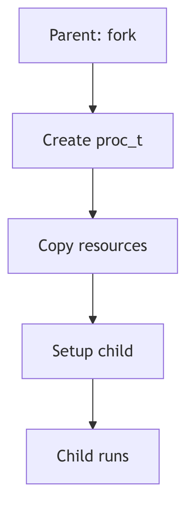
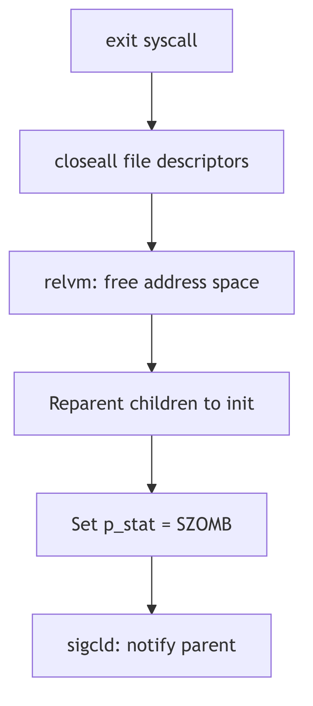
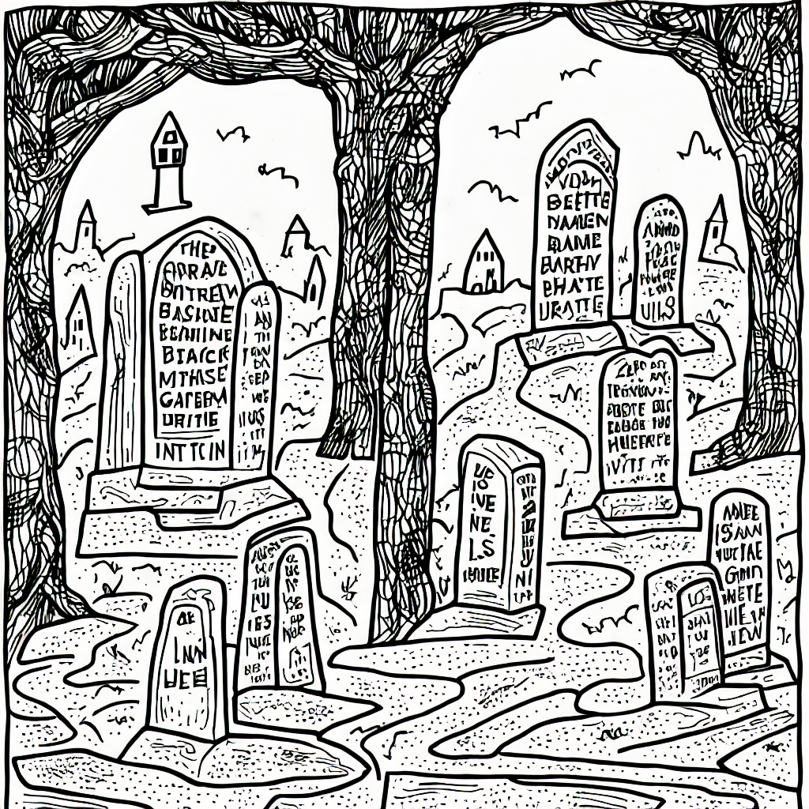
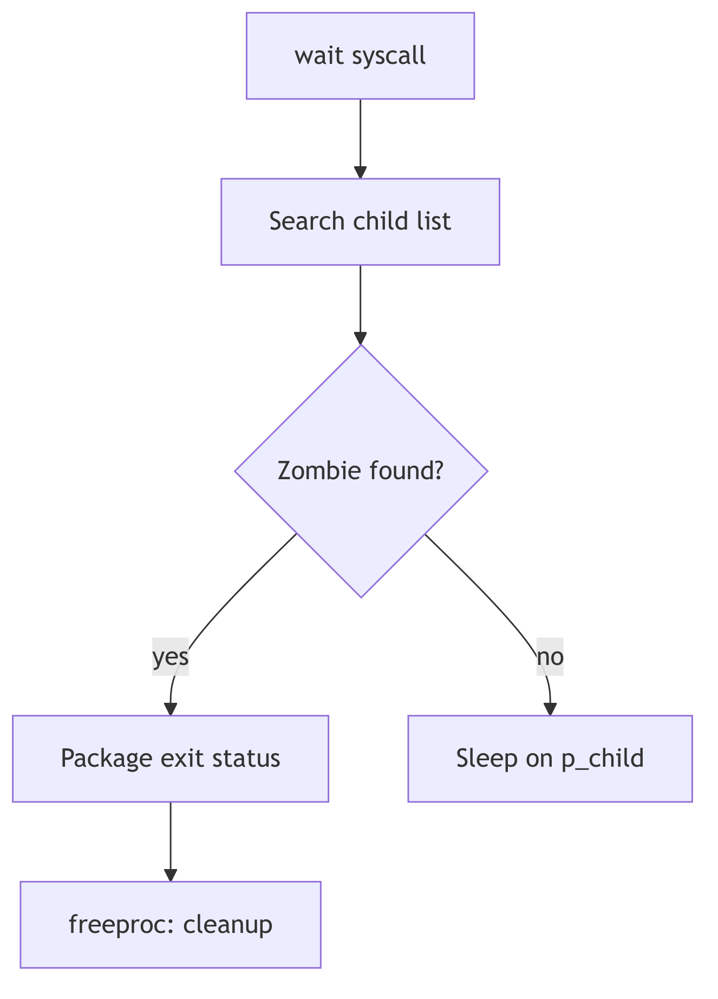

The Genesis and Demise of a Process: A Kernel's Grand Orchestration

The SVR4 i386 kernel, a venerable maestro of multitasking, conducts a perpetual symphony of processes. Each process, from its first breath to its final sigh, embarks on an intricate dance with the kernel's inner workings. To truly grasp the essence of SVR4—its elegant resource management, its disciplined isolation of execution, and its masterful orchestration of concurrent tasks—one must first become intimately acquainted with this grand lifecycle. We peel back the layers, not merely observing, but *feeling* the silicon pulse beneath the C logic.

<br/>

## The Spark of Life: Process Creation



In the dominion of SVR4, a new process doesn't simply *appear*; it is *born*. The primal act of creation is embodied by the `fork()` system call—a moment of digital fission where one process, the stoic parent, begets another, the eager child. Imagine, if you will, the kernel as a meticulous scribe, duplicating the parent's entire universe: its memory segments, its open portals to the filesystem (file descriptors), and even the fleeting thoughts held within its CPU registers.

Upon this miraculous birth, a subtle yet profound distinction emerges. The `fork()` call, like an oracle, whispers the child's unique Process ID (PID) to the parent, while to the child, it merely bestows a humble `0`, a symbol of its nascent identity.

```c
// A classic fork() scenario in SVR4
#include <unistd.h>
#include <stdio.h>
#include <sys/types.h> // For pid_t

int main() {
    pid_t pid;
    printf("Before fork, PID is %d\n", getpid()); // Line 6

    pid = fork(); // Line 8

    if (pid < 0) {
        perror("fork failed");
        return 1;
    } else if (pid == 0) {
        // Child process
        printf("I am the child! My PID is %d, my parent's PID is %d\n", getpid(), getppid());
    } else {
        // Parent process
        printf("I am the parent! My PID is %d, my child's PID is %d\n", getpid(), pid);
    }
    return 0;
}
```
**Code Snippet 1.1: The Primal `fork()`**

More often than not, this newborn child process hungers for its own destiny, a program distinct from its parent's. This desire is fulfilled by the `exec` family of system calls (e.g., `execve()`, `execl()`). When an `exec` call is invoked, the kernel, with swift precision, incinerates the child's current identity—its code, its data, its very stack and heap—and replaces it with the fresh, crisp image of a new program. Yet, through this metamorphosis, the process's soul, its PID, remains steadfast, a constant identifier in a changing world.

<br/>

### `fork()` vs. `vfork()`: A Tale of Two Births and Kernel Optimization

But SVR4, ever the pragmatist, offered a sibling to `fork()`: the enigmatic `vfork()`. This wasn't merely a naming convention; it was an optimization born from the austere memory landscapes of 1988. Unlike its memory-duplicating cousin, `vfork()` was a gambit. The child, rather than receiving its own pristine copy of the parent's address space, was instead granted temporary stewardship *within the parent's very own address space*.

The parent, a benevolent but watchful guardian, would then pause, suspended in time, awaiting the child's crucial next move: either an `exec()` to shed its shared skin and embrace its own program, or a swift `_exit()` to gracefully depart. This daring optimization elegantly sidestepped the heavy toll of copying an entire address space, a true boon when an `exec()` was imminent.

However, like any daring maneuver, `vfork()` came with its own perilous tightrope walk. Should the child, in its shared dominion, dare to *modify* the parent's address space before its inevitable `exec()`, chaos could ensue. The kernel, ever vigilant, enforces this strict contract to prevent a child's nascent scribbles from corrupting the parent's pristine canvas.


---

> #### **The Ghost of SVR4: Memory Constraints of Yore**
>
> In the dimly lit server rooms of 1988, memory was a precious commodity, measured in megabytes rather than gigabytes. The full duplication performed by `fork()`—especially for large processes—could be a performance bottleneck. `vfork()` was a clever, if slightly perilous, solution to mitigate this. It exploited the common `fork()`-then-`exec()` pattern, avoiding an expensive copy that would immediately be discarded.
>
> **Modern Contrast (2026):** Today, with gigabytes of RAM being the norm and sophisticated Copy-On-Write (COW) mechanisms deeply embedded in `fork()` implementations (even for Linux's `fork()`, which effectively acts like a COW `vfork()` for the address space), the explicit `vfork()` call is largely deprecated and its use discouraged in modern systems. The kernel handles the optimization transparently, making the old SVR4 `vfork()` an elegant but obsolete historical artifact. The spirit of efficiency lives on, but the explicit `vfork()` dance is rarely seen outside of historical curiosities.

---

<br/>

### The u-Block: A Glimpse into a Process's Soul (SVR4 Edition)

Central to the SVR4 process's identity, beyond its PID, was the venerable **User Area**, affectionately known as the **u-block**. This kernel-resident data structure, unique to each process, was a veritable treasure trove of context. It housed the process's kernel stack, its per-process open file table, signal handling information, error numbers, and a myriad of other critical runtime details. It was, in essence, the kernel's intimate dossier on a running process.

```c
// Conceptual simplified structure of the u-block (struct user)
// In reality, much more complex, often defined in <sys/user.h>
struct user {
    caddr_t       u_stack;      // User stack pointer (conceptual)
    struct proc   *u_procp;     // Pointer to the proc table entry
    int           u_error;      // Error number for system calls
    file_t        *u_ofile[NOFILE]; // Per-process open file table
    struct sighandling u_signal; // Signal handling information
    // ... many more fields
};
```
**Code Snippet 1.2: The Intimate `u_block` (Simplified)**

> #### **The Ghost of SVR4: The u-block's Legacy**
>
> The u-block was a cornerstone of SVR4 process management, a compact and efficient way to store per-process kernel context. Its design reflected a time when every byte of memory was carefully accounted for. It served as a critical bridge between the generic `proc` table entry (which held system-wide process information) and the specific, rapidly changing context of a process's kernel execution.
>
> **Modern Contrast (2026):** In contemporary Linux, the concept of a monolithic u-block has evolved. Its responsibilities are now distributed across various fields within the comprehensive `struct task_struct` and related data structures. While the `task_struct` in Linux is far more extensive and integrated, the spirit of the u-block—that direct, intimate connection to a process's ephemeral state—is still palpable within the modern kernel's design. The SVR4 u-block stands as an elegant predecessor, showing how fundamental information was once encapsulated.

---

<br/>

## The Final Curtain: Process Termination



Alas, even the most vibrant process must, at some juncture, meet its cessation. This can occur either by graceful self-annihilation or by an unforeseen, often forceful, intervention.

*   **Voluntary Departure**: A process, having fulfilled its purpose, may choose to exit gracefully by invoking `exit()` or `_exit()`. The `_exit()` call, a more direct route, bypasses the user-space cleanup routines (like `atexit()` handlers or `stdio` buffer flushing), making it suitable for children destined for an immediate `exec()` or for robust error handling where user-space state is untrustworthy. Returning from the `main()` function in C is, in essence, a call to `exit()`.

*   **Involuntary Eviction**: The kernel, or another process, can forcibly terminate a process, most often through the delivery of a signal. A `SIGKILL`, for instance, is the ultimate, unblockable eviction notice, while a `SIGSEGV` (segmentation fault) marks a catastrophic misstep in memory access, compelling the kernel to intervene.

Upon termination, a process does not vanish instantaneously. Instead, it lingers as a spectral **"zombie"** process. In this enigmatic state, its computational essence is gone, its resources largely reclaimed by the kernel. Yet, a vestige remains: its entry in the kernel's Process Table and its Process Control Block (PCB), specifically to house its exit status. This spectral existence serves a vital purpose: it allows the parent process, through the `wait()` or `waitpid()` system calls, to collect the child's final report—its exit status—and only then does the kernel fully expunge the zombie, "reaping" its last kernel resources.



Should a parent process prematurely depart this digital realm before its children, those orphaned processes are not left to wander the wilderness. Instead, they are nobly adopted by the venerable `init` process (always PID 1), the primordial ancestor of all user-space processes. `init`, the steadfast caretaker, assumes the responsibility of patiently `wait()`ing for these adopted children, dutifully reaping their zombie forms when their time comes. This ensures that no process lingers eternally, hogging precious Process Table entries.

---

> #### **The Ghost of SVR4: The Importance of Reaping**
>
> Unreaped zombie processes, while consuming minimal resources, can exhaust the finite number of entries in the kernel's Process Table. In the SVR4 era, this was a tangible risk, capable of leading to system instability by preventing new processes from being created. The `wait()` family of calls wasn't just good practice; it was a necessary ritual to maintain kernel hygiene.
>
> **Modern Contrast (2026):** While modern kernels have larger process tables, the principle remains. Zombie processes, if accumulated in large numbers, can still signify application bugs (e.g., parent processes not `wait()`ing for their children) and can indeed consume resources, albeit mostly Process Table entries, which are still finite. The `init` adoption mechanism remains a cornerstone of UNIX-like systems, a testament to the foresight of early designers.

---

<br/>

## The Dance of Existence: Process States

Throughout its ephemeral existence, a process whirls through a ballet of states, each signifying its current relationship with the CPU and the kernel's resources. The SVR4 kernel, with its meticulous oversight, maintains a **Process Table**—a grand ledger of `proc` structures, each a detailed dossier on a single process. This `proc` structure is the central repository, containing its PID, its current state, its security credentials, and a web of pointers to other critical kernel data, such as our familiar u-block.

The primary states in this grand choreography include:

*   **Running**: The process is, at this very instant, clutching the CPU, executing its instructions with fervor.
*   **Ready (Runnable)**: Poised and eager, the process is perfectly capable of running but is momentarily sidelined, patiently awaiting its turn on the CPU, a hopeful contender in the scheduler's queue.
*   **Sleeping (Waiting)**: The process has temporarily retired from active computation, having voluntarily surrendered the CPU. It slumbers, awaiting a specific event—perhaps the completion of an I/O operation, the arrival of a signal, or the tick of a timer. It's in a state of suspended animation, ready to awaken when its desired event materializes.
*   **Zombie**: As discussed, this is the spectral aftermath of a terminated process, awaiting its parent's final rites of `wait()` or `waitpid()`.
*   **Stopped**: A process temporarily frozen in time, usually by an external force—a `SIGSTOP` or `SIGTSTP` signal—often seen in the graceful mechanics of shell job control. It can be resumed by a `SIGCONT` signal.

<br/>

> #### **The Ghost of SVR4: Process Groups and Sessions for Order**
>
> The SVR4 kernel introduced sophisticated mechanisms like **process groups** and **sessions** (related to Critique Point 3) not merely as abstract concepts, but as fundamental tools for imposing order on the chaos of multiple processes.
>
> **Process Groups** are collections of related processes, typically created by a shell pipeline (e.g., `command1 | command2`). Signals, such as `SIGINT` (Ctrl+C), are often delivered to an entire process group, allowing for collective control. This was crucial for shell job control, enabling a user to suspend (`SIGTSTP`), resume (`SIGCONT`), or terminate an entire pipeline of commands with a single keystroke.
>
> **Sessions** elevate this concept further, encapsulating one or more process groups. A session typically corresponds to a login session or a terminal, acting as an insulating layer. When a terminal closes, a `SIGHUP` signal is often sent to the session leader, which can then propagate it to its process groups, gracefully terminating the applications associated with that session. This structured hierarchy was vital for managing interactive user environments and background jobs reliably.

---

<br/>

## The Kernel's Hand-Off: Context Switching

The very illusion of concurrency—of many processes seemingly running simultaneously on a single CPU—is conjured by the kernel's exquisite mastery of **context switching**. This is the heart of multitasking: the instantaneous, surgical act of preserving the entire operational state of the currently executing process, and then, with equal precision, reinstating the state of another.

When the scheduler, having made its momentous decision, dictates a change, the kernel embarks on a critical, low-level ballet. The CPU's fleeting memories are meticulously archived:

*   **General-Purpose Registers**: The immediate workspace of the CPU, holding operands and results.
*   **Program Counter (Instruction Pointer)**: The CPU's bookmark, indicating the next instruction to execute.
*   **Stack Pointer**: The current top of the process's stack.
*   **Process Status Word (PSW)**: A register reflecting the CPU's current operational mode, flags, and interrupt status.
*   **Memory Management Unit (MMU) State**: Crucially, the base register pointing to the process's page tables (e.g., `CR3` on x86), which defines its unique virtual address space.

This meticulously saved "context" is stored within the process's `proc` structure (or its u-block, or a combination thereof), a snapshot awaiting the process's eventual return to the CPU.

At the core of this resurrection, particularly in SVR4, lies the often-unsung hero: the `resume()` function.

### The `resume()` Function: Awakening a Slumbering Giant

The `resume()` function, typically a highly optimized, architecture-dependent assembly routine, is the incantation that breathes life back into a scheduled process (addressing Critique Point 1). It is the final, atomic act of the context switch. Its mission: to load the previously saved CPU state of the chosen `newproc` into the physical CPU registers.

Conceptually, `resume()` performs the inverse operation of context saving:

1.  It receives pointers to the `proc` structures (or their relevant context saving areas) of the `oldproc` (the process being switched *from*) and `newproc` (the process being switched *to*) to save the current CPU state (registers, stack pointer, program counter) of `oldproc`.
2.  It updates the kernel's internal pointers to reflect the currently executing process.
3.  **Crucially**, it restores the saved CPU state of `newproc`, including its `CR3` register to point to `newproc`'s page tables, effectively switching the active virtual address space.
4.  It then "returns" into the `newproc`'s context, making it appear as if `newproc` was simply suspended and is now continuing from where it left off.

```assembly
// Conceptual pseudo-assembly for resume() (x86 specific)
// Actual implementation would be far more intricate and platform-specific
resume(oldproc, newproc):
    ; Save oldproc's context (often done by the caller or an interrupt handler)
    ; ...
    
    ; Switch current process pointers (conceptual)
    mov EAX, newproc_ptr
    mov [current_proc_ptr], EAX ; Update global current process pointer

    ; Restore newproc's MMU context (CR3 register)
    mov EAX, [newproc_page_table_base]
    mov CR3, EAX ; This is where the virtual address space magic happens!

    ; Restore newproc's general purpose registers, stack pointer, and instruction pointer
    pop EBP
    pop ESI
    pop EDI
    pop EDX
    pop ECX
    pop EBX
    pop EAX
    
    mov ESP, [newproc_kernel_stack_pointer] ; Load new kernel stack
    
    ; Finally, return to the new process's execution flow
    ret_from_interrupt_or_call ; Jumps to newproc's saved EIP/CS
```
**Code Snippet 1.3: The `resume()` Function's Orchestration (Pseudo-Assembly)**

The `resume()` function is an exquisite piece of engineering, often residing at the very boundary between C code and the raw power of assembly. It operates with surgical precision, ensuring that the transition between processes is seamless and efficient, a blink-and-you-miss-it moment that underpins the entire multiprocessing paradigm.

---


