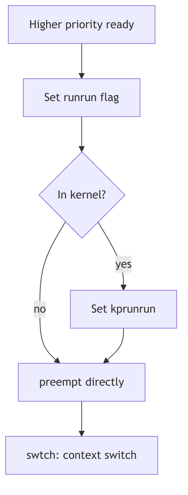
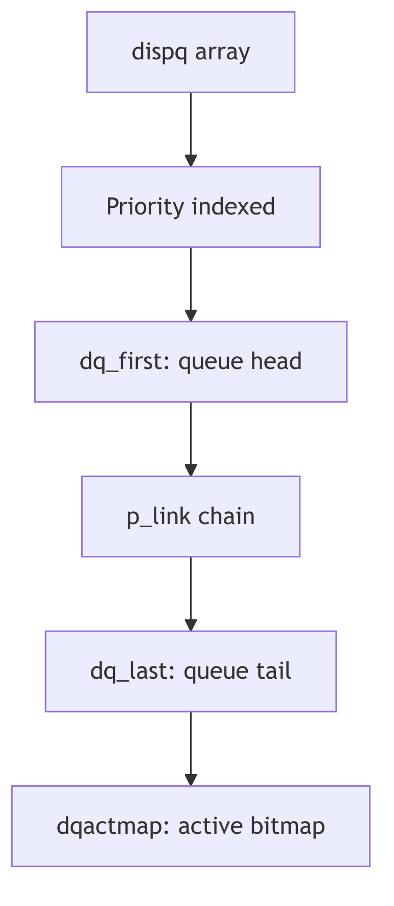
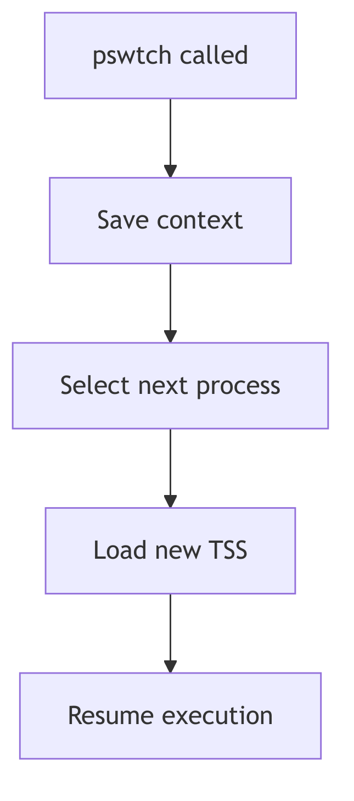

The Time-Keeper's Art: Process Scheduling

Having explored the fascinating genesis and eventual cessation of a process in SVR4, let us now turn our gaze to the ballet master itself: the **Process Scheduler**. This unsung hero within the kernel is the ultimate arbiter of CPU time, meticulously deciding which hungry contender gets to taste the precious silicon next. In a world teeming with processes, each clamoring for attention, the scheduler’s role is akin to a benevolent, yet firm, traffic controller, ensuring that the CPU’s finite resources are distributed with purpose, policy, and a touch of SVR4 elegance.

 

## The Grand Conductor: SVR4 Scheduling Classes

SVR4, with its characteristic architectural foresight, did not merely present a monolithic scheduling policy. Instead, it unveiled a highly flexible, multi-tiered framework—the **Scheduling Classes**. This innovative design allowed the kernel to employ distinct algorithms tailored to the very nature of the processes they governed. No longer would a time-critical sensor process be treated with the same casual indifference as a background compilation job. Each had its class, its policy, and its priority.

The primary dramatis personae in this scheduling theater were:

*   **Real-Time (RT)**: These are the prima donnas of the kernel, demanding and receiving the highest accolades of priority. An RT process, once runnable, seizes the CPU with an almost tyrannical grip, running uninterrupted until it either voluntarily yields (blocks) or explicitly steps aside. Their existence is predicated on absolute predictability, making them indispensable for applications where temporal guarantees are not merely desirable, but mission-critical—think industrial control systems or specialized multimedia streams.

*   **System (SYS)**: The backbone of the kernel itself, this class is reserved for the essential gears and levers of the operating system. Core kernel threads, interrupt handlers, and critical system daemons reside here. SYS processes operate at fixed, elevated priorities, ensuring that the kernel, the very heart of the system, remains responsive, vigilant, and unburdened by the whims of user-space frivolity.

*   **Time-Sharing (TS)**: This is the bustling marketplace of user processes, the common folk of the SVR4 kingdom. TS processes are scheduled with an emphasis on fairness and equitable CPU distribution. They dance to a **round-robin** tune, each receiving a quantum of CPU time (a "time slice"), after which they are politely, but firmly, ushered back into the run queue. Their priorities are not static decrees but dynamic whispers, constantly adjusted by the kernel's keen observation of their CPU appetites and periods of rest. A process that has recently been CPU-hungry might find its priority gently nudged downwards, while one that has patiently slept might receive a boost, ensuring that no single process hoards the CPU indefinitely.

---

> #### **The Ghost of SVR4: The Genesis of Modular Scheduling**
>
> The SVR4 scheduling classes were a remarkably prescient design choice in their era. Before this, many UNIX-like systems employed simpler, more monolithic scheduling algorithms that struggled to balance the demands of real-time responsiveness with general-purpose time-sharing. The modularity introduced by SVR4 allowed for greater flexibility and extensibility, foreshadowing the plugin-based scheduling architectures seen in modern kernels.
>
> **Modern Contrast (2026):** Modern Linux kernels, while not explicitly using the "SVR4 classes" nomenclature, adopt similar multi-policy approaches. The Completely Fair Scheduler (CFS) handles general time-sharing, while `SCHED_FIFO` and `SCHED_RR` cater to real-time needs, and a `SCHED_DEADLINE` class provides even stronger temporal guarantees. The SVR4 design laid crucial groundwork for separating policy from mechanism in kernel scheduling, a principle that endures to this day.

---

 

## The SVR4 Scheduler: A Priority-Driven Maestro

At the operational core of the SVR4 scheduler lies a finely tuned priority system, managed through a series of **run queues**. Imagine a grand antechamber with many doors, each labeled with a priority level within a specific scheduling class. When a process becomes runnable—awakening from a sleep, or finishing an I/O operation—it is meticulously placed onto its appropriate run queue.

When a CPU, that insatiable hunger for instructions, becomes available (perhaps because a running process decided to block, or its allotted time slice expired), the scheduler springs into action. Its directive is absolute: **always select the highest-priority runnable process from the highest-priority non-empty scheduling class.**

Within the `Time-Sharing` class, this mechanism becomes particularly nuanced. The scheduler isn't merely a static gatekeeper; it's an active observer. Processes that tirelessly grind away, consuming vast tracts of CPU time, will find their dynamic priorities gently, but persistently, decreasing. Conversely, those processes that have patiently waited, perhaps slumbering for an I/O event, will experience a compensatory increase in their priority. This astute mechanism, often termed **"priority aging"**, is the scheduler's subtle art of preventing CPU starvation, ensuring that even the most humble Time-Sharing process will eventually receive its moment in the silicon sun.

 

## The Interruption: Preemption

SVR4, a marvel of its time, was a **preemptive kernel**. This means that the CPU's current tenant—the running process—could be summarily interrupted and forced to relinquish its hold, even if it hadn't completed its quantum of time or explicitly paused. Preemption is the very essence of responsive multitasking, ensuring that critical events or higher-priority demands are never ignored.

Preemption could be triggered by several compelling forces:

*   **The Ascent of a Monarch**: Should a process of unequivocally higher priority (an `RT` process, for example) suddenly become runnable, the currently executing, lower-priority process is immediately—and without ceremony—ejected from the CPU. The new monarch reigns supreme.
*   **The Tyranny of the Time Slice**: For `Time-Sharing` processes, the CPU is not an endless buffet but a carefully rationed meal. Once a process consumes its entire allotted **time slice**, the scheduler, with clockwork precision, preempts it. The process is then returned to the run queue, often with a subtly adjusted (read: reduced) priority, awaiting its next turn.
*   **The Call of the Hardware**: External **interrupts**, those urgent cries from the hardware (a disk signaling completion, a network packet arriving), can also trigger preemption. The CPU immediately diverts its attention to the interrupt handler. Upon completion, the scheduler re-evaluates the landscape, often leading to a context switch if a higher-priority task is now runnable.

 

## Dispatch Queues: The Scheduler's Ledger

To manage this dynamic ebb and flow of processes, the SVR4 kernel employs **dispatch queues**. Conceptually, these are explicit data structures, often linked lists, each corresponding to a distinct priority level. When a process transitions from a blocked state to a runnable state, it is meticulously inserted into the appropriate dispatch queue for its current priority.

The scheduler’s central loop, a relentless cycle of decision and execution, can be distilled into these fundamental steps:

1.  **Survey the Landscape**: Continuously examine the dispatch queues for any runnable processes.
2.  **Identify the Chosen One**: From the highest-priority non-empty dispatch queue, pluck the next process slated for execution.
3.  **The Great Switch**: Initiate a **context switch** to the selected process, involving the intricate dance of saving the old state and restoring the new state, as we discussed with the `resume()` function.
4.  **Repeat Ad Infinitum**: The cycle perpetuates, an eternal vigil ensuring the CPU is always serving the highest demand.

This sophisticated yet elegant dispatching mechanism is how SVR4 maintained both responsiveness for critical tasks and fairness for general computation, a testament to the enduring principles of efficient operating system design.

