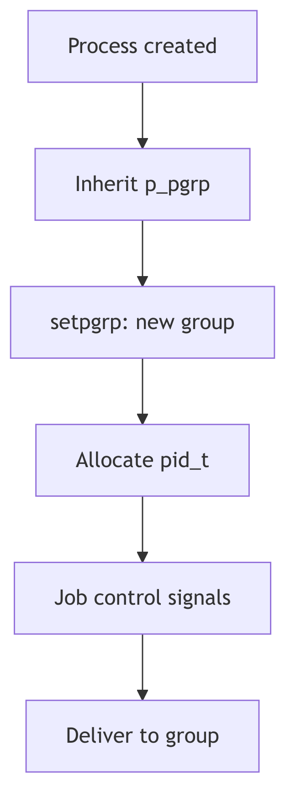

Process Groups and Sessions

## Overview

Process groups and sessions organize processes for job control and terminal management. Each process belongs to exactly one process group, identified by `p_pgrp`. Process groups belong to sessions, enabling shells to manage foreground and background jobs.

## Process Groups

The `setpgrp()` system call creates a new process group or joins an existing one. The `p_pgidp` pointer references a shared `pid_t` structure used for group identification. The `pgjoin()` function (pgrp.c) links processes into groups:

```c
void
pgjoin(p, pgp)
proc_t *p;
struct pid *pgp;
{
    p->p_pgidp = pgp;
    p->p_pgrp = pgp->pid_id;
    PID_HOLD(pgp);
}
```

Process groups enable signal broadcasting - killing a process group sends signals to all member processes.

## Sessions

Sessions group related process groups, typically corresponding to a login session. The session leader (usually the shell) creates the session via `setsid()`. The `sess_t` structure tracks the controlling terminal and session ID:

```c
typedef struct sess {
    pid_t *s_sidp;      /* session ID */
    vnode_t *s_vp;      /* controlling terminal vnode */
    struct cred *s_cred; /* credentials */
} sess_t;
```

Only the session leader can acquire a controlling terminal. Terminal I/O from background process groups triggers SIGTTIN or SIGTTOU, implementing job control.

## Terminal Control

Foreground process groups can perform terminal I/O without restriction. Background groups attempting reads receive SIGTTIN (suspending them), while writes receive SIGTTOU if the `TOSTOP` flag is set. This prevents background jobs from interfering with interactive terminal use.



