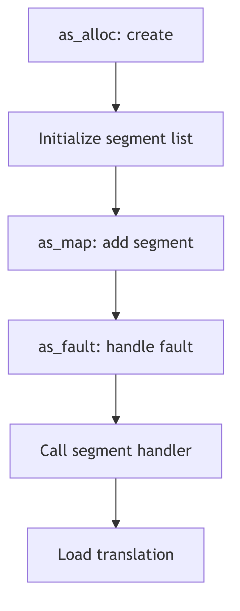

Virtual Memory Overview

## Overview

The SVR4 virtual memory system manages process address spaces through the `struct as` abstraction. Each process has a private address space containing code, data, heap, stack, and memory-mapped regions. The address space is composed of segments managed by pluggable segment drivers.

## Address Space Structure

```c
typedef struct as {
    struct hat *a_hat;      /* hardware address translation */
    struct seg *a_segs;     /* segment list */
    size_t a_size;          /* total mapped size */
    struct as *a_next;      /* list link */
    int a_lock;             /* lock for modifications */
} as_t;
```

The `a_segs` list contains all mapped segments. The `a_hat` pointer manages page tables and TLB entries through the Hardware Address Translation layer.

## Segment Management

Segments represent contiguous virtual address ranges with uniform properties. The `as_map()` function (vm_as.c) creates new mappings by invoking segment driver create functions. Each segment type (vnode, anonymous, device) provides operations for fault handling, duplication, and protection changes.

## Address Space Operations

`as_dup()` duplicates address spaces for fork, using copy-on-write to defer physical copying. `as_fault()` handles page faults by delegating to the appropriate segment driver. `as_free()` releases all segments and page tables during exit.

The address space abstraction isolates process memory management from hardware-specific details, enabling portability across architectures.



