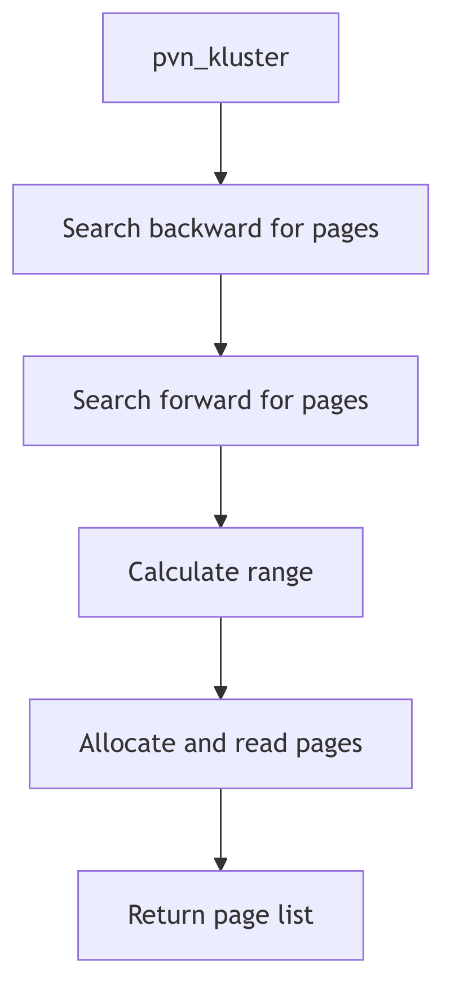

Page Replacement and Paging

## Overview

The paged vnode (pvn) layer provides support for vnode operations that involve page I/O. It implements page clustering, read-ahead, and pageout operations for file-backed pages. The layer coordinates between the file system and VM system to efficiently manage pages that map file data.

## Page Clustering

The `pvn_kluster()` function (vm_pvn.c:86) finds contiguous pages for I/O optimization:

```c
page_t *
pvn_kluster(vp, off, seg, addr, offp, lenp, vp_off, vp_len, isra)
    struct vnode *vp;
    register u_int off;
    register struct seg *seg;
    register addr_t addr;
    u_int *offp, *lenp;
    u_int vp_off, vp_len;
    int isra;
{
    register int delta, delta2;
    register page_t *pp;
    page_t *plist = NULL;
    addr_t straddr;
    int bytesavail;
    u_int vp_end;
```

The function searches for the largest contiguous block of pages around the target address that map to consecutive file offsets. This clustering reduces I/O operations by combining multiple page requests into single larger transfers.

## Pageout Operations

The pvn layer provides `pvn_vplist_dirty()` to identify dirty pages for writeout, and `pvn_done()` to handle I/O completion. These functions work with the page scanner and file systems to flush modified pages to backing storage.

## Read-Ahead

The `isra` parameter in `pvn_kluster()` indicates read-ahead mode. When set, the function extends the I/O range beyond the faulting page to bring in adjacent pages that are likely to be accessed soon. This prefetching improves sequential access patterns by reducing future page faults.

## Page Scanner Integration

The page scanner (also called the pageout daemon or clock algorithm) periodically examines pages to identify candidates for reclamation. For file-backed pages, the pvn layer interfaces with the scanner to:

1. Identify clean pages that can be immediately freed
2. Flush dirty pages to their backing files before reclamation
3. Maintain page reference bits for least-recently-used tracking
4. Cluster pageout operations to improve I/O efficiency

## VOP_PUTPAGE and VOP_GETPAGE

File systems implement these vnode operations using pvn layer functions:

**VOP_GETPAGE**: Called during page faults to read pages from the file. Uses `pvn_kluster()` to determine the optimal I/O range, then initiates asynchronous I/O for the clustered pages.

**VOP_PUTPAGE**: Called to write dirty pages back to the file. Can be triggered by explicit sync operations, memory pressure, or file close. The pvn layer coordinates with the buffer cache to ensure consistency.

## I/O Completion

The `pageio_done()` callback handles I/O completion for paged vnode operations. It updates page state, wakes waiting processes, and releases I/O locks. Error handling ensures that I/O failures are properly propagated to affected processes.

## Buffer Management

The pvn layer interacts with the segmap segment driver for temporary kernel mappings of file data. This cooperation ensures that file system operations and VM operations maintain a consistent view of file contents while avoiding unnecessary data copying.



