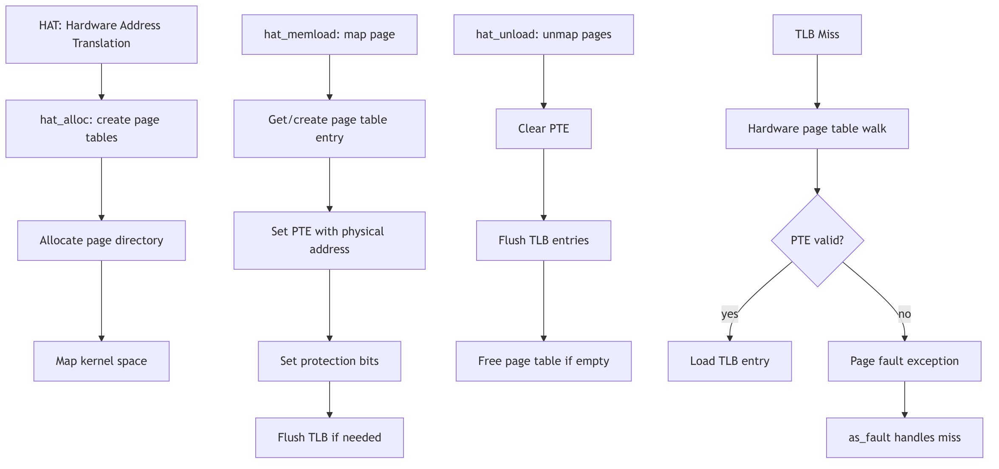

Hardware Address Translation

## Overview

The Hardware Address Translation (HAT) layer abstracts page table management from architecture-specific details. On i386, HAT manages two-level page tables with 4KB pages. The layer handles TLB management, page table allocation, and virtual-to-physical mappings.

## HAT Operations

```c
struct hat_ops {
    void (*hat_alloc)(struct as *);
    void (*hat_free)(struct as *);
    void (*hat_memload)(struct as *, caddr_t, struct page *, uint, uint);
    void (*hat_unload)(struct as *, caddr_t, size_t, uint);
    void (*hat_sync)(struct as *, caddr_t, size_t, uint);
};
```

`hat_memload()` establishes mappings by setting page table entries. `hat_unload()` removes mappings and flushes the TLB to maintain coherency. The i386 implementation uses hardware page table walks, with the HAT layer managing page directory and page table allocation.

## TLB Management

The Translation Lookaside Buffer caches virtual-to-physical translations. The HAT layer must explicitly flush TLB entries after changing PTEs to prevent stale translations. Global flushes use `invlpg` or CR3 reload; selective flushes use `invlpg` for specific addresses.



