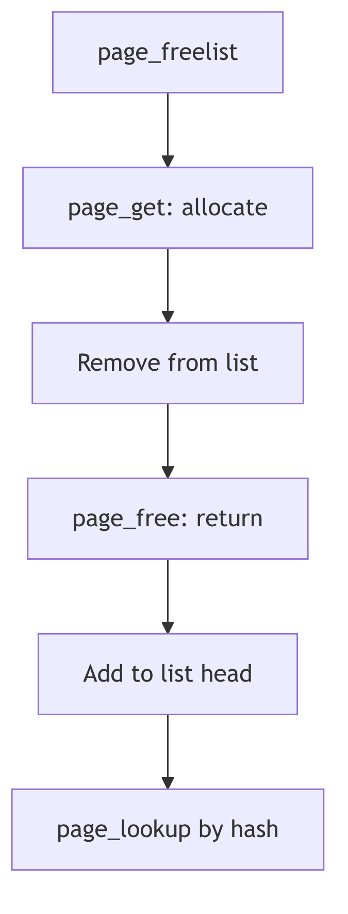

Page Management

## Overview

The page allocator manages physical memory through the `page` structure. Each physical page has metadata tracking its state, identity, and relationships. The free list organizes unused pages, while the page hash enables rapid lookup by vnode/offset.

## Page Structure

```c
typedef struct page {
    struct page *p_next;     /* free/hash list */
    struct page *p_prev;
    struct vnode *p_vnode;   /* identity */
    ulong p_offset;
    uint p_lock:1, p_mod:1, p_ref:1;
} page_t;
```

Pages transition between free, cached, and active states based on usage patterns.

## Page Allocation

`page_get()` allocates from the free list or reclaims from the cache. `page_free()` returns pages to the free pool. The page scanner implements clock algorithm replacement, maintaining working sets while reclaiming inactive pages.



