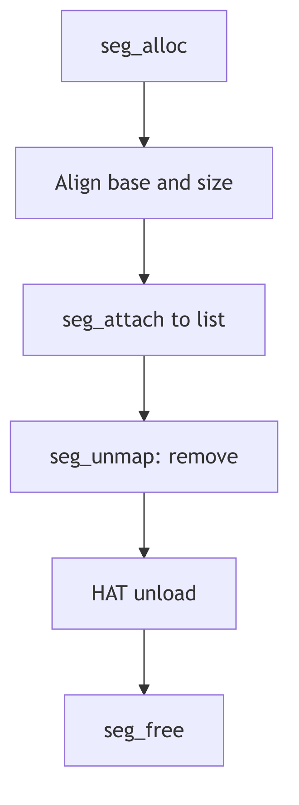

Memory Segments

## Overview

Segments represent contiguous virtual address ranges with uniform properties. The `seg` structure provides a framework for managing different types of memory regions through pluggable segment drivers. Each segment type implements operations for fault handling, protection changes, and synchronization.

## Segment Structure

```c
struct seg {
    addr_t s_base;           /* base virtual address */
    u_int s_size;            /* size in bytes */
    struct as *s_as;         /* containing address space */
    struct seg *s_next;      /* next segment in address space */
    struct seg *s_prev;      /* previous segment */
    struct seg_ops *s_ops;   /* segment operations */
    caddr_t s_data;          /* driver private data */
};
```

The segment list is maintained in sorted order by base address. The `s_ops` pointer provides the interface to segment driver operations.

## Segment Allocation

The `seg_alloc()` function (vm_seg.c:66) allocates and attaches a segment:

```c
struct seg *
seg_alloc(as, base, size)
    struct as *as;
    register addr_t base;
    register u_int size;
{
    register struct seg *new;
    addr_t segbase;
    u_int segsize;

    segbase = (addr_t)((u_int)base & PAGEMASK);
    segsize =
        (((u_int)(base + size) + PAGEOFFSET) & PAGEMASK) - (u_int)segbase;

    if (!valid_va_range(&segbase, &segsize, segsize, AH_LO))
        return ((struct seg *)NULL);

    new = (struct seg *)kmem_fast_alloc((caddr_t *)&seg_freelist,
        sizeof (*seg_freelist), seg_freeincr, KM_SLEEP);
    struct_zero((caddr_t)new, sizeof (*new));
    if (seg_attach(as, segbase, segsize, new) < 0) {
        kmem_fast_free((caddr_t *)&seg_freelist, (char *)new);
        return ((struct seg *)NULL);
    }
    return (new);
}
```

Addresses and sizes are page-aligned using `PAGEMASK`. The fast allocator maintains a freelist of segment structures to avoid frequent kmem_alloc() calls.

## Segment Attachment

The `seg_attach()` function (vm_seg.c:101) links the segment into the address space:

```c
int
seg_attach(as, base, size, seg)
    struct as *as;
    addr_t base;
    u_int size;
    struct seg *seg;
{
    seg->s_as = as;
    seg->s_base = base;
    seg->s_size = size;
    return (as_addseg(as, seg));
}
```

The `as_addseg()` function inserts the segment into the sorted list, checking for overlaps with existing segments. Overlapping segments cause allocation failure.

## Segment Operations

Each segment driver provides a `seg_ops` structure with function pointers:

```c
struct seg_ops {
    int (*dup)(struct seg *, struct seg *);
    int (*unmap)(struct seg *, addr_t, u_int);
    void (*free)(struct seg *);
    faultcode_t (*fault)(struct seg *, addr_t, u_int, enum fault_type,
                         enum seg_rw);
    int (*setprot)(struct seg *, addr_t, u_int, uint);
    int (*checkprot)(struct seg *, addr_t, uint);
    int (*sync)(struct seg *, addr_t, u_int, int, uint);
};
```

The `fault` operation handles page faults within the segment. The `dup` operation creates copy-on-write mappings for fork. The `unmap` operation removes mappings and frees resources.

## Common Segment Types

**seg_vn**: File-backed segments for executables and mmap'd files
**seg_u**: Stack and heap segments with anonymous backing
**seg_dev**: Device memory mappings
**seg_kmem**: Kernel memory segments
**seg_map**: Kernel temporary mappings

Each type provides specialized handling for its particular use case while conforming to the common segment driver interface.



