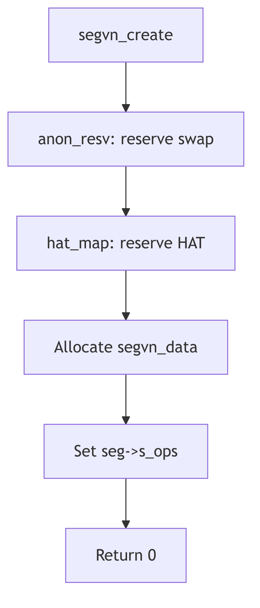

Segment Drivers - VNode

## Overview

The seg_vn driver manages file-backed and anonymous memory segments. It handles executable mappings, shared libraries, mmap'd files, and copy-on-write semantics for fork(). The driver supports both MAP_PRIVATE and MAP_SHARED mappings with flexible backing storage.

## Segvn Data Structure

The `segvn_data` structure (seg_vn.h:79) contains per-segment state:

```c
struct segvn_data {
    mon_t lock;
    u_char pageprot;         /* true if per page protections present */
    u_char prot;             /* current segment prot if pageprot == 0 */
    u_char maxprot;          /* maximum segment protections */
    u_char type;             /* type of sharing done */
    struct vnode *vp;        /* vnode that segment mapping is to */
    u_int offset;            /* starting offset of vnode for mapping */
    u_int anon_index;        /* starting index into anon_map anon array */
    struct anon_map *amp;    /* pointer to anon share structure */
    struct vpage *vpage;     /* per-page information */
    struct cred *cred;       /* mapping credentials */
    u_int swresv;            /* swap space reserved for this segment */
};
```

The `vp` and `offset` fields identify the file backing, while `amp` points to anonymous memory for private pages. The driver can combine file and anonymous backing within a single segment.

## Anon Map Structure

The `anon_map` structure (seg_vn.h:69) manages shared anonymous memory:

```c
struct anon_map {
    u_int refcnt;            /* reference count on this structure */
    u_int size;              /* size in bytes mapped by the anon array */
    struct anon **anon;      /* pointer to an array of anon pointers */
    u_int swresv;            /* swap space reserved for this anon_map */
};
```

Multiple segments can share the same anon_map for System V shared memory. The reference count tracks sharing, and the entire structure is freed when refcnt reaches zero.

## Segment Creation

The `segvn_create()` function (seg_vn.c:157) establishes a new mapping:

```c
int
segvn_create(seg, argsp)
    struct seg *seg;
    _VOID *argsp;
{
    register struct segvn_crargs *a = (struct segvn_crargs *)argsp;
    register struct segvn_data *svd;
    register u_int swresv = 0;

    if (a->type != MAP_PRIVATE && a->type != MAP_SHARED)
        cmn_err(CE_PANIC, "segvn_create type");

    if (a->amp != NULL && a->vp != NULL)
        cmn_err(CE_PANIC, "segvn_create anon_map");

    /* Reserve swap space if needed */
    if ((a->vp == NULL && a->amp == NULL)
      || (a->type == MAP_PRIVATE && (a->prot & PROT_WRITE))) {
        if (anon_resv(seg->s_size) == 0)
            return (EAGAIN);
        swresv = seg->s_size;
    }

    /* Reserve HAT resources */
    error = hat_map(seg, a->vp, a->offset & PAGEMASK,
            a->prot & ~PROT_WRITE, HAT_PRELOAD);
    if (error != 0) {
        if (swresv != 0)
            anon_unresv(swresv);
        return(error);
    }
```

The function first validates arguments, then reserves swap space for potentially private pages. HAT resources are reserved with initial protections disabling write access to force protection faults for lazy allocation.

## Segment Concatenation

Seg_vn attempts to merge adjacent segments with compatible properties (seg_vn.c:237):

```c
if ((seg->s_prev != seg) && (a->amp == NULL) && (seg->s_as != &kas)) {
    register struct seg *pseg, *nseg;

    pseg = seg->s_prev;
    if (pseg->s_base + pseg->s_size == seg->s_base &&
        pseg->s_ops == &segvn_ops &&
        segvn_extend_prev(pseg, seg, a, swresv) == 0) {
        /* success! now try to concatenate with following seg */
        crfree(cred);
        nseg = pseg->s_next;
        if (nseg != pseg && nseg->s_ops == &segvn_ops &&
            pseg->s_base + pseg->s_size == nseg->s_base)
            (void) segvn_concat(pseg, nseg);
        return (0);
    }
```

Concatenation reduces address space fragmentation and improves efficiency by merging segments with the same vnode, protections, and mapping type.

## Operations Vector

The seg_vn driver provides a complete operations vector (seg_vn.c:91):

```c
struct seg_ops segvn_ops = {
    segvn_dup,
    segvn_unmap,
    segvn_free,
    segvn_fault,
    segvn_faulta,
    segvn_unload,
    segvn_setprot,
    segvn_checkprot,
    segvn_kluster,
    segvn_swapout,
    segvn_sync,
    segvn_incore,
    segvn_lockop,
    segvn_getprot,
    segvn_getoffset,
    segvn_gettype,
    segvn_getvp,
};
```

The `segvn_fault` operation handles page faults by reading from the vnode or allocating anonymous pages. The `segvn_dup` operation implements copy-on-write for fork() by sharing the anon_map and marking pages read-only.



