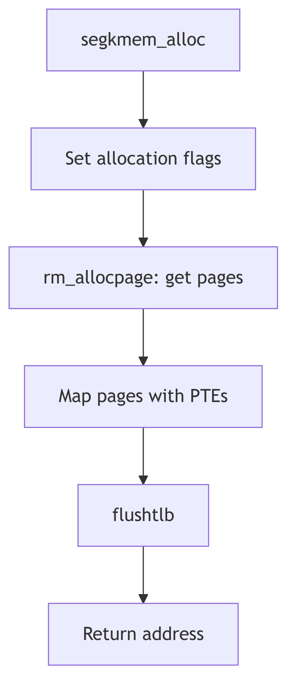

Segment Drivers - Kernel Memory

## Overview

The seg_kmem driver manages kernel virtual address space segments. Unlike user segments, kernel segments directly manipulate page table entries and do not use the standard fault mechanism. The driver provides explicit allocation and deallocation of physical pages for kernel use.

## Kernel Segments

SVR4 defines several global kernel segments (seg_kmem.c:110):

```c
struct seg ktextseg;        /* kernel text segment */
struct seg kvseg;           /* pageable kernel virtual memory */
struct seg kpseg;           /* non-pageable kernel memory */
struct seg kpioseg;         /* kernel programmed I/O area */
struct seg kdvmaseg;        /* DMA-able memory segment */
```

Each segment serves a specific purpose in the kernel address space. The `kvseg` segment holds pageable kernel data, while `kpseg` contains permanently wired pages.

## Operations Vector

The seg_kmem operations vector (seg_kmem.c:116) differs significantly from user segment drivers:

```c
struct seg_ops segkmem_ops = {
    (int(*)())segkmem_badop,        /* dup */
    (int(*)())segkmem_badop,        /* split */
    (void(*)())segkmem_badop,       /* free */
    segkmem_fault,
    segkmem_faulta,
    segkmem_unload,
    segkmem_setprot,
    segkmem_checkprot,
    (int(*)())segkmem_badop,        /* kluster */
    (u_int (*)())segkmem_badop,     /* swapout */
    (int(*)())segkmem_badop,        /* sync */
    (int(*)())segkmem_badop,        /* incore */
    (int(*)())segkmem_badop,        /* lockop */
    segkmem_getprot,
    segkmem_getoffset,
    segkmem_gettype,
    segkmem_getvp,
};
```

Many operations are set to `segkmem_badop`, which panics if called. Kernel segments do not support duplication (fork), splitting, or swapping since these operations are meaningless for kernel memory.

## Segment Creation

The `segkmem_create()` function (seg_kmem.c:142) performs minimal initialization:

```c
int
segkmem_create(seg, argsp)
    struct seg *seg;
    caddr_t argsp;
{
    /* No need to notify the hat layer, since the SDT's are
     * already allocated for seg_kmem; i.e. no need to call
     * hat_map().
     */

    seg->s_ops = &segkmem_ops;
    seg->s_data = seg->s_base;    /* must be set to something */

    return (0);
}
```

Unlike user segments, no HAT reservation is needed since kernel page tables are pre-allocated at boot time.

## Physical Page Allocation

The `segkmem_alloc()` function (seg_kmem.c:356) allocates and maps physical pages:

```c
STATIC int
segkmem_alloc(seg, addr, len, flag)
    struct seg *seg;
    addr_t addr;
    u_int len;
    int flag;
{
    page_t *pp;
    register pte_t *ppte;
    pte_t tpte;
    int flg;

    tpte.pg_pte = PG_V;
    ASSERT(seg->s_as == &kas);

    flg = ((flag & NOSLEEP) ? P_NOSLEEP : P_CANWAIT);
    if (!(flag & KM_NO_DMA))
        flg |= P_DMA;
    flg |= P_NORESOURCELIM;

    pp = rm_allocpage(seg, addr, len, flg);

    if (pp != (page_t *)NULL) {
        ppte = svtopte(addr);
        while (pp != (page_t *)NULL) {
            ASSERT(!PG_ISVALID(ppte));
            tpte.pgm.pg_pfn = page_pptonum(pp);
            page_sub(&pp, pp);
            *ppte++ = tpte;
            addr += PAGESIZE;
            if (((ulong)ppte & PTMASK) == 0) {
                ppte = svtopte(addr);
            }
        }
        flushtlb();
        return (1);
    }
    return (0);
}
```

The function obtains physical pages from the resource manager, then directly writes page table entries using `svtopte()` to translate virtual addresses to PTE pointers. The TLB is flushed after establishing mappings.

## Page Deallocation

The `segkmem_free()` function (seg_kmem.c:438) reverses the allocation process:

```c
STATIC void
segkmem_free(seg, addr, len)
    register struct seg *seg;
    addr_t addr;
    u_int len;
{
    page_t *pp;
    register pte_t *ppte;
    pte_t tpte;

    ASSERT(seg->s_ops == &segkmem_ops);
    ppte = svtopte(addr);

    for (; (int)len > 0; len -= PAGESIZE, addr += PAGESIZE) {
        tpte = *ppte;
        ASSERT(PG_ISVALID(ppte));

        (ppte++)->pg_pte = 0;

        pp = page_numtookpp(tpte.pgm.pg_pfn);
```

The function clears page table entries and returns physical pages to the free pool. No HAT layer involvement is required since seg_kmem bypasses the normal HAT interface.

## Protection Management

The `segkmem_setprot()` function (seg_kmem.c:196) modifies page protections by directly updating PTEs. This low-level approach provides maximum efficiency for kernel operations while avoiding the overhead of the normal segment driver protection mechanisms.



