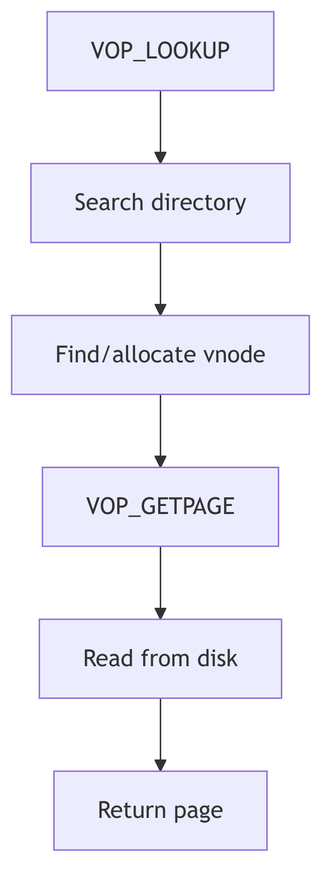

VNode Interface

## Overview

The vnode (virtual node) represents an active file in the system. Vnodes abstract file system implementation details, providing a uniform interface for file operations regardless of the underlying file system type. Each vnode contains function pointers for file-specific operations.

## Vnode Structure

The vnode structure (vnode.h:62) represents a file object:

```c
typedef struct vnode {
    u_short v_flag;                  /* vnode flags */
    u_short v_count;                 /* reference count */
    struct vfs *v_vfsmountedhere;    /* ptr to vfs mounted here */
    struct vnodeops *v_op;           /* vnode operations */
    struct vfs *v_vfsp;              /* ptr to containing VFS */
    struct stdata *v_stream;         /* associated stream */
    struct page *v_pages;            /* vnode pages list */
    enum vtype v_type;               /* vnode type */
    dev_t v_rdev;                    /* device (VCHR, VBLK) */
    caddr_t v_data;                  /* private data for fs */
    struct filock *v_filocks;        /* ptr to filock list */
} vnode_t;
```

The `v_count` field tracks active references. The `v_vfsp` points to the containing file system. The `v_data` field holds filesystem-specific inode data. The `v_pages` field links pages cached for this file.

## Vnode Types

The vtype enumeration (vnode.h:50) classifies vnodes:

```c
typedef enum vtype {
    VNON  = 0,    /* no type */
    VREG  = 1,    /* regular file */
    VDIR  = 2,    /* directory */
    VBLK  = 3,    /* block device */
    VCHR  = 4,    /* character device */
    VLNK  = 5,    /* symbolic link */
    VFIFO = 6,    /* FIFO */
    VXNAM = 7,    /* XENIX named file */
    VBAD  = 8     /* bad vnode */
} vtype_t;
```

The type determines which operations are valid and affects permission checking and system call behavior.

## Vnode Operations

The vnodeops structure (vnode.h:93) defines file operations:

```c
typedef struct vnodeops {
    int (*vop_open)();
    int (*vop_close)();
    int (*vop_read)();
    int (*vop_write)();
    int (*vop_ioctl)();
    int (*vop_setfl)();
    int (*vop_getattr)();
    int (*vop_setattr)();
    int (*vop_access)();
    int (*vop_lookup)();
    int (*vop_create)();
    int (*vop_remove)();
    int (*vop_link)();
    int (*vop_rename)();
    int (*vop_mkdir)();
    int (*vop_rmdir)();
    int (*vop_readdir)();
    int (*vop_symlink)();
    int (*vop_readlink)();
    int (*vop_fsync)();
    void (*vop_inactive)();
    int (*vop_fid)();
    void (*vop_rwlock)();
    void (*vop_rwunlock)();
    int (*vop_seek)();
    int (*vop_cmp)();
    int (*vop_frlock)();
    int (*vop_space)();
    int (*vop_realvp)();
    int (*vop_getpage)();
    int (*vop_putpage)();
    int (*vop_map)();
    int (*vop_addmap)();
    int (*vop_delmap)();
    int (*vop_poll)();
    int (*vop_dump)();
    int (*vop_pathconf)();
    int (*vop_allocstore)();
} vnodeops_t;
```

Operations are invoked through macros like `VOP_READ(vp, uiop, iof, cr)` which indirect through the v_op pointer.

## Key Operations

**VOP_LOOKUP**: Searches a directory for a named entry, returning the vnode for the found file. This is the foundation of pathname resolution.

**VOP_GETPAGE/VOP_PUTPAGE**: Handle page faults and pageout for memory-mapped files. These operations coordinate with the VM system to provide file-backed memory.

**VOP_RWLOCK/VOP_RWUNLOCK**: Provide reader/writer locking for the vnode to serialize concurrent access during operations like read, write, and truncate.

**VOP_INACTIVE**: Called when the reference count reaches zero. The file system can release resources, though the vnode itself may be cached.

## Vnode Flags

Vnode flags (vnode.h:80) control behavior:

```c
#define VROOT     0x01    /* root of its file system */
#define VNOMAP    0x04    /* file cannot be mapped/faulted */
#define VDUP      0x08    /* file should be dup'ed rather than opened */
#define VNOMOUNT  0x20    /* file cannot be covered by mount */
#define VNOSWAP   0x10    /* file cannot be used as virtual swap device */
#define VISSWAP   0x40    /* vnode is part of virtual swap device */
```

The VROOT flag marks file system root vnodes. VNOMAP prevents memory mapping for special files.

## Reference Counting

The `VN_HOLD(vp)` macro increments v_count, while `VN_RELE(vp)` decrements it. When the count reaches zero, `VOP_INACTIVE()` is invoked. This allows the system to cache inactive vnodes while ensuring cleanup when no longer needed.



