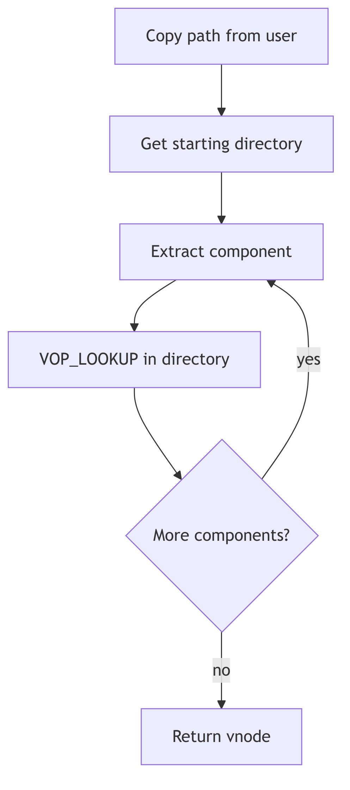

Pathname Resolution

## Overview

Pathname resolution translates textual path names into vnodes. The process handles multiple pathname components, mount points, symbolic links, and permission checking. The central function `lookuppn()` iterates through path components, invoking `VOP_LOOKUP()` on each directory.

## Pathname Structure

The pathname structure (pathname.h) maintains state during lookup:

```c
struct pathname {
    char *pn_buf;        /* underlying storage */
    char *pn_path;       /* remaining pathname */
    uint pn_pathlen;     /* remaining length */
};
```

The `pn_path` pointer advances through the path as components are consumed. The `pn_get()` function copies the path from user space, while `pn_free()` releases the buffer.

## Lookupname Function

The `lookupname()` function (lookup.c:56) provides the high-level interface:

```c
int
lookupname(fnamep, seg, followlink, dirvpp, compvpp)
    char *fnamep;                /* user pathname */
    enum uio_seg seg;            /* addr space that name is in */
    enum symfollow followlink;   /* follow sym links */
    vnode_t **dirvpp;            /* ret for ptr to parent dir vnode */
    vnode_t **compvpp;           /* ret for ptr to component vnode */
{
    struct pathname lookpn;
    register int error;

    if (error = pn_get(fnamep, seg, &lookpn))
        return error;
    error = lookuppn(&lookpn, followlink, dirvpp, compvpp);
    pn_free(&lookpn);
    return error;
}
```

The function allocates a pathname buffer, calls `lookuppn()` to perform the lookup, then frees the buffer. It returns both the target vnode and its parent directory.

## Lookuppn Function

The `lookuppn()` function (lookup.c:84) implements the core algorithm:

```c
int
lookuppn(pnp, followlink, dirvpp, compvpp)
    register struct pathname *pnp;
    enum symfollow followlink;
    vnode_t **dirvpp;
    vnode_t **compvpp;
{
    register vnode_t *vp;    /* current directory vp */
    register vnode_t *cvp;   /* current component vp */
    vnode_t *tvp;
    char component[MAXNAMELEN];
    register int error;
    register int nlink;

    sysinfo.namei++;
    nlink = 0;
    cvp = NULL;
```

The function iterates through path components, calling `VOP_LOOKUP()` on each directory vnode. It handles special cases for "." and "..", checks permissions, and follows mount points.

## Component Iteration

The lookup loop extracts one component at a time:

1. Call `pn_getcomponent()` to extract the next component name
2. Check for "." (current directory) and ".." (parent directory)
3. Call `VOP_LOOKUP()` on the current directory vnode
4. Check if the result is a mount point and follow it if needed
5. Check if the result is a symbolic link and follow it if requested
6. Make the result vnode the new current directory
7. Repeat until the path is exhausted

## Mount Point Traversal

When a lookup returns a vnode with `v_vfsmountedhere` set, the system crosses into the mounted file system:

```c
if (vp->v_vfsmountedhere != NULL) {
    VFS_ROOT(vp->v_vfsmountedhere, &tvp);
    VN_RELE(vp);
    vp = tvp;
}
```

The `VFS_ROOT()` operation obtains the root vnode of the mounted file system, replacing the mount point vnode.

## Symbolic Link Handling

When a symbolic link is encountered and `followlink` is set, the system reads the link target and restarts the lookup from that path. A `nlink` counter prevents infinite loops through circular symbolic links.

## Permission Checking

At each step, `VOP_ACCESS()` verifies that the process has execute permission on the directory being searched. This ensures that users cannot traverse directories they lack permission to access, even if they know the names of files within.

## Directory Name Lookup Cache

To optimize repeated lookups, the DNLC caches successful directory lookups. Before calling `VOP_LOOKUP()`, the system checks the cache. Cache hits avoid expensive directory searches and disk I/O.



