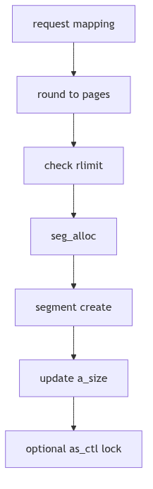
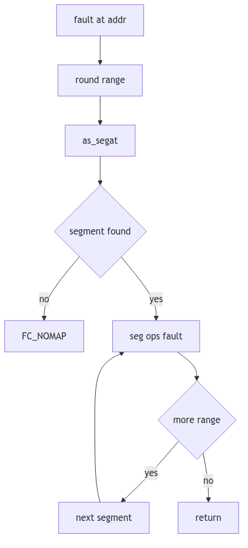

# Address Space: The Estate Ledger and the Surveyor

Imagine a grand estate with rolling fields, stone walls, and a patient surveyor who keeps the official ledger. Each parcel has a boundary, a purpose, and a steward. Some parcels are orchards, others are quarries, and a few are common grounds shared by the town. The ledger does not grow crops; it records where they may grow. The surveyor does not haul stone; he marks where the quarry begins and ends.

SVR4's address space is that estate ledger. It records every mapped range of virtual memory, keeps the parcels in order, and hands each range to the steward responsible for its behavior. The kernel's surveyor is the `struct as`, and its parcels are segments.

<br/>

## The Estate Ledger: `struct as`

The address space definition lives in `vm/as.h` (vm/as.h:45-63). It is a compact record that ties segments to a hardware translation layer and tracks the size of the estate.

```c
struct as {
    u_int   a_lock: 1;
    u_int   a_want: 1;
    u_int   a_paglck: 1;
    u_int   : 13;
    u_short a_keepcnt;  /* number of `keeps' */
    struct  seg *a_segs;    /* segments in this address space */
    struct  seg *a_seglast; /* last segment hit on the address space */
    size_t  a_size;     /* size of address space */
    size_t  a_rss;      /* memory claim for this address space */
    struct  hat a_hat;  /* hardware address translation */
};
```
**The Estate Ledger Structure** (vm/as.h:52-63)

Key details:
- **`a_segs`** is a circular, sorted list of segments.
- **`a_seglast`** is a locality hint: the last segment hit by a lookup.
- **`a_hat`** embeds the hardware address translation state for this space.

The comment in `as.h` makes the division of labor explicit: "All the hard work is in the segment drivers and the hardware address translation code" (vm/as.h:46-50). The ledger tracks the parcels; the stewards do the work.


**Figure 2.1.1: A Process Address Space as an Estate**

<br/>


**Address Space - Kingdom Provinces**

## Establishing a Parcel: `as_map()`

When the kernel maps a new range, it calls `as_map()` in `vm_as.c`. The function rounds the range to page boundaries, checks resource limits, allocates a segment, and invokes the segment driver's create routine (vm/vm_as.c:504-551).

```c
int
as_map(as, addr, size, crfp, argsp)
    struct as *as;
    addr_t addr;
    u_int size;
    int (*crfp)();
    caddr_t argsp;
{
    register struct seg *seg;
    register addr_t raddr;
    register u_int rsize;
    int error;

    raddr = (addr_t)((u_int)addr & PAGEMASK);
    rsize = (((u_int)(addr + size) + PAGEOFFSET) & PAGEMASK) - (u_int)raddr;

    if (as->a_size + rsize > u.u_rlimit[RLIMIT_VMEM].rlim_cur)
        return (ENOMEM);

    seg = seg_alloc(as, addr, size);
    if (seg == NULL)
        return (ENOMEM);

    as->a_seglast = seg;
    error = (*crfp)(seg, argsp);
    if (error != 0) {
        seg_free(seg);
    } else {
        as->a_size += rsize;
        if (as->a_paglck) {
            error = as_ctl(as, addr, size, MC_LOCK, 0,
                (caddr_t)NULL, (ulong *)NULL, (size_t)NULL);
            if (error != 0)
                (void) as_unmap(as, addr, size);
        }
    }
    return (error);
}
```
**The Parcel Grant** (vm/vm_as.c:504-551, abridged)

The key idea: `as_map()` does not know what kind of segment it is creating. It calls a creation function pointer (`crfp`), allowing vnode-backed, anonymous, or device segments to establish their own rules.


**Figure 2.1.2: Mapping a New Parcel**

<br/>

## Duplication by Survey: `as_dup()`

During `fork()`, the child receives a copy of the parent's address space. `as_dup()` allocates a new `as`, walks the segment list, and asks each segment driver to duplicate itself (vm/vm_as.c:134-172).

```c
newas = as_alloc();
seg = as->a_segs;
if (seg != NULL) {
    do {
        newseg = seg_alloc(newas, seg->s_base, seg->s_size);
        if (newseg == NULL) {
            as_free(newas);
            return (NULL);
        }
        if ((*seg->s_ops->dup)(seg, newseg) != 0) {
            seg_free(newseg);
            as_free(newas);
            return (NULL);
        }
        newas->a_size += seg->s_size;
        seg = seg->s_next;
    } while (seg != sseg);
}
if (hat_dup(as, newas) != 0) {
    as_free(newas);
    return (NULL);
}
```
**The Surveyor's Copy** (vm/vm_as.c:134-169, abridged)

Here, the segment driver decides whether to copy or share pages. Copy-on-write is implemented in those segment drivers, not in the address space itself. The ledger merely requests a duplicate.

<br/>

## Faults and Boundaries: `as_fault()`

Page faults are resolved by walking the segment list and delegating to the segment's fault handler. `as_fault()` computes a rounded range, finds the first segment, then calls `seg->s_ops->fault` on each subrange (vm/vm_as.c:224-307).

```c
seg = as_segat(as, raddr);
if (seg == NULL)
    return (FC_NOMAP);

res = (*seg->s_ops->fault)(seg, raddr, ssize, type, rw);
```
**The Boundary Dispute** (vm/vm_as.c:257-278, abridged)

If a soft-lock fails partway through, `as_fault()` revisits the already-locked pages and unlocks them with `F_SOFTUNLOCK` (vm/vm_as.c:285-304). The surveyor refuses to leave the ledger half-updated.


**Figure 2.1.3: Fault Resolution Across Segments**

<br/>

## Keeping Order: `as_addseg()`

Segments are stored in a sorted, circular list. `as_addseg()` inserts a new segment in address order, rejecting overlaps (vm/vm_as.c:178-217). This ensures the estate ledger remains strictly ordered and non-overlapping.

The sorting rule is simple: each new parcel must fit between existing ones without touching their boundaries. Overlaps return `-1`, a clear signal that the requested mapping is illegal.

<br/>

> **The Ghost of SVR4:** We kept our estates in a sorted ring and asked each steward to resolve faults and duplicates. Modern kernels still keep per-process maps, but they have sprouted red-black trees, VMA caches, and speculative faults. The surveyor's ledger has evolved into a faster, more complex registry, yet the idea is unchanged: name each parcel, enforce its boundaries, and ask the right steward when something goes wrong.

<br/>

## The Ledger Closes

An address space is a map, not a machine. It remembers segments, sizes, and translation state, and it delegates the real work to its stewards. SVR4's design keeps the ledger small and the rules clear: map, duplicate, fault, unmap. The surveyor's hand is steady, and the estate remains ordered.
