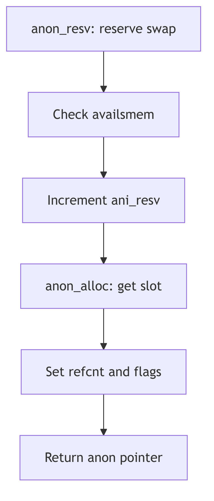

Anonymous Memory


**Anonymous Memory - Lost and Found**

## Overview

The anonymous memory layer manages physical pages that have no permanent identity in the file system. This includes stack pages, heap allocations, and copy-on-write pages created during fork(). Anonymous pages use swap space for backing storage and are discarded when all references are removed.

## Anon Structure

The core data structure is the `anon` struct defined in anon.h:

```c
struct anon {
    int an_refcnt;
    union {
        struct page *an_page;    /* hint to the real page */
        struct anon *an_next;    /* free list pointer */
    } un;
    struct anon *an_bap;         /* pointer to real anon */
    short an_flag;               /* ALOCKED, AWANT */
    short an_use;                /* for debugging */
};
```

The reference count enables copy-on-write optimization after fork(). When multiple processes share the same physical page, the `an_refcnt` tracks how many references exist. The `an_page` field provides a hint to locate the page without hash table lookup.

## Reservation and Allocation

Anonymous memory requires explicit reservation before use. The `anon_resv()` function (vm_anon.c:124) checks available swap space:

```c
int
anon_resv(size)
    u_int size;
{
    register int pages = btopr(size);

    if (availsmem - pages < tune.t_minasmem) {
        nomemmsg("anon_resv", pages, 0, 0);
        return 0;
    }

    if (anoninfo.ani_resv + pages > anoninfo.ani_max) {
        return 0;
    }
    anoninfo.ani_resv += pages;
    availsmem -= pages;
    return (1);
}
```

Reservation ensures the system won't over-commit swap space. The `anoninfo` structure tracks maximum, free, and reserved anonymous pages globally.

## Anon Allocation

The `anon_alloc()` function (vm_anon.c:161) allocates an anon slot:

```c
struct anon *
anon_alloc()
{
    register struct anon *ap;

    mon_enter(&anon_lock);
    ap = swap_alloc();
    if (ap != NULL) {
        anoninfo.ani_free--;
        ap->an_refcnt = 1;
        ap->un.an_page = NULL;
        ap->an_flag = ALOCKED;
    }
    mon_exit(&anon_lock);
    return (ap);
}
```

The function delegates to `swap_alloc()` to obtain an anon structure from the swap layer. Initial reference count is 1, and the slot is locked to prevent concurrent access.

## Reference Counting

The `anon_decref()` function (vm_anon.c:208) handles reference count decrements:

```c
STATIC void
anon_decref(ap)
    register struct anon *ap;
{
    register page_t *pp;
    struct vnode *vp;
    u_int off;

    if (ap->an_refcnt == 1) {
        swap_xlate(ap, &vp, &off);
        pp = page_find(vp, off);

        if (pp != NULL) {
            if (pp->p_intrans == 0)
                page_abort(pp);
        }
        ap->an_refcnt--;
        mon_enter(&anon_lock);
        swap_free(ap);
        anoninfo.ani_free++;
        mon_exit(&anon_lock);
    } else {
        ap->an_refcnt--;
    }
}
```

When the reference count reaches zero, the function frees the associated page and returns the anon slot to the swap layer. The `page_abort()` call removes the vnode association and returns the page to the free list.

## Copy-on-Write Optimization

Anonymous memory provides critical support for efficient fork() through copy-on-write. When a process forks, child and parent initially share the same physical pages with incremented reference counts. Only when one process writes to a shared page does the system create a private copy. This optimization significantly reduces fork() overhead and memory consumption.



