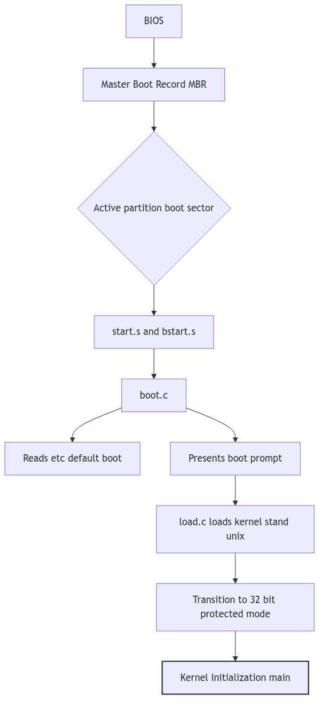
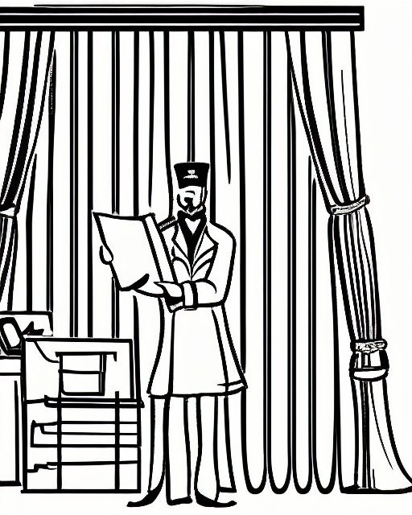

# The Boot Process

## Overview: The Great Engine's Ignition

The booting of an operating system is the Great Engine's Ignition, a carefully choreographed sequence of events that brings the complex machinery of the kernel to life. It is a process that begins with a single spark from the hardware and culminates in the thunderous roar of a fully operational system, ready to serve its users. In SVR4, this ignition sequence is a multi-stage affair, a journey from the primitive 16-bit real mode of the i386 processor to the sophisticated 32-bit protected mode environment in which the kernel proper resides.

## The First Spark: The BIOS and the Boot Block

The ignition sequence begins with the BIOS (Basic Input/Output System), the firmware that is embedded in the machine's motherboard. When the machine is powered on, the BIOS performs a series of power-on self-tests (POST) and then, following a configured boot order, it reads the first 512 bytes from the boot device (usually a hard disk). This first sector is the Master Boot Record (MBR).

The MBR contains a small amount of code and a partition table. The MBR code's job is to find the active partition, load its first sector (the boot block), and transfer control to it. This is the first spark, the handoff from the hardware's firmware to the operating system's own boot code. The initial assembly code for this process is found in `start.s`.

## The Bootstrap Loader: `boot.c`

The code in the boot block is a simple, 16-bit real-mode program whose sole purpose is to load a larger, more sophisticated bootloader from the filesystem. This is the second stage of the boot process, and its main C program is `boot.c`.

The `boot.c` program is responsible for:

*   **Initializing the hardware**: It queries the BIOS for information about the machine's memory size and hard disk geometry.
*   **Reading the defaults file**: It reads the `/etc/default/boot` file to determine the default kernel to load and other boot-time parameters.
*   **The boot prompt**: It presents the user with a boot prompt, allowing them to override the defaults and specify a different kernel or set of options.
*   **Loading the kernel**: It calls the `bload` function in `load.c` to load the kernel into memory.

## Loading the Kernel: `load.c`

The `load.c` program contains the logic for reading the kernel image (usually `/stand/unix`) from the disk and placing it in memory. It understands the format of the executable file (either COFF or ELF in SVR4) and can parse its headers to determine how to load its various sections (text, data, and bss) into memory.

## The Final Ignition: The Transition to Protected Mode

Once the kernel is loaded into memory, the bootloader's final task is to transfer control to it. This is a critical and delicate moment, the final ignition sequence that brings the great engine to life. The `bstart` function, called from `boot.c`, is responsible for this final step. It performs the following actions:

1.  **Sets up the bootinfo structure**: It populates a `bootinfo` structure in a well-known location in low memory, passing information about the memory layout, disk parameters, and other boot-time information to the kernel.
2.  **Enters protected mode**: It switches the i386 processor from 16-bit real mode to 32-bit protected mode, a critical step that allows the kernel to access the full range of the machine's memory and to take advantage of its memory protection features.
3.  **Jumps to the kernel entry point**: Finally, it performs a long jump to the kernel's entry point, the `main` function in the kernel's own code. At this point, the bootloader's job is done, and the kernel is in control.

**Figure 5.1.1: The SVR4 Boot Sequence**

 

> **The Ghost of SVR4:**
>
> "Our ignition sequence was a marvel of minimalist engineering, a carefully crafted chain of small programs, each one handing off to the next, to pull the kernel up by its own bootstraps. But it was a system built on trust. The BIOS trusted the MBR, the MBR trusted the boot block, and the bootloader trusted the kernel. There were no digital signatures, no secure enclaves, no cryptographic handshakes. In your time, you have built fortresses around this process. Your UEFI (Unified Extensible Firmware Interface) and its 'Secure Boot' protocol are a response to a world of threats we could scarcely have imagined. Your bootloaders are signed and verified, your kernels are measured and attested. You have traded the simple elegance of our ignition sequence for the complex, but necessary, security of a world where the very foundations of the system are under constant attack."

**Boot Process - Theater Opening Night**

## Conclusion

The boot process is the critical, and often unseen, foundation upon which the entire operating system is built. It is the Great Engine's Ignition, the carefully choreographed sequence of events that transforms a dormant piece of hardware into a living, breathing system. The SVR4 boot process, with its multi-stage loader and its transition from the simple world of the BIOS to the sophisticated world of the protected-mode kernel, is a classic example of this process, a testament to the ingenuity of the engineers who first brought these great engines to life.