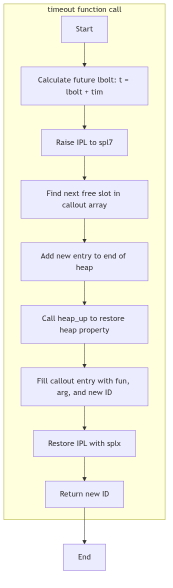

# Clock and Timer Management: The Keeper of the Great Clock

At the very center of the kernel-city stands a great clock tower. It does not merely tell time; it is the source of the city's pulse, the regular, rhythmic heartbeat that governs the pace of all activity. From this tower, a chime echoes at a constant, unwavering frequency. This chime—the **clock interrupt**—is the fundamental unit of time for the kernel, the metronome against which all process scheduling, time-slicing, and delays are measured.

The keeper of this clock is a sleepless entity, an interrupt handler that, upon every chime, rouses itself to perform the system's most essential temporal duties. It increments the system's notion of uptime, decrements the time slices of running processes, and, most importantly, consults a great bulletin board affixed to the tower's base. This board lists notices of tasks to be performed at specific future times. It is this mechanism, the `callout` table, that allows the kernel to remind itself to perform an action not now, but at some precise moment in the future.

<br/>

## The Heartbeat: `clkstart()` and the Clock Interrupt

Before the city can truly awaken, its heart must begin to beat. This is the responsibility of the `clkstart()` function, called from `main()` during the system's initialization. Its job is to program the machine's hardware—the Programmable Interval Timer (PIT)—to begin generating interrupts at a fixed frequency, typically 100 times per second (100 Hz).

**Winding the Great Clock** (ml/pit.c:54):
```c
clkstart()
{
	unsigned int	flags;
	unsigned char	byte;

	/* ... hardware-specific calculations ... */

	intr_disable();         /* disable interrupts */
	/* We use only timer 0, so we program that. */
	outb(pitctl_port, pit0_mode);
	byte = clknumb;
	outb(pitctr0_port, byte);
	byte = clknumb>>8;
	outb(pitctr0_port, byte); 

	/* ... initialize high-resolution timer variables ... */

	intr_restore();         /* restore interrupt state */
}
```
Once `clkstart()` has run, the hardware is armed. At every tick (e.g., every 10 milliseconds), it sends an electrical signal to the processor, triggering an interrupt. The processor immediately stops its current activity, saves its state, and jumps to the `clock()` function in `os/clock.c`, the interrupt service routine.

This `clock()` function is the tireless keeper of time. On every invocation, it:
-   Increments the global `lbolt` counter, a variable that tracks the number of ticks since the system booted.
-   Updates the user and system time accounting for the currently running process.
-   Checks if any process's alarm timer (`p_clktim`) has expired and, if so, posts a `SIGALRM` signal.
-   Decrements the time slice of the current process, marking it for rescheduling if its quantum is exhausted.
-   Crucially, it checks if any notices posted on the time-ordered bulletin board are now due.

<br/>


**Clock and Timers - City Clock Tower**

## The Bulletin Board: The `callout` Table

Affixed to the base of the clock tower is a public bulletin board where any part of the kernel can post a notice for a future action. This is the **`callout` table**, a simple array of `callo` structures defined in `sys/callo.h`.

**A Notice for Future Action** (sys/callo.h:17):
```c
struct	callo
{
	int	c_time;		/* incremental time */
	int	c_id;		/* timeout id */
	caddr_t	c_arg;		/* argument to routine */
	void	(*c_func)();	/* routine */
};
extern	struct	callo	callout[];
```

Each `callo` entry, or "notice," contains the four elements needed for a delayed function call:
-   **`c_time`**: The absolute `lbolt` value at which the function should be executed.
-   **`c_func`**: A pointer to the function that is to be called.
-   **`c_arg`**: The argument to be passed to that function.
-   **`c_id`**: A unique identifier for this specific request, so that it might be cancelled before it occurs.

The `callout` array is managed as a **heap**, a data structure that allows for very efficient retrieval of the entry with the smallest `c_time`. This means the notice that is due to expire soonest is always at the very top of the heap (at `callout[0]`), allowing the `clock()` function to check for due notices with extreme efficiency. It need only look at the first entry; if its time has not yet come, then no other entry's time has come either.

<br/>

## Posting a Notice: `timeout()`

When a driver or subsystem needs to schedule an action for the future—for instance, to check for a response from a slow device in half a second—it uses the `timeout()` function.

**Pinning a Notice to the Board** (os/clock.c:380):
```c
int
timeout(fun, arg, tim)
	void (*fun)();
	caddr_t arg;
	long tim;
{
	register struct	callo	*p1;
	register int	j;
	int	t;
	int	id;
	int	s;

	t = lbolt + tim;		/* absolute time in the future */

	s = spl7();

	if ((j = calllimit + 1) == v.v_call)
		cmn_err(CE_PANIC,"Timeout table overflow");

	/* Add the new entry and then restore the heap property. */
	calllimit = j;
	j = heap_up(t, j);

	p1		= &callout[j];
	p1->c_time	= t;
	p1->c_func	= fun;
	p1->c_arg	= arg;
	p1->c_id	= id = ++timeid;

	splx(s);
	return id;
}
```
The `timeout` function's procedure is straightforward:
1.  It calculates the absolute time `t` in the future when the function should run by adding the requested delay `tim` to the current `lbolt`.
2.  It raises the interrupt priority level (`spl7()`) to ensure the `callout` table is not modified by an interrupt while it is being manipulated.
3.  It finds the next available slot in the `callout` array.
4.  It calls `heap_up()` to take this new notice and percolate it up the heap until it finds its correct, time-ordered position.
5.  It fills in the function pointer, argument, and unique ID, and returns the ID to the caller.

This ID can later be passed to `untimeout()` to find and remove the notice from the board before it has a chance to execute, cancelling the pending action.


**Figure 5.8.1: Simplified Flowchart for `timeout()` Function**

---

> #### **The Ghost of SVR4: The Humble Heap**
>
> In my day, the `callout` table, organized as a heap, was a perfectly serviceable mechanism. With a system-wide `HZ` of 100, we could only schedule events with a granularity of 10 milliseconds, which was more than sufficient for the hardware of the era. The heap structure ensured that adding and removing timers was reasonably efficient, with a cost proportional to the logarithm of the number of pending timeouts—a great improvement over the simple, unsorted array of my ancestors, which had to be scanned linearly on every clock tick!
>
> **Modern Contrast (2026):** The great clock in a 2026 Linux kernel is a far more sophisticated instrument. The simple heap has been replaced by hierarchical **timer wheels**. A timer wheel is an ingenious data structure that groups timers into buckets based on when they are set to expire. Timers due in the very near future are in a "fast" wheel with fine-grained slots; timers due far in the future are in a "slow" wheel with coarse-grained slots. As time progresses, entire buckets of timers from the coarser wheels are "cascaded" down into the finer ones. This allows the kernel to manage hundreds of thousands of pending timers with near-constant-time overhead for insertion, deletion, and expiration checking.
>
> Furthermore, modern systems are no longer bound by a single, slow `HZ`. They support **high-resolution timers (hrtimers)** and a "tickless" or "dynamic tick" kernel. If there are no immediate events to service, the kernel can tell the hardware to stop sending interrupts altogether, allowing the CPU to enter deep sleep states to conserve power. It will then program the clock hardware to fire a single interrupt at the precise nanosecond the very next timer is due to expire. The city's great clock no longer chimes ceaselessly; it has learned to chime only when a notice on the bulletin board is truly ready for action.

---

<br/>

## Conclusion: The City's Pacemaker

The clock and timer mechanisms are the unsung heroes of the operating system, the essential pacemakers that ensure the orderly progression of time and the timely execution of deferred work. The clock interrupt provides the fundamental rhythm, while the `callout` table and its associated `timeout()` function provide a robust and efficient means for any part of the kernel to schedule its own future. Like the great clock tower at the city's heart, this system provides a central, reliable point of temporal coordination, allowing the complex, asynchronous world of a multitasking kernel to function with precision and grace.
