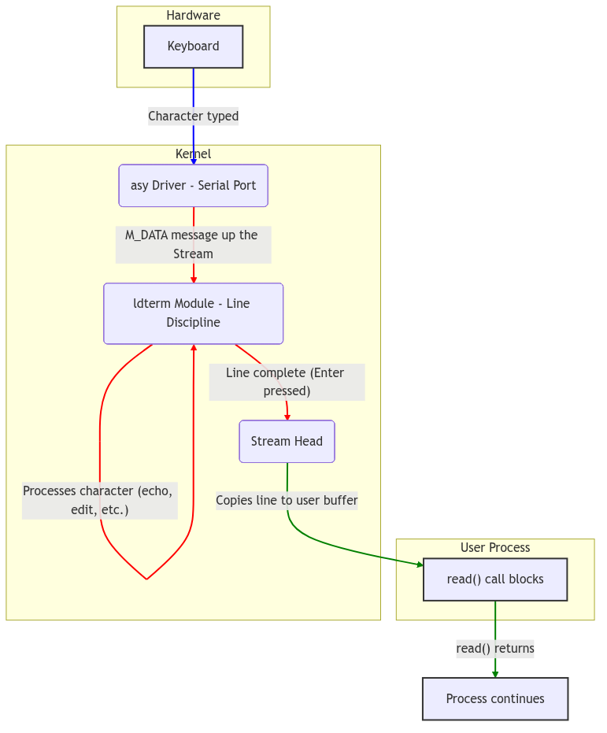

# Console and Terminal I/O: The Telegraph Office

In the bustling kernel-city, communication with the outside world—with the user at their keyboard—is handled by a specialized and highly structured institution: the Telegraph Office. This is not the simple freight depot of the [Block I/O Subsystem](./block-io.md), which deals in large, uniform crates of data. The Telegraph Office deals in the nuanced and often irregular flow of individual characters, the dots and dashes of conversation that must be received, interpreted, formatted, and dispatched with precision. This is the domain of the SVR4 **Terminal I/O Subsystem**.

At its core, this system is a masterclass in the **STREAMS** framework. A terminal is not a single, monolithic driver, but a vertical assembly of message-passing modules, a processing pipeline that transforms raw electrical signals into the polished, line-oriented text that user programs expect. Each keystroke is a telegraphic signal, sent from the hardware up through a series of clerks, each performing a specific duty, until a complete, coherent message is ready for delivery to the application.

<br/>

## The Telegraph Operator: The `asy` Driver

At the lowest level, closest to the hardware, sits the telegraph operator. This is the **asynchronous serial communications driver**, or `asy`. This driver's sole concern is the physical manipulation of the serial port hardware—the UART chip—translating electrical voltages into bytes, and bytes back into voltages. It knows nothing of lines, words, or erase characters; it knows only of data registers, status bits, and interrupts.

The operator's workstation is defined by the `asy` structure, which holds the hardware port addresses for a given serial line.

**The Operator's Workstation** (sys/asy.h:147):
```c
struct asy{
	int		asy_flags;
	unsigned	asy_dat;	/* data register port */
	unsigned	asy_icr;	/* interrupt control register port */
	unsigned	asy_isr;	/* interrupt status register port */
	unsigned	asy_lcr;	/* line control register port */
	unsigned	asy_mcr;	/* modem control register port */
	unsigned	asy_lsr;	/* line status register port */
	unsigned	asy_msr;	/* modem status register port */
	/* ... */
};
```
When a character arrives at the serial port, an interrupt is generated. The `asy` driver's interrupt handler awakens, reads the byte from the `asy_dat` port, packages it into a STREAMS message (`mblk_t`), and sends it "upstream" to the next clerk in the pipeline. It is a simple, mechanical task, performed with speed and no interpretation.

<br/>

## The Formatting Clerk: The `ldterm` Module

The raw bytes sent up from the `asy` operator are not yet fit for consumption by a user application. A user typing "h", "e", "l", "l", "o", "backspace", "p" expects the application to read the line "help". The task of interpreting these raw keystrokes, handling line-editing conventions, processing special characters, and assembling complete lines falls to the formatting clerk: the **line discipline module**, `ldterm`.

`ldterm` is a STREAMS module that is "pushed" on top of the `asy` driver. It intercepts the stream of characters and buffers them, a process known as *canonical processing*. It maintains a complex state machine for each terminal session, defined in `struct ldterm_mod`.

**The Clerk's Ledger** (sys/ldterm.h:50):
```c
typedef struct ldterm_mod {
	mblk_t *t_savbp;		/* Chars saved up for a single message */
	mblk_t *t_echomp;	/* Characters waiting to be echoed */
	int t_msglen;		/* # of chars in saved message */
	long t_state;		/* internal state of ldterm module */
	struct termios t_modes;	/* Current terminal modes */
	unsigned char *t_eucp;	/* Ptr to euc width structure */
	/* ... many other state fields ... */
} ldtermstd_state_t;
```
When `ldterm`'s "put" procedure (`ldtermrput`) receives a data message from the driver, it does not immediately pass it on. Instead, it processes each character according to the terminal's current modes (`t_modes`):
-   If it's a normal character, it is echoed back down the stream (if `ECHO` is set) and added to the line buffer (`t_savbp`).
-   If it's the `ERASE` character (e.g., backspace), `ldterm` removes the previous character from its buffer and sends the appropriate erasure sequence (e.g., backspace-space-backspace) back down to the terminal for display.
-   If it's the `KILL` character, the entire line buffer is cleared.
-   If it's the `EOF` or newline character, the contents of the line buffer are packaged into a single message and finally sent upstream to the stream head, where the user's `read()` call will be satisfied.

This entire formatting service is provided by the `ldterm` module, which is defined by its STREAMS entry points.

**The Line Discipline's `qinit` Structure** (io/ldterm.c:104):
```c
static struct qinit ldtermrinit = {
	ldtermrput,	/* The 'put' procedure for the read-side */
	ldtermrsrv,	/* The 'service' procedure for the read-side */
	ldtermopen,
	ldtermclose,
	NULL,
	&ldtermmiinfo
};

struct streamtab ldterm_info = {
	&ldtermrinit,	/* Read-side processing */
	&ldtermwinit,	/* Write-side processing */
	NULL,
	NULL
};
```

This structure is the key to its identity as a STREAMS module, providing the kernel with the function pointers needed to plumb it into the stream.

<br/>

## Connecting the Office: The STREAMS Pipeline

The true power of this model is how these independent components are connected. When a user opens a terminal device like `/dev/tty01`, the kernel sees that the `asy` driver has a `d_str` pointer in its `cdevsw` entry. This tells the kernel to create a STREAMS pipeline. Initially, the **stream head** (the kernel's interface for the user's `read` and `write` calls) is connected directly to the `asy` driver.

Then, through an `I_PUSH` `ioctl()` call, the `ldterm` module is pushed onto the stream. The kernel re-wires the pointers: the stream head now points to `ldterm`, and `ldterm` points to `asy`. A two-way communication path is formed:
-   **Upstream (Read):** `asy` -> `ldterm` -> Stream Head -> `read()`
-   **Downstream (Write):** `write()` -> Stream Head -> `ldterm` -> `asy`

This modular pipeline allows for immense flexibility. One could, for instance, push a "JSON formatting" module on top of `ldterm` to automatically parse terminal input, or a network module below it to create a remote terminal session, all without modifying the other components.


**Figure 5.10.1: TTY STREAMS Data Flow from Hardware to User Process**

---

> #### **The Ghost of SVR4: The Universal Erector Set**
>
> We saw in STREAMS a universal building block, an Erector Set for I/O. The TTY subsystem was its most perfect expression. We built everything with it. The console, serial ports, network pseudo-terminals for `rlogin` and `telnet`—they were all just different stacks of STREAMS modules. A pseudo-terminal (`ptem`) driver on the bottom, `ldterm` in the middle, and the stream head on top. This modularity was the pinnacle of our design philosophy.
>
> **Modern Contrast (2026):** The Linux kernel, in its relentless pursuit of performance, viewed our elegant Erector Set as cumbersome. The overhead of allocating message blocks for every character, the function call chain to pass them up and down the stream—it was, frankly, slow. For a 9600-baud serial line, this was of no consequence. For a modern gigabit network connection masquerading as a terminal via SSH, it is a significant bottleneck. The modern Linux TTY subsystem, while still supporting the same `termios` interface, is a far more monolithic affair.
>
> The line discipline is no longer a swappable STREAMS module but a tightly integrated set of functions (the `n_tty.c` discipline) compiled directly into the kernel's TTY core. The complex machinery of `mblk_t` messages is replaced by a simpler `tty_buffer` and `flip_buffer` mechanism. While pseudo-terminals still exist, they are a specialized driver, not a generic STREAMS component. The result is a system that is significantly faster for terminal I/O, but which has sacrificed the universal modularity we so prized. The specialized workshops have triumphed over the general-purpose Telegraph Office.

---

<br/>

## Conclusion: From Raw Signals to Polished Lines

The SVR4 console and terminal subsystem is the quintessential example of the power and elegance of the STREAMS architecture. It takes the raw, uninterpreted signals from the hardware and, through a disciplined chain of clerks, transforms them into the structured, line-oriented data that programs expect. The `asy` driver works the wire, and the `ldterm` module works the language.

This separation of concerns—physical transmission from logical formatting—creates a clean, powerful, and extensible system. Like a well-run telegraph office, it ensures that every message is not only received but is also understood, corrected, and properly formatted before it reaches its final destination, providing the seamless conversational interface that is the hallmark of a UNIX system.
