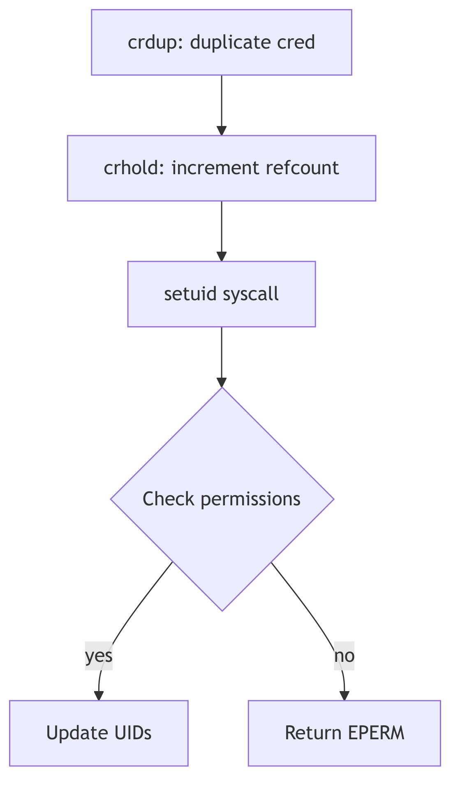
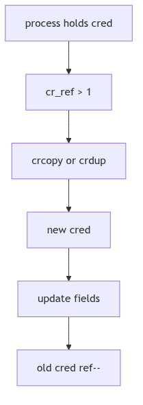
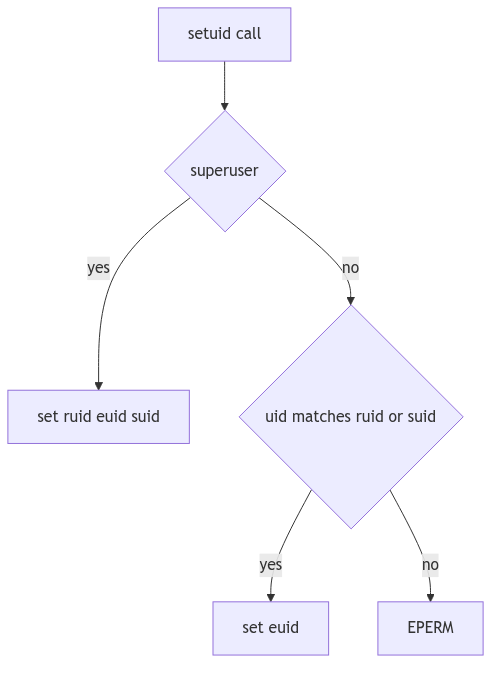

# Credentials and Access Control: The Seals, the Ledger, and the Wax

Imagine a courthouse where every petition bears a wax seal. The seal is not the person, but it carries the person's authority. Clerks do not know the petitioner; they only read the seal. If a seal changes, the clerk must ensure no other parchment was stamped with the old impression.

SVR4's credentials are those seals. The `cred_t` structure encodes user IDs and groups, and the kernel shares and duplicates these seals with strict reference counts to avoid accidental authority leaks.

<br/>

## The Seal: `struct cred`

The credential structure is defined in `sys/cred.h` (sys/cred.h:20-30). It holds effective, real, and saved IDs, as well as supplementary groups.

```c
typedef struct cred {
    ushort cr_ref;      /* reference count */
    ushort cr_ngroups;  /* number of groups in cr_groups */
    uid_t  cr_uid;      /* effective user id */
    gid_t  cr_gid;      /* effective group id */
    uid_t  cr_ruid;     /* real user id */
    gid_t  cr_rgid;     /* real group id */
    uid_t  cr_suid;     /* saved user id */
    gid_t  cr_sgid;     /* saved group id */
    gid_t  cr_groups[1];/* supplementary group list */
} cred_t;
```
**The Seal Structure** (sys/cred.h:20-29)

Two distinctions matter:
- **Effective IDs** (`cr_uid`, `cr_gid`) decide access checks.
- **Real/saved IDs** (`cr_ruid`, `cr_suid`) preserve the original identity and allow privilege drops and restorations.


**Figure 1.7.1: Credentials Shared Across Processes**

<br/>

## Reference Counts and Copy-on-Write

Credentials are shared to reduce memory churn. When a process needs to modify its credentials, it must first obtain a private copy. The core routines live in `os/cred.c`.

```c
struct cred *
crget()
{
    if (crfreelist) {
        cr = &crfreelist->cl_cred;
        crfreelist = ((struct credlist *)cr)->cl_next;
    } else
        cr = (struct cred *)kmem_alloc(crsize, KM_SLEEP);
    struct_zero((caddr_t)cr, sizeof(*cr));
    crhold(cr);
    return cr;
}
```
**The Blank Seal** (os/cred.c:92-109, abridged)

`crdup()` and `crcopy()` both duplicate the seal, but they differ in how they treat the original:
- **`crdup()`** creates a new copy and leaves the old intact (os/cred.c:153-162).
- **`crcopy()`** duplicates and then frees the old one (os/cred.c:137-147).

Reference counts are decremented in `crfree()`; when the count reaches zero the seal is returned to the freelist (os/cred.c:118-129). The courthouse reuses its wax only when no parchments remain.


**Figure 1.7.2: Copy-on-Write and Reference Counting**

<br/>

## The Setuid Ritual

`setuid()` is the classic credential-changing system call. SVR4 enforces the rules in `os/scalls.c` (os/scalls.c:221-264): a non-root process may only switch its effective UID to its real or saved UID, while a superuser may set all three.

```c
if (u.u_cred->cr_uid
  && (uid == u.u_cred->cr_ruid || uid == u.u_cred->cr_suid)) {
    u.u_cred = crcopy(u.u_cred);
    u.u_cred->cr_uid = uid;
} else if (suser(u.u_cred)) {
    u.u_cred = crcopy(u.u_cred);
    u.u_cred->cr_uid = uid;
    u.u_cred->cr_ruid = uid;
    u.u_cred->cr_suid = uid;
} else
    error = EPERM;
```
**The Setuid Decision** (os/scalls.c:244-264, abridged)

The saved UID is the lockbox: a setuid program can drop privileges to the real UID and later regain them by restoring the saved UID, all within the rules of the seal.


**Figure 1.7.3: Switching Identities with `setuid()`**

<br/>

## Superuser Recognition

The `suser()` helper is a simple test with an important side effect: if the effective UID is zero, the kernel sets an accounting flag and returns success (os/cred.c:181-188). This is the courthouse clerk noting that a royal seal was presented.

<br/>

> **The Ghost of SVR4:** Our seals were simple: IDs and groups, reference counted and shared. Modern systems have capabilities, namespaces, and per-thread credentials, but the same rule remains. Authority must be explicit, copied when it changes, and never leaked across unrelated processes.

<br/>

## The Seal Is Set

Credentials are the kernel's identity ledger. They are shared, copied with care, and enforced on every privileged action. The wax is not the person, but the courthouse will only honor the seal.
