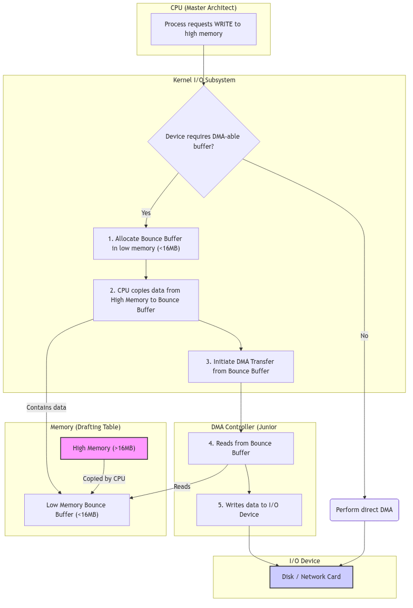

# DMA and Buffer Management: The Architect's Drafting Table

Let us imagine a grand architectural firm where plans are drawn up on an enormous drafting table, representing the system's memory. The master architect—the CPU—can reach any part of this vast surface with ease. However, to assist with the tedious task of copying and moving sections of the blueprints, the firm employs a team of junior drafters. These juniors are the **Direct Memory Access (DMA)** controllers, specialized hardware that can move data between memory and I/O devices without involving the master architect, freeing him for more complex work.

A difficulty arises. Some of the most reliable and time-tested of these junior drafters, the venerable ISA-bus devices, are of a shorter stature. They cannot reach the upper portions of the enormous table; their access is physically limited to the lower 16 megabytes of the surface. When a blueprint located in the upper reaches of the table needs to be copied by one of these drafters, a special procedure is required. This is the central challenge of DMA and buffer management in a 32-bit system that must maintain compatibility with 24-bit-address devices: how to manage data transfers when the source or destination lies beyond the reach of the hardware assigned to the task.

<br/>

## The Universal Work Order: `struct dma_cb`

To bring order to this process, every DMA request, regardless of the drafter who will fulfill it, is described by a universal work order. This is the DMA Command Block, or `dma_cb`, defined in `sys/dma.h`. This structure contains every parameter needed to specify a data transfer.

**The DMA Command Block** (sys/dma.h:54):
```c
struct dma_cb {
	struct dma_cb  *next;       /* free list link */
	struct dma_buf *targbufs;   /* list of target data buffers */
	struct dma_buf *reqrbufs;   /* list of requestor data buffers */
	unsigned char  command;     /* Read/Write/Translate/Verify */
	unsigned char  targ_type;   /* Memory/IO */
	unsigned char  reqr_type;   /* Memory/IO */
	unsigned char  targ_step;   /* Inc/Dec/Hold */
	unsigned char  reqr_step;   /* Inc/Dec/Hold */
	unsigned char  trans_type;  /* Single/Demand/Block/Cascade */
	unsigned char  targ_path;   /* 8/16/32 */
	unsigned char  reqr_path;   /* 8/16/32 */
	unsigned char  cycles;      /* 1 or 2 */
	unsigned char  bufprocess;  /* Single/Chain/Auto-Init */
	/* ... */
	int            (*proc)();   /* address of application call routine */
};
```
This comprehensive work order specifies the source (`reqrbufs`), the destination (`targbufs`), the direction (`command`: Read or Write), and the precise hardware parameters of the transfer, such as the data path width and transfer mode. By abstracting the request into this common structure, the kernel can use a generalized set of functions to manage DMA for a wide variety of devices.

<br/>

## The Scribe's Assistant: `dma_breakup`

The most common and vexing problem is a single I/O request that is too large to be handled in one go, especially if it crosses a memory boundary that the hardware cannot traverse (such as the 16MB boundary for an ISA device). In this case, a scribe's assistant must intervene to break the large, contiguous request into a series of smaller, manageable transfers. This assistant is the `dma_breakup()` function.

When a block device driver initiates a transfer on a buffer (`buf_t`) that is known to have such limitations, it does not call the hardware strategy routine directly. Instead, it calls `dma_breakup()`, passing its own strategy routine as an argument.

**The Breakup Logic** (io/physdsk.c:74, simplified):
```c
dma_breakup(strat, obp)
	int (*strat)();
	register struct buf *obp;
{
	register int cc, iocount;
	register struct buf *bp;	

	/* Duplicate the original buffer header */
	bp = (struct buf *)kmem_zalloc(sizeof (*bp), KM_SLEEP);
	bcopy((caddr_t)obp, (caddr_t)bp, sizeof(*bp));
	iocount = obp->b_bcount;

	/* Do the fragment of the buffer in the first page */
	cc = min(iocount, pgbnd(bp->b_un.b_addr));
	bp->b_bcount = cc;
	(*strat)(bp);
	/* ... wait for I/O to complete ... */
	iocount -= cc;

	/* Now do the DMA a page at a time */
	while (iocount > 0) {
		bp->b_bcount = cc = min(iocount, NBPP);
		/* ... update buffer address and block number ... */
		(*strat)(bp);
		/* ... wait for I/O to complete ... */
		iocount -= cc;
	}

	kmem_free((caddr_t)bp, sizeof(*bp));
	biodone(obp); /* Signal completion of the original, large buffer */
}
```
`dma_breakup` is a master of delegation. It creates a temporary, secondary buffer header and uses it to submit a series of smaller I/O requests to the underlying driver's strategy routine, one for each physically contiguous chunk of the original request. It meticulously tracks the progress, waiting for each small piece to complete before submitting the next, until the entire original request has been satisfied.

<br/>

## The Lowly Drafting Stool: `dmaable` Buffers

Sometimes, breaking up the request is not enough. If the data's final destination is in a memory region that the junior drafter simply cannot reach, an intermediate staging area is required. This is the purpose of the special pool of **DMA-able memory**.

At boot time, the system identifies all physical memory that lies below the 16-megabyte line—the part of the drafting table everyone can reach. A special pool of memory pages, `dmaable_pages`, is reserved from this region. When a device needs to perform DMA to or from a high memory address, the kernel intervenes:
1.  It allocates a temporary buffer from the special DMA-able pool.
2.  **On a write:** It copies the user's data *from* the high-memory buffer *to* the temporary DMA-able buffer. It then instructs the DMA controller to write from this temporary buffer to the device.
3.  **On a read:** It instructs the DMA controller to read from the device *into* the temporary DMA-able buffer. Once the DMA is complete, the kernel copies the data *from* the temporary buffer *to* the user's final destination in high memory.

This process, known as "double-buffering" or creating a "bounce buffer," is managed by functions like `dmaable_rawio()` in `io/dmacheck.c`. It is inefficient—it requires an extra copy operation by the CPU—but it is the essential accommodation that allows modern, high-memory systems to work harmoniously with older, address-limited hardware. It is the architect providing a lowly drafting stool for the junior drafter to stand on, enabling him to complete his work.


**Figure 5.9.1: Data Flow with a DMA Bounce Buffer**

---

> #### **The Ghost of SVR4: The Magic of the IOMMU**
>
> We went to such great lengths to accommodate our less capable devices! The logic in `dmacheck.c` is a testament to this, a complex web of buffer checks, page allocations, and data copying, all to manually bridge the gap between the 24-bit world of ISA and the 32-bit world of the CPU. We maintained separate free lists for DMA-able pages and non-DMA-able pages, and the `dma_breakup` function was a constant companion for any driver author. It was a source of great complexity, but it was the price of compatibility.
>
> **Modern Contrast (2026):** The modern architect's workshop has been graced with a magical new piece of furniture: the **IOMMU (Input/Output Memory Management Unit)**. This piece of hardware sits between the I/O bus and the main memory bus and acts as a universal translator for addresses. When a device attempts to perform DMA, the IOMMU intercepts the address. It maintains its own set of page tables, conceptually similar to the CPU's MMU, which map the device's limited "I/O Virtual Addresses" to arbitrary physical memory addresses.
>
> A 32-bit device can be instructed to write to address `0x100000`, and the IOMMU will translate that on the fly to physical address `0x8C000000` in high memory. The device believes it is operating in a simple, contiguous memory space, while the IOMMU is transparently and efficiently scattering its reads and writes all over the physical RAM. Bounce buffers are no longer needed. The `dma_breakup` function becomes largely obsolete. The complex software logic for managing DMA-able pools vanishes, replaced by the simple act of programming the IOMMU's translation tables. The lowly drafting stool has been replaced by a magical, self-adjusting floor that brings any part of the great table effortlessly within reach.

---

<br/>

## Conclusion: Bridging the Divide

DMA buffer management in SVR4 is a pragmatic and resourceful solution to a difficult problem. It acknowledges the physical limitations of hardware and provides a robust software framework to bridge the divide between devices of different capabilities. The universal language of the DMA Command Block allows for standardized requests, while the `dma_breakup` function and the management of a dedicated `dmaable` memory pool provide the necessary accommodations for older devices. This system, while complex, is a perfect illustration of the kernel's role as a master mediator, creating a harmonious and functional whole from disparate and sometimes challenging parts. It ensures that every drafter in the firm, no matter their stature, can contribute to the final blueprint.
