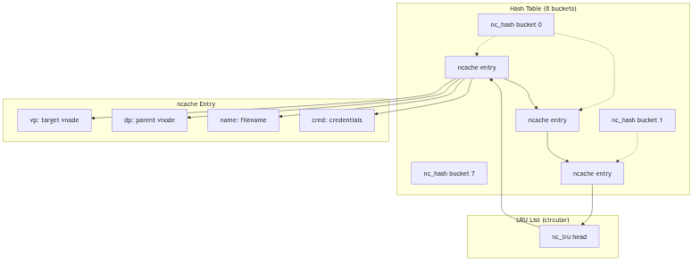
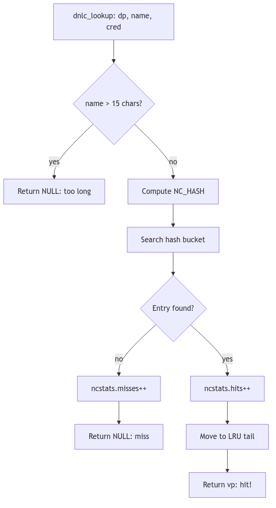

# Directory Name Lookup Cache: The Librarian's Pocket Notebook

Picture, if you will, a grand old-world library housing ten thousand volumes across a labyrinth of oak shelves and winding corridors. A patron approaches the circulation desk and requests, with utmost civility, "Volume XIV of the *Proceedings*, Section III, if you please." The traditional approach demands a ceremony: the librarian consults the enormous leather-bound card catalog, pulls the appropriate drawer with a satisfying *thunk*, flips through dozens of index cards with practiced fingers, notes the shelf location on a slip of paper, navigates the marble-floored corridors to the designated alcove, and finally retrieves the requested tome.

This ritual, performed thousands of times each day, wears not only paths in the marble floor but also precious moments from the patron's afternoon. Yet the head librarian, a woman of keen observation and sharper memory, notices a pattern: certain volumes are requested repeatedly. The *Proceedings* Volume XIV, perhaps, or the *Atlas of Parliamentary Districts*, or the *Compendium of Agricultural Statistics*. These popular tomes account for the vast majority of requests, while thousands of other volumes gather dust, consulted once per decade if at all.

The solution? A **pocket notebook**—a small, leather-bound ledger tucked into her waistcoat. When Volume XIV is requested, she jots down: "*Proceedings XIV-III → Shelf 47B, Alcove West*". When the next patron, not five minutes later, requests the very same volume, she need not consult the grand catalog at all. A quick glance at her pocket notebook reveals the answer swiftly. This is the essence of the **Directory Name Lookup Cache (DNLC)**: a compact, rapidly-consulted ledger of recent lookups, sparing the kernel the expense of traversing directory blocks for frequently-accessed pathnames.

<br/>

## The Kernel's Pocket Notebook: DNLC Architecture

In the SVR4 kernel, pathname resolution—the act of translating a string like `/usr/bin/sh` into the vnode representing the shell executable—is a repetitive, expensive operation. Consider the pattern: a typical workstation might resolve `/usr/bin/sh` hundreds of times per hour as users spawn shells, scripts invoke utilities, and programs execute child processes. Each resolution, without caching, demands:

1. **Directory Scan**: Read the directory's data blocks from disk (or buffer cache)
2. **Linear Search**: Compare the target name against each directory entry
3. **Vnode Allocation**: Allocate and initialize the result vnode
4. **Attribute Fetch**: Load inode metadata from disk

This is the *card catalog walk* made manifest in silicon and spinning platters. The DNLC, residing entirely in DRAM, short-circuits this process by caching the most recent `(parent_directory_vnode, filename) → child_vnode` mappings. When a lookup succeeds in the cache—a "hit"—the kernel avoids the directory scan entirely, retrieving the answer with the speed of a memory reference rather than the latency of disk I/O.


**DNLC - Librarian's Pocket Notebook**

### The Ledger Entry: `struct ncache`

Each entry in the DNLC is a `struct ncache`, defined in `sys/dnlc.h`:

```c
struct ncache {
    struct ncache *hash_next;    /* hash chain, MUST BE FIRST */
    struct ncache *hash_prev;
    struct ncache *lru_next;     /* LRU chain */
    struct ncache *lru_prev;
    struct vnode *vp;            /* vnode the name refers to */
    struct vnode *dp;            /* vnode of parent directory */
    char namlen;                 /* length of name */
    char name[NC_NAMLEN];        /* segment name (max 15 chars) */
    struct cred *cred;           /* credentials */
};
```
**The Ledger Entry Structure** (sys/dnlc.h:24)

The structure is elegantly minimal:
- **`dp` (directory parent vnode)**: The vnode of the containing directory (e.g., `/usr/bin`)
- **`name[NC_NAMLEN]`**: The filename itself (e.g., `"sh"`), limited to 15 characters
- **`vp` (result vnode)**: The vnode of the target file (the shell executable)
- **`cred`**: The credentials used during the original lookup (for permission consistency)
- **Hash and LRU pointers**: Dual-linked-list membership for fast lookup and aging

The 15-character limit (`NC_NAMLEN`) is a pragmatic choice: longer names are rare and would consume excessive cache memory. When encountering a name exceeding this limit, the kernel simply bypasses the cache, performing the full directory scan. This is acceptable; such names are infrequent, and the cache optimizes for the common case, not the pathological edge.

<br/>

## The Dual Index: Hash Table and LRU List

The DNLC employs a **dual organization** reminiscent of a Victorian office combining an alphabetized filing cabinet (for speed) with a chronological archive (for aging):


**Figure 3.4.1: The Dual Organization—Hash Table and LRU List**

### Hash Table: The Alphabetized Cabinet

The cache entries are indexed by a simple hash function (fs/dnlc.c:64):

```c
#define NC_HASH_SIZE    8    /* size of hash table */

#define NC_HASH(namep, namelen, vp)  \
    ((namep[0] + namep[namelen-1] + namelen + (int) vp) & (NC_HASH_SIZE-1))
```
**The Hashing Incantation** (fs/dnlc.c:62-65)

The hash combines:
- **First character** of the name: `namep[0]`
- **Last character**: `namep[namelen-1]`
- **Name length**: `namelen`
- **Parent vnode pointer**: `(int) vp`

This yields an index into `nc_hash[]`, an array of 8 hash buckets. The hash is intentionally simple—computed in a handful of CPU cycles—trading perfect distribution for speed. Collisions are resolved via chaining: each bucket is the head of a doubly-linked list of `ncache` entries. With a cache sized at 64–256 entries, an 8-bucket table means average chains in the single digits to a few dozen; not instant, but still far cheaper than a directory I/O.

> **Why such a small hash table?** In 1990, DRAM was measured in megabytes, not gigabytes. The DNLC, sized at perhaps 64-256 entries (`ncsize`), represented a significant memory investment. A hash table of 8 or 16 buckets provided adequate distribution without wasting precious address space on empty buckets. Modern systems, with gigabytes of RAM, can afford thousands of hash buckets and correspondingly enormous caches.

### LRU List: The Chronological Archive

Simultaneously, all `ncache` entries are threaded onto a **Least Recently Used (LRU)** list. The LRU is a doubly-linked circular list, with the global `nc_lru` structure serving as the list head. When a cached entry is accessed (a hit), it is moved to the tail of the LRU list, marking it as "recently used." When a new entry must be added and the cache is full, the entry at the head of the LRU list—the *least* recently used—is evicted, its vnodes released, and its slot reused.

This is the librarian's practice of periodically reviewing her pocket notebook and erasing entries for volumes not requested in months, making room for fresh annotations.

<br/>

## The Ritual of Consultation: `dnlc_lookup()`

When the pathname resolution code (in `lookuppn()`) needs to find a directory entry, it first consults the DNLC via `dnlc_lookup()` (fs/dnlc.c:232):


**Figure 3.4.2: The Lookup Ritual—Consulting the Pocket Notebook**

```c
vnode_t *
dnlc_lookup(dp, name, cred)
    vnode_t *dp;
    char *name;
    cred_t *cred;
{
    register int namlen;
    register int hash;
    register struct ncache *ncp;

    if (!doingcache)
        return NULL;
    if ((namlen = strlen(name)) > NC_NAMLEN) {
        ncstats.long_look++;
        return NULL;    /* name too long to cache */
    }
    hash = NC_HASH(name, namlen, dp);
    if ((ncp = dnlc_search(dp, name, namlen, hash, cred)) == NULL) {
        ncstats.misses++;
        return NULL;    /* cache miss */
    }
    ncstats.hits++;
    /* Move to end of LRU list (mark as recently used) */
    RM_LRU(ncp);
    INS_LRU(ncp, nc_lru.lru_prev);
    return ncp->vp;    /* cache hit! */
}
```
**The Lookup Ritual** (fs/dnlc.c:232-260, simplified)

The process:
1. **Reject overlength names**: If `namlen > NC_NAMLEN`, bypass the cache
2. **Compute hash**: `NC_HASH(name, namlen, dp)`
3. **Search hash bucket**: Walk the chain, comparing `(dp, name, cred)` tuples
4. **On hit**: Move entry to LRU tail (mark as recently used), return `vp`
5. **On miss**: Increment `ncstats.misses`, return `NULL` (caller performs full lookup)

The beauty is in the negative case: a cache miss costs only a hash computation and a short list traversal. The positive case avoids an entire directory I/O operation, saving thousands of cycles and potential disk latency.

<br/>

## Recording New Wisdom: `dnlc_enter()`

When pathname resolution performs a *full* directory scan and successfully locates a file, it records the result in the DNLC for future reference via `dnlc_enter()` (fs/dnlc.c:164):

```c
void
dnlc_enter(dp, name, vp, cred)
    register vnode_t *dp;
    register char *name;
    vnode_t *vp;
    cred_t *cred;
{
    register unsigned int namlen;
    register struct ncache *ncp;
    register int hash;

    if (!doingcache)
        return;
    if ((namlen = strlen(name)) > NC_NAMLEN) {
        ncstats.long_enter++;
        return;    /* name too long to cache */
    }
    hash = NC_HASH(name, namlen, dp);
    if (dnlc_search(dp, name, namlen, hash, cred) != NULL) {
        ncstats.dbl_enters++;
        return;    /* already cached */
    }
    /* Take least recently used cache struct */
    ncp = nc_lru.lru_next;
    /* Remove from LRU and hash chains */
    RM_LRU(ncp);
    RM_HASH(ncp);
    /* Release old vnodes if any */
    if (ncp->dp != NULL) VN_RELE(ncp->dp);
    if (ncp->vp != NULL) VN_RELE(ncp->vp);
    if (ncp->cred != NULL) crfree(ncp->cred);
    /* Hold the new vnodes and fill in cache info */
    ncp->dp = dp; VN_HOLD(dp);
    ncp->vp = vp; VN_HOLD(vp);
    ncp->namlen = namlen;
    bcopy(name, ncp->name, (unsigned)namlen);
    ncp->cred = cred;
    if (cred) crhold(cred);
    /* Insert in LRU and hash chains */
    INS_LRU(ncp, nc_lru.lru_prev);
    INS_HASH(ncp, (struct ncache *)&nc_hash[hash]);
    ncstats.enters++;
}
```
**The Inscription Ceremony** (fs/dnlc.c:164-226, simplified)

The steps:
1. **Validate name length**: Skip if `namlen > NC_NAMLEN`
2. **Check for duplicate**: If already cached, do nothing
3. **Evict LRU entry**: Take head of LRU list (oldest entry)
4. **Release old resources**: `VN_RELE()` the old vnodes, `crfree()` the old credentials
5. **Hold new resources**: `VN_HOLD()` the new vnodes, `crhold()` credentials (increment reference counts)
6. **Fill entry**: Copy `name`, set `dp`, `vp`, `cred`
7. **Reinsert**: Add to LRU tail (most recently used) and hash bucket

The vnode `VN_HOLD()` calls are critical: the DNLC maintains references to vnodes, preventing them from being prematurely freed. When a cache entry is evicted, the corresponding `VN_RELE()` decrements the reference count, potentially freeing the vnode if no other references exist.

<br/>

## Maintaining Coherency: Cache Invalidation

The DNLC's Achilles' heel is **cache coherency**. If a file is deleted or renamed, the cache entry becomes stale, pointing to a vnode that no longer corresponds to the pathname. SVR4 addresses this through *purge* operations:

- **`dnlc_purge_vp(vnode_t *vp)`**: Remove all entries referencing this vnode (called when a vnode is reused or a file is deleted)
- **`dnlc_remove(vnode_t *dp, char *name)`**: Remove a specific `(dp, name)` entry (called when a directory entry is removed)
- **`dnlc_purge()`**: Flush the entire cache (used during emergency cleanup or unmount)

These functions walk the hash buckets and LRU list, removing matching entries and releasing their vnode holds. The cost is linear in the number of cache entries, but infrequent: deletions and renames are rare compared to lookups.

<br/>

## Statistics: Measuring Effectiveness

The kernel tracks cache performance in `struct ncstats` (sys/dnlc.h:39):

```c
struct ncstats {
    int hits;         /* cache hits */
    int misses;       /* cache misses */
    int enters;       /* entries added */
    int dbl_enters;   /* duplicate enter attempts */
    int long_enter;   /* names too long to cache */
    int long_look;    /* lookup of overly long names */
    int lru_empty;    /* LRU list empty (cache disabled) */
    int purges;       /* cache flushes */
};
```

These statistics, exposed via `/dev/kmem` or `crash` utilities, allow administrators to assess cache effectiveness. A high hit rate (>90%) indicates the cache is well-sized and locality is strong. A low hit rate suggests either insufficient cache size (`ncsize` tunable) or workloads with poor locality (e.g., random file access).

<br/>

---

> #### **The Ghost of SVR4: The Humble Pocket Notebook**
>
> The DNLC, with its 8-bucket hash table and LRU eviction, was a marvel of economy in 1990. Caching perhaps 64-256 entries in a few kilobytes of DRAM, it captured the majority of pathname lookups for typical workloads—compilers, shells, editors—all repeatedly accessing `/usr/include`, `/bin`, `/tmp`. The 15-character name limit was a pragmatic compromise: most Unix utilities (`ls`, `cat`, `grep`, `sed`, `awk`) fit comfortably, and the rare overly-verbose filename (`a_very_long_descriptive_name_for_a_script.sh`) simply bypassed the cache. The design respected the iron law of 1990: *memory is precious; optimize for the common case*.
>
> **Modern Contrast (2026):** Linux's `dcache` (directory entry cache) is the spiritual descendant of the DNLC but operates at a vastly different scale. Modern kernels cache **millions** of dentries (directory entries) in gigabytes of RAM, using hash tables with thousands of buckets. The dcache employs **RCU (Read-Copy-Update)** for lockless lookups, allowing CPUs to traverse the cache without acquiring spinlocks, a necessity for modern multi-core systems with dozens of simultaneous pathname resolutions. The dcache also caches **negative** entries (lookups that fail), preventing repeated scans for nonexistent files—a pattern common in software builds testing for optional libraries (`./configure` scripts). The name length limit has been lifted to 255 characters (the ext4 maximum), and the cache integrates tightly with the unified page cache, prefetching inodes alongside directory blocks. Yet the core principle remains: a small, fast, in-memory ledger of recent translations, sparing the filesystem from redundant I/O. The DNLC's pocket notebook has become a vast indexed encyclopedia, but the librarian's wisdom endures.

---

<br/>

## Conclusion: The Wisdom of the Ledger

The Directory Name Lookup Cache embodies a timeless principle of systems design: **cache the frequent, ignore the rare**. By maintaining a compact, rapidly-consulted index of recent pathname→vnode translations, the DNLC transforms what would be thousands of disk I/Os per second into memory references, improving system responsiveness by orders of magnitude. The dual hash/LRU organization balances lookup speed with aging policy, while the 15-character limit respects memory constraints without crippling functionality.

In the grand orchestration of the SVR4 VFS layer, the DNLC is the librarian's pocket notebook—a humble tool, yet indispensable, ensuring that the kernel's repeated consultations of the directory catalog do not grind the system to a halt. It is not flashy, not complex, but profoundly effective: the hallmark of good engineering.
