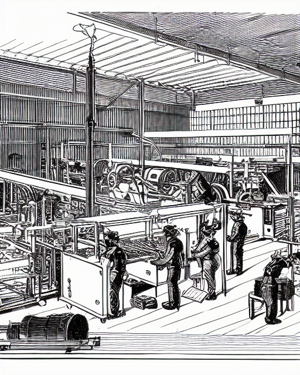
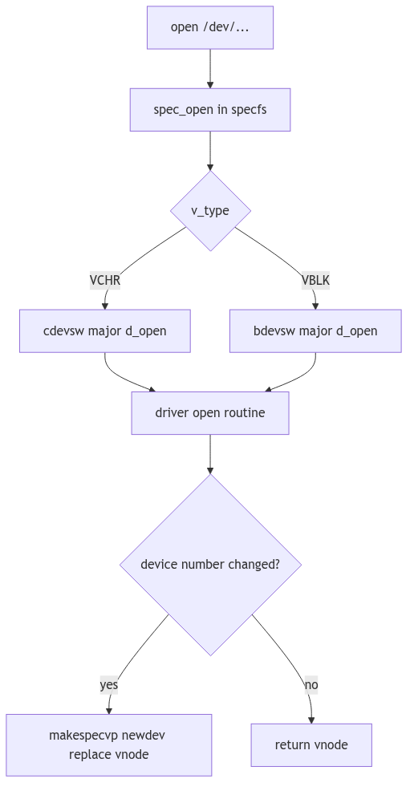
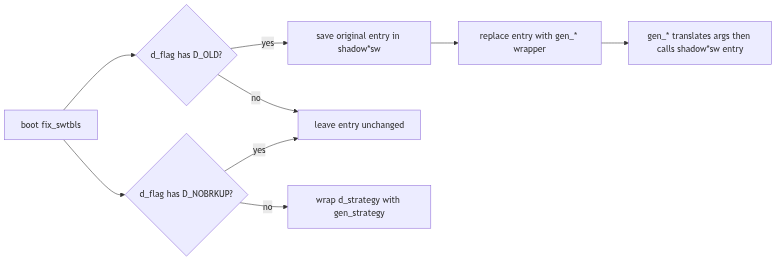

# Device Driver Framework: The Grand Exchange and Its Operators

Imagine a cavernous trading hall, a Grand Exchange where every merchant occupies a fixed stall and each stall bears a brass placard with a number. Couriers arrive at the marble steps with sealed orders, each envelope marked only by its stall number. The clerks do not wander the city in search of a merchant; they consult the exchange ledger, march to the indicated desk, and the transaction begins without ceremony. The exchange thrives not because it knows every merchant personally, but because it knows exactly where to route each order.

In SVR4, device drivers occupy those numbered stalls. The kernel receives requests in the form of device numbers and dispatches them through a rigid set of tables. These tables, the *device switches*, are the exchange ledger. The driver framework is less a grand hierarchy and more a disciplined registry: a strict roster of entry points, a handful of flags, and a promise that a major number will always lead to the correct operator.

<br/>

## The Switchboards of the Kernel

SVR4 maintains two primary switch tables: one for block devices and one for character devices. Their structures are declared in `sys/conf.h` and are the formal contract between the core kernel and every driver (sys/conf.h:15-107).

```c
struct bdevsw {
    int (*d_open)();
    int (*d_close)();
    int (*d_strategy)();
    int (*d_print)();
    int (*d_size)();
    int (*d_xpoll)();
    int (*d_xhalt)();
    char *d_name;
    struct iobuf *d_tab;
    int *d_flag;
};

struct cdevsw {
    int (*d_open)();
    int (*d_close)();
    int (*d_read)();
    int (*d_write)();
    int (*d_ioctl)();
    int (*d_mmap)();
    int (*d_segmap)();
    int (*d_poll)();
    int (*d_xpoll)();
    int (*d_xhalt)();
    struct tty *d_ttys;
    struct streamtab *d_str;
    char *d_name;
    int *d_flag;
};
```
**The Switchboard Columns** (sys/conf.h:20-54)

The tables reveal the kernel's expectations:
- **Block devices** must offer a `d_strategy()` routine for buffer-oriented I/O.
- **Character devices** are richer in interface: read/write/ioctl, memory mapping, and the STREAMS hook `d_str`.
- **`d_flag`** describes the driver's lineage and quirks (old-style compatibility, DMA behavior, etc.).
- **`d_name`** is the human-readable handle, used in configuration tools and diagnostics.

Two arrays, `bdevsw[]` and `cdevsw[]`, carry these entries, while `bdevcnt` and `cdevcnt` define their bounds (sys/conf.h:33-107). The tables are not discovered; they are compiled into the kernel image by configuration, and their indices are the major device numbers.

<br/>


**Driver Framework - Machine Factory**

## Tickets, Majors, and Dispatch

When user space opens a device node under `/dev`, the kernel routes the call through the special file system layer. `spec_open()` extracts the major number and dispatches into the appropriate switch table. The mechanism is deliberate and unromantic: a single array lookup, followed by a function pointer call (fs/specfs/specvnops.c:283-357).

```c
if ((error = (*cdevsw[maj].d_open)
  (&newdev, flag, OTYP_CHR, cr)) == 0
    && dev != newdev) {
    /* Clone open handling */
    if ((nvp = makespecvp(newdev, VCHR)) == NULL) {
        (*cdevsw[getmajor(newdev)].d_close)
          (newdev, flag, OTYP_CHR, cr);
        error = ENOMEM;
        break;
    }
    /* vnode replacement continues */
}
...
if ((error = (*bdevsw[maj].d_open)(&newdev, flag,
        OTYP_BLK, cr)) == 0 && dev != newdev) {
    /* Block clone handling */
}
```
**The Dispatch to the Operator** (fs/specfs/specvnops.c:283-357, simplified)

The dispatch depends on two simple facts:
1. **The vnode type** decides the table (`VCHR` for `cdevsw`, `VBLK` for `bdevsw`).
2. **The major number** selects the row, and the function pointer is invoked.

Once dispatched, the driver is sovereign. It may honor the original device number, or it may return a new one (for clone devices), in which case the special file layer swaps out the vnode to match the driver's chosen identity.


**Figure 5.2.1: Dispatch Through the Switch Tables**

<br/>

## Old-Style Drivers and the Compatibility Clerks

SVR4 straddles two eras. Some drivers follow the new interfaces (passing full device numbers, using modern `uio` structures), while older ones expect the pre-4.0 conventions. Rather than force every old driver to be rewritten, SVR4 interposes a set of compatibility wrappers.

At startup, `fix_swtbls()` walks the switch tables and replaces old-style entry points with generic shims, saving the original pointers into `shadowcsw[]` and `shadowbsw[]` (os/predki.c:41-71).

```c
for (i = 0; i < bdevcnt; i++) {
    if (*bdevsw[i].d_flag & D_OLD) {
        shadowbsw[i].d_open = bdevsw[i].d_open;
        bdevsw[i].d_open = gen_bopen;
        shadowbsw[i].d_close = bdevsw[i].d_close;
        bdevsw[i].d_close = gen_bclose;
    }
    if (!(*bdevsw[i].d_flag & D_NOBRKUP)) {
        shadowbsw[i].d_strategy = bdevsw[i].d_strategy;
        bdevsw[i].d_strategy = (int(*)())gen_strategy;
    }
}
for (i = 0; i < cdevcnt; i++) {
    if (*cdevsw[i].d_flag & D_OLD) {
        shadowcsw[i].d_open = cdevsw[i].d_open;
        cdevsw[i].d_open = gen_copen;
        shadowcsw[i].d_close = cdevsw[i].d_close;
        cdevsw[i].d_close = gen_cclose;
        shadowcsw[i].d_read = cdevsw[i].d_read;
        cdevsw[i].d_read = gen_read;
        shadowcsw[i].d_write = cdevsw[i].d_write;
        cdevsw[i].d_write = gen_write;
        shadowcsw[i].d_ioctl = cdevsw[i].d_ioctl;
        cdevsw[i].d_ioctl = gen_ioctl;
    }
}
```
**The Compatibility Ledger** (os/predki.c:41-71)

These wrappers translate between old and new calling conventions. `gen_read()` and `gen_write()` populate the legacy `u` area fields before invoking the old driver routine, then copy results back out to the modern `uio` (os/predki.c:136-174). The exchange clerk knows the antique forms by heart.

The compatibility pass is triggered during startup immediately after process table initialization (os/startup.c:475-504). It is not a runtime negotiation; it is a once-only retrofit before any device is opened.


**Figure 5.2.2: Old-Style Wrapping via `fix_swtbls()`**

<br/>

## The Clone Desk: One Stall, Many Identities

SVR4 also supports a clever trick: the clone driver. A single major number can hand out new minors (and sometimes new majors) as devices are opened. The clone driver’s `clnopen()` routine resolves the *real* target by looking up the requested major in `cdevsw[]`, then installing its queues and invoking the actual driver open (io/clone.c:43-123).

```c
emaj = getminor(*devp);
maj = etoimajor(emaj);

if ((maj >= cdevcnt) || !(stp = cdevsw[maj].d_str))
    return (ENXIO);

setq(qp, stp->st_rdinit, stp->st_wrinit);

if (*cdevsw[maj].d_flag & D_OLD) {
    /* old-style driver: minor returned directly */
    if ((newdev = (*qp->q_qinfo->qi_qopen)(qp, oldev, flag, CLONEOPEN)) == OPENFAIL)
        return (u.u_error == 0 ? ENXIO : u.u_error);
    *devp = makedevice(emaj, (newdev & OMAXMIN));
} else {
    if (error = (*qp->q_qinfo->qi_qopen)(qp, &newdev, flag, CLONEOPEN, crp))
        return (error);
    *devp = newdev;
}
```
**The Clone Negotiation** (io/clone.c:43-123, simplified)

The clone driver is an exchange desk that issues bespoke tickets on demand. It also underscores the switch table's importance: even when devices are dynamic, their initial rendezvous still occurs through `cdevsw[]`.

<br/>

> **The Ghost of SVR4:** Modern kernels still keep registries of driver entry points, but the registry has moved into a world of loadable modules, device trees, and hotplug buses. Linux’s `struct file_operations` and `struct block_device_operations` echo the `cdevsw` and `bdevsw` lineage, yet registration is no longer frozen at link time. A driver can appear at runtime, bind to a device described by firmware, and be queried through sysfs. The exchange has become a living marketplace, stalls erected and removed as the day progresses.

<br/>

## The Exchange at Dusk

The SVR4 driver framework is not a cathedral of abstractions; it is a ledger, a row of brass plates, and a clerk who can route a request without asking where it came from. It succeeds because it is *predictable*: the major number points to the stall, the stall points to the operator, and the operator answers. The rest of the kernel can trade in confidence, knowing the exchange keeps its books in perfect order.
