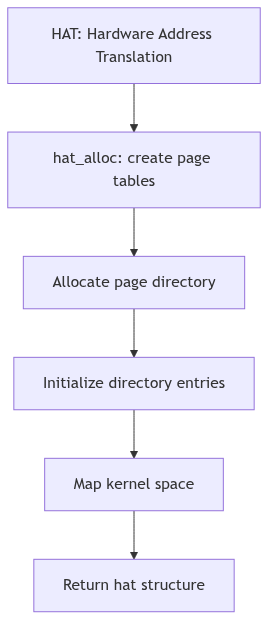
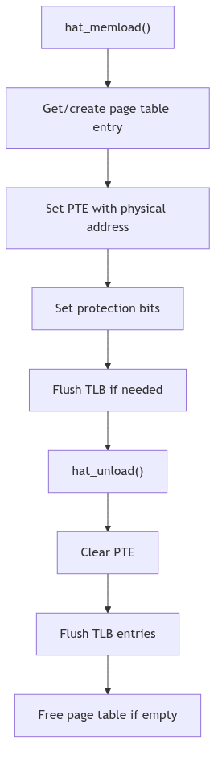
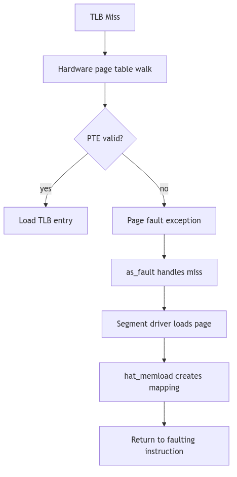
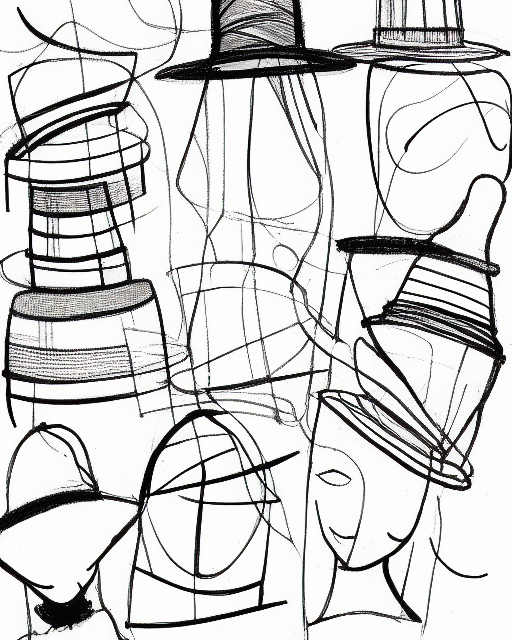
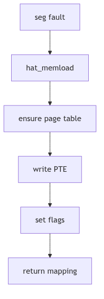
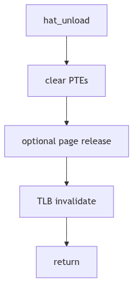

# HAT Layer: The Translator's Desk

Imagine a busy customs office where every traveler carries a passport in one language but must be recorded in another. The translator at the desk does not care about the journey; she simply maps names and numbers between two alphabets. If a translation changes, she must update her ledger and notify the guards so they no longer trust the old translation.

SVR4's Hardware Address Translation (HAT) layer is that translator. It maps virtual addresses to physical frames, keeps a ledger of page tables, and flushes the TLB when the mapping changes.

<br/>

## The Translator's Ledger: `struct hat`

On i386, each address space embeds a `struct hat` defined in `vm/vm_hat.h` (vm/vm_hat.h:82-89).

```c
typedef struct hat {
    struct hatpt *hat_pts;     /* current page table list */
    struct hatpt *hat_ptlast;  /* last page table to fault */
} hat_t;
```
**The Translation Ledger** (vm/vm_hat.h:86-89)

The HAT keeps a list of page tables and a locality hint (`hat_ptlast`) to speed repeated faults in the same region. It is a simple structure, but it anchors the entire translation system.


**Figure 2.2.1: Address Space Allocation with hat_alloc**


**Figure 2.2.2: Loading and Unloading Mappings**


**Figure 2.2.3: TLB Miss Handling**

<br/>


**HAT Layer - Royal Milliner's Shop**

## The Operation Set: `hat.h`

The HAT interface exposes a standardized set of operations for segment drivers and the VM system (vm/hat.h:81-147). These include loading mappings, unloading them, and syncing page state.

```c
void hat_memload(/* seg, addr, pp, prot, flags */);
void hat_unload(/* seg, addr, len, flags */);
void hat_pagesync(/* pp */);
```
**The Translation Tools** (vm/hat.h:91-112, abridged)

Flags like `HAT_LOCK`, `HAT_UNLOCK`, and `HAT_RELEPP` control whether mappings are locked down or whether the underlying page is released when a mapping is removed (vm/hat.h:130-147). These flags are the translator's instructions: whether the ledger entry is permanent, temporary, or due for release.

<br/>

## Loading a Mapping: `hat_memload()`

When a segment driver has a page to map, it calls `hat_memload()`. The i386 implementation allocates or finds the page table, writes the PTE, and makes the translation visible to hardware. The full routine is lengthy, but its essence is clear: ensure a page table exists, then load the mapping (vm/vm_hat.c:1069-1107).

The mapping can be locked with `HAT_LOCK` to keep it resident, which is how the kernel pins critical pages.


**Figure 2.2.4: Loading a Translation**

<br/>

## Unloading and Syncing: `hat_unload()` and `hat_pagesync()`

When a mapping is removed, `hat_unload()` clears the PTEs and may release the underlying page depending on flags such as `HAT_RELEPP` or `HAT_PUTPP` (vm/hat.h:135-137). The i386 HAT then invalidates the TLB entry to prevent stale translations (vm/vm_hat.c:617-623).

Page synchronization is handled by `hat_pagesync()`, which pulls reference and modification bits from hardware into the page structure (vm/hat.h:110-112). This is how the VM system learns which pages are dirty or recently accessed.


**Figure 2.2.5: Clearing Mappings and Flushing the TLB**

<br/>

## The TLB Contract

The Translation Lookaside Buffer is fast but forgetful. It caches translations, so the HAT must invalidate entries whenever mappings change. The i386 implementation uses `invlpg` or a CR3 reload to ensure no stale mappings persist. The translator's desk is useless if the guards still read the old passport.

<br/>

> **The Ghost of SVR4:** We kept the HAT as a strict interface so segment drivers could remain portable. Modern systems still separate the translation layer, but they also add huge pages, ASID tagging, and batched TLB shootdowns. The translator now works at scale, yet she still keeps the same ledger: virtual address in, physical frame out.

<br/>

## The Ledger Closes

The HAT layer is the interpreter between software intent and hardware reality. It loads mappings, unloads them, and keeps the TLB honest. Without the translator's desk, the address space is a map with no way to reach the ground.
