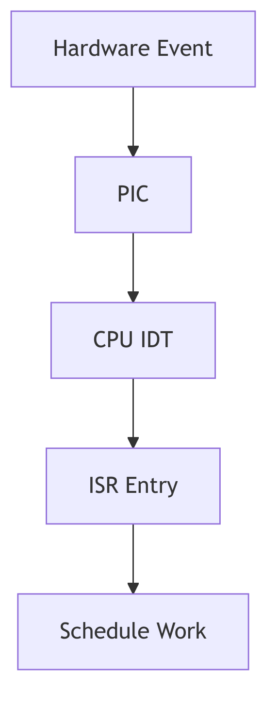
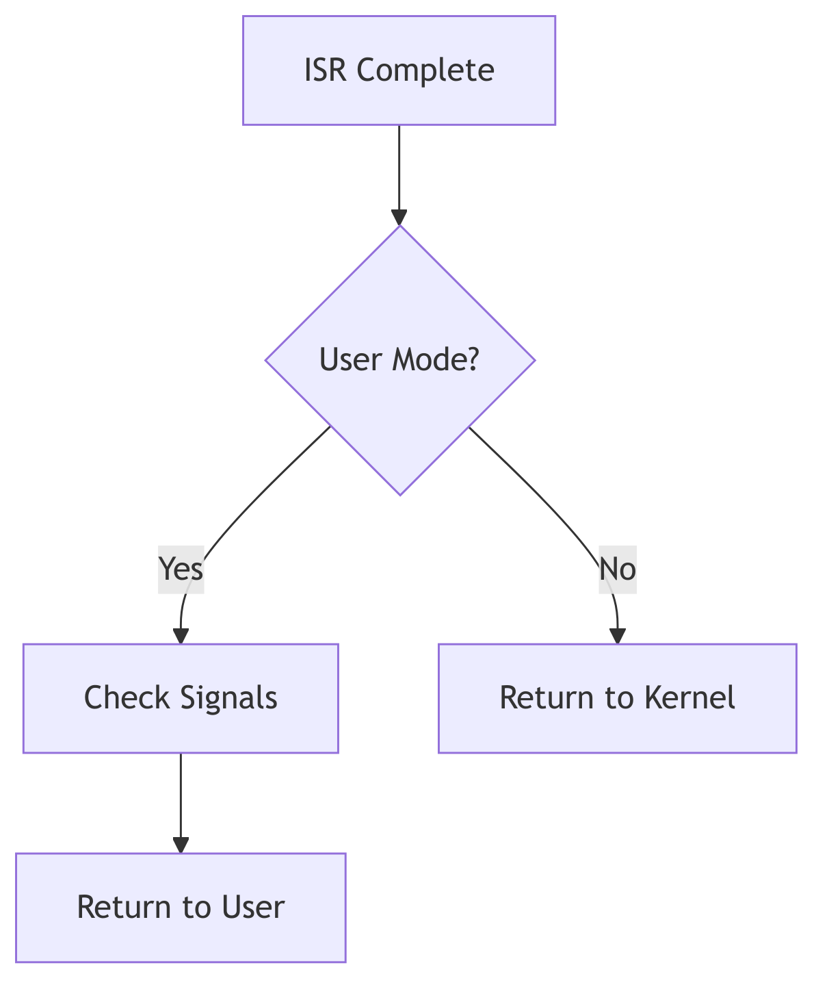
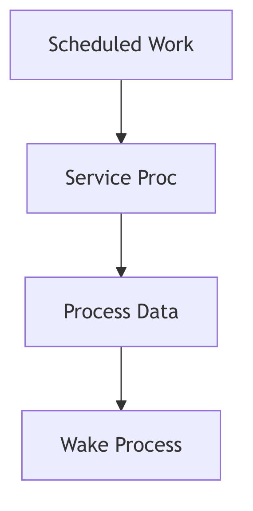

The Telegraph's SLAM: Interrupt Handling as Electrical Tyranny

In the orchestrated quietude of a running kernel, where processes execute in orderly time slices and system calls proceed through well-defined paths, there exists a class of events that **refuses to wait, refuses to ask permission, refuses to be polite**: **interrupts**.

An interrupt is not a knock. Knocks are courteous. Knocks can be ignored.

**An interrupt is a lightning strike.**

Picture the CPU as a diligent scholar hunched over illuminated manuscripts (user processes), quill in hand, mid-sentence in an important treatise. Beside him on the desk sits a telegraph key—silent, inert. Then, without warning, the key **SLAMS down**—*click-click-click*—unbidden, uncaring for his sentence mid-phrase, his ink mid-stroke. The telegraph wire (the `INTR` pin on the i386 package) carries voltage from the Programmable Interrupt Controller, a spike from 0V to 5V that the CPU's state machine **electrically detects** on every single clock cycle.

The CPU doesn't "hear" the interrupt. It doesn't "check for" the interrupt. The silicon itself, at the transistor level, **senses voltage** on a dedicated pin, and the processor's finite state machine—wired into the chip during fabrication—**hijacks the instruction pipeline**. This is not software. This is **electrical tyranny**.

<br/>

## The Hardware Foundation: Silicon Routing Tables

The Intel i386 processor, SVR4's silicon foundation, implements interrupts not through software courtesy but through **microcode-assisted table lookups hardwired into the instruction decoder**. The Interrupt Descriptor Table (IDT) is not a data structure in the abstract sense—it is a **2048-byte region of physical RAM** (256 entries × 8 bytes each), whose base address resides in the `IDTR` register, a 48-bit value split into 32-bit base address and 16-bit limit.

When the CPU detects that `INTR` pin assertion—a physical voltage transition from LOW to HIGH—the microcode doesn't "look up" the IDT like a reader consulting an index. The interrupt vector (0-255), delivered by the PIC via the data bus, is **hardware-multiplied by 8** in the address generation unit (each IDT entry is 8 bytes). This product is added to `IDTR.base`, producing a physical memory address like `0xC0001050`.

The CPU then issues a **memory read transaction** on the system bus:
- RAS (Row Address Strobe) asserts, selecting DRAM row
- CAS (Column Address Strobe) asserts, selecting column within row
- Sense amplifiers detect capacitor charge (HIGH = ~5V, LOW = ~0V)
- The 8 bytes of the IDT entry arrive in the CPU's prefetch queue

**This happens in microcode, faster than a single user-visible instruction.**

The IDT entry specifies:
1. **Code Segment Selector** (16 bits): Which ring-0 code segment contains the handler
2. **Offset** (32 bits): The exact `EIP` value to jump to
3. **Flags**: Interrupt gate vs. trap gate, privilege level requirements

The CPU then **atomically**:
- Pushes `SS:ESP`, `EFLAGS`, `CS:EIP` onto the kernel stack (retrieved from the Task State Segment)
- Loads new `CS:EIP` from the IDT entry
- Switches CPL (Current Privilege Level) to 0
- Clears the interrupt flag (IF) for interrupt gates, preventing nested interrupts

**This is not software branching. This is silicon routing.** The scholar's hand (program counter) jerks mid-word to a new page (the ISR entry point). His previous page and pen position (`CS:EIP`, `EFLAGS`) are shoved into a drawer (kernel stack) by reflex—atomically, in hardware, without software involvement.

<br/>


**Interrupts - Butler in Manor**

## The Trap Gate: Entry from User Mode

SVR4 distinguishes between **traps** (synchronous exceptions arising from program execution, like page faults or system calls) and **interrupts** (asynchronous hardware events). Both, however, share a common entry mechanism on i386: the **trap gate** or **interrupt gate** in the IDT.

When a trap or interrupt occurs from user mode, control transfers to the kernel's assembly-language entry stub, which immediately saves the user's register state onto the kernel stack. For hardware interrupts, this stub then invokes the appropriate device-specific **interrupt service routine (ISR)** registered for that interrupt vector. For traps, control flows to the `k_trap()` or `s_trap()` functions in `trap.c`.

The `s_trap()` function, invoked just before returning from kernel mode to user mode, is a crucial checkpoint:

```c
// From trap.c - System Trap Handler (lines 124-177)
void s_trap()
{
	register proc_t	*pp;
	time_t	 syst;

	pp = u.u_procp;
	syst = pp->p_stime;

	// Check for pending preemption
	if (runrun != 0)
		preempt();

	// Check for pending signals
	if (ISSIG(pp, FORREAL))
		psig();
	else if (EV_ISTRAP(pp))
		ev_traptousr();

	// Update profiling data if enabled
	if (u.u_prof.pr_scale & ~1)
		addupc((void(*)())u.u_ar0[EIP], (int)(pp->p_stime - syst));
}
```
**Code Snippet 5.3.1: System Trap Handler**

This function performs three critical checks before returning to user mode:

1. **Preemption Check (`runrun`)**: If the `runrun` flag is set (signaling that a higher-priority process is runnable or the current process's time slice has expired), `preempt()` is invoked, triggering a context switch.
2. **Signal Delivery (`ISSIG` / `psig`)**: If any signals are pending for the current process, they are delivered via `psig()`, potentially invoking user-mode signal handlers or terminating the process.
3. **Profiling Update**: If process profiling is enabled, the time spent in the kernel is accounted for.

This routine is the kernel's final gatekeeper, ensuring that asynchronous events (signals, preemption) are processed before relinquishing control to user code.

<br/>

## Interrupt Priority Levels: SILENCE in the Tavern

Not all interrupts are created equal. A timer interrupt, which must occur precisely every 10 milliseconds to maintain system time, takes precedence over a keyboard interrupt (which can wait 50 milliseconds while you finish your critical section). SVR4's hierarchy is brutal and simple: **interrupt priority levels**.

The `spl6()` function is like shouting **"SILENCE!"** in a crowded bustling tavern—not politely requesting quiet, but **COMMANDING** it. Every device interrupt below priority 6 MUST wait, frozen mid-sentence, mouths open but silent, until `splx()` restores the original noise level.

**What Happens in Silicon:**

When you call `spl6()`, the kernel executes (on i386):

```asm
movb $0xBF, %al     ; Interrupt mask: allow only IRQ 6 and above
outb %al, $0x21     ; Write to PIC's interrupt mask register (IMR)
```

This `outb` instruction—a single opcode, two bytes—travels down the I/O bus to the 8259A Programmable Interrupt Controller chip. The PIC's Interrupt Mask Register is a physical 8-bit latch at I/O port `0x21`. When that byte arrives, transistors flip. Voltage levels change. IRQs 0-5 are now **electrically disconnected** from the CPU's `INTR` pin—their interrupt lines go nowhere, severed at the silicon level.

The disk (IRQ 14) can finish its operation. The network card (IRQ 10) can receive a packet. They can assert their interrupt lines. **But the PIC will not forward these to the CPU.** The `INTR` pin remains LOW. The interrupts are not queued, not buffered—they are **held at the source**, the PIC refusing to translate them into interrupt vectors.

When `splx(s)` restores the original mask:

```asm
movb %dl, %al       ; Restore saved mask from 's'
outb %al, $0x21     ; Reconnect severed interrupt lines
```

The transistors flip back. The electrical pathways reconnect. Any pending interrupts—disk done, network packet arrived—**FLOOD** through the now-open gate, often causing a cascade of nested ISR invocations.

**Bach Mode (What It Does):**

```c
int s = spl6();      // Block IRQs 0-5. Save old mask in 's'.
q->q_count += len;   // Critical section: update queue byte count
splx(s);             // Restore original interrupt mask
```

**Whimsy Mode (What It Means):**

You're a tavern keeper (kernel) trying to count coins (update `q_count`). Patrons (interrupts) keep shouting drink orders mid-count, forcing you to restart. So you bellow "**SILENCE!**"—`spl6()`—and the room freezes. You count your coins. Then you nod—`splx()`—and the cacophony resumes.

**The Virtue Lost:**

In 1988, `spl` was brilliant—a **coarse lock** that protected the entire kernel with a single I/O instruction. Every programmer knew: `spl6()` → you have **10 microseconds, tops**. Hold it longer and the clock interrupt drifts, time itself loses accuracy. Modern kernels mock this with fine-grained spinlocks (`spin_lock_irqsave()`), but `spl` had a virtue: **predictability**. `spl6()` on an i386 always took exactly **12 CPU cycles** (the `outb` instruction latency). Modern interrupt latency is a *probability distribution*. SVR4's was a **contract**.

<br/>

## The Two-Phase Handler: Top Half and Bottom Half

A cardinal rule of interrupt handling is: **minimize time spent at high interrupt priority**. Prolonged execution with interrupts disabled can cause timer drift, lost network packets, and system unresponsiveness. To reconcile this constraint with the need for complex processing, SVR4 employs a **two-phase interrupt handling model**:

### Top Half: The Minimal ISR

The **top half** is the ISR that executes immediately upon interrupt arrival, at elevated priority. Its responsibilities are deliberately minimal:

1. **Acknowledge the Hardware**: Signal the device that the interrupt has been received (often by reading a status register or writing to a control register).
2. **Enqueue Work**: Place a message on a queue (e.g., a STREAMS queue for network packets) or set a flag indicating that deferred processing is needed.
3. **Schedule Bottom Half**: If necessary, schedule a lower-priority task to perform the heavy lifting.
4. **Return Swiftly**: Exit the ISR, allowing other interrupts to be serviced.

For example, a network driver's ISR might simply enqueue the incoming packet onto the IP module's queue and return, leaving the packet's interpretation and routing to the bottom half.

### Bottom Half: Deferred Processing

The **bottom half** executes at a lower priority, often during the return path from kernel mode or via explicitly scheduled kernel threads. This is where the bulk of interrupt-related work occurs: packet processing, buffer management, signal delivery, and more.

In STREAMS (as we saw in [STREAMS Framework](./streams.md)), the bottom half is often the **service procedure**, invoked via `runqueues()` when the queue is enabled. This separation ensures that the top half remains brief, while the bottom half can safely block, allocate memory, and interact with user processes.

<br/>

## The Kernel Stack Switch: Safeguarding Interrupt Context

When an interrupt occurs from user mode, the i386 hardware automatically switches from the user's stack (in user address space) to the kernel stack (pointed to by the Task State Segment, TSS). This switch is critical: executing an ISR on a potentially tiny or corrupted user stack would be catastrophic.

The kernel stack, allocated per-process and residing in kernel memory, provides a safe execution environment for the ISR. All register saves, local variables, and nested function calls occur on this stack. Upon interrupt return (`IRET` instruction), the hardware restores the user stack pointer, seamlessly resuming user execution.

For interrupts that occur while already in kernel mode (e.g., a timer interrupt during a system call), no stack switch occurs—the ISR executes on the existing kernel stack. The `k_trap()` function in `trap.c` handles such kernel-mode traps, ensuring that even nested interrupts are processed correctly.

<br/>

## Device Interrupt Handling: From Hardware to Software

A typical device interrupt flow in SVR4 unfolds as follows:

1. **Hardware Event**: A disk controller completes an I/O operation, asserting the `INTR` line.
2. **PIC Arbitration**: The Programmable Interrupt Controller (PIC) determines the highest-priority pending interrupt and signals the CPU with the corresponding interrupt vector.
3. **CPU Dispatch**: The CPU indexes into the IDT, retrieves the handler address, and transfers control.
4. **ISR Execution**: The device driver's ISR acknowledges the interrupt, reads status, enqueues data or signals completion, and returns.
5. **Bottom Half Scheduling**: If the ISR enqueued work (e.g., onto a STREAMS queue), it calls `qenable()`, scheduling the queue's service procedure.
6. **Deferred Processing**: During the next invocation of `runqueues()`, the service procedure processes the enqueued data, potentially passing it up the STREAMS stack or waking a sleeping process.
7. **Return to User**: Finally, `s_trap()` checks for signals and preemption before returning control to the interrupted user process.

This multi-stage pipeline ensures that latency-sensitive acknowledgment happens immediately, while complex processing is deferred to a safer, more permissive context.

**Figure 5.3.1: Interrupt Entry Path**



The diagram shows hardware event detection through ISR execution and bottom-half scheduling.

**Figure 5.3.2: Return to User Mode**



The return path checks for preemption and signals before resuming user execution.

**Figure 5.3.3: Bottom Half Processing**



Deferred processing in the bottom half handles protocol stack operations.

---

> **The Ghost of SVR4: Interrupt Handling Evolution**
>
> In 1988, the i386's interrupt architecture was state-of-the-art. The IDT, priority levels, and automatic stack switching provided a robust foundation for kernel interrupt handling. SVR4's two-phase model (top half / bottom half) was a pragmatic solution to the competing demands of responsiveness and throughput.
>
> Yet the model showed its age as systems scaled. The global `spl` locks, while simple, were coarse-grained bottlenecks on multiprocessor systems. Every `spl6()` call serialized access, limiting parallelism.
>
> **Modern Contrast (2026):** Modern Linux employs **interrupt threads** for most devices—the ISR performs minimal work (acknowledging the interrupt and waking a dedicated kernel thread), and the bulk of processing occurs in that thread context, scheduled like any other task. This allows per-device concurrency, fine-grained locking, and even preemption of interrupt handlers. Additionally, **MSI (Message Signaled Interrupts)** and **MSI-X** on modern PCIe devices bypass the shared PIC entirely, delivering interrupts as memory writes, enabling hundreds of distinct interrupt vectors per device. The per-CPU interrupt handling and lockless data structures of modern kernels achieve parallelism unimaginable in the spl-dominated SVR4 era. Yet the fundamental principles—minimal ISR, deferred processing, careful stack management—endure, testament to the timeless wisdom of SVR4's architects.

---

<br/>

## Ancient Incantations: The PIC's Whispers

The interrupt handling code in SVR4 still bears the scars of hardware from another era—remnants that persist in modern kernels like hieroglyphs on reused stone:

**The 8259A PIC and the EOI Ritual**

The End-Of-Interrupt command is a relic of 8259A hardware from 1976. Every ISR must execute:

```c
outb(0x20, 0x20);  // Send EOI to master PIC
```

This magic incantation—writing `0x20` to I/O port `0x20`—tells the PIC "I'm done with this interrupt, you may send the next one." Modern kernels still execute this **exact byte sequence** on x86 systems with legacy interrupt controllers. The numbers `0x20, 0x20` are not symbolic—they're hardcoded hardware constants from 1976, when the 8259A's datasheet assigned `0x20` as the "End of Interrupt" command and `0x20` as the master PIC's command port. These magic numbers whisper through four decades of kernel code.

**The Privilege Ring Scars**

The `systrap` entry point in SVR4's `trap.c` still manipulates `CS` and `SS` segment selectors—relics of i386's four privilege rings (Ring 0-3). x86-64 in 2026 uses only two rings (Ring 0 = kernel, Ring 3 = user), but the segment register manipulation remains, vestigial but functional:

```c
// From trap.c - segment selectors still checked
if ((r0ptr[CS] & 0x03) != 0)  // CPL check: were we in user mode?
    s_trap();  // Signal/preemption check
```

That `& 0x03` masks the Current Privilege Level—a two-bit field in the code segment selector that could theoretically be 0, 1, 2, or 3, but in practice is only ever 0 or 3. Rings 1 and 2 are ghosts, defined in silicon but unused by every major OS since the 1990s.

**The INT 0x80 Archaeological Site**

The `INT 0x80` instruction—SVR4's system call entry point—is an archaeological site. Modern kernels abandoned it for `SYSENTER` (Intel) or `SYSCALL` (AMD), reducing system call latency from ~100 cycles to ~30. But every Linux system compiled with `-m32` (32-bit compatibility mode) still generates `INT 0x80` in C library wrappers. The instruction echoes, a software fossil from an era when software interrupts were the only way to enter Ring 0.

**The TSS: A Structure Larger Than Its Use**

The Task State Segment on i386 is 104 bytes—enough to save the entire CPU state for hardware task switching. SVR4 allocates one TSS per CPU but uses only 8 bytes of it (the kernel stack pointer fields `SS0:ESP0`). The remaining 96 bytes—segment registers for Ring 1/2, LDT selector, I/O permission bitmap offset—sit idle, allocated but never written. This is a monument to a feature Intel envisioned (hardware multitasking) but no OS ever adopted.

**The `cli` / `sti` Dyad**

```asm
cli  ; Clear interrupt flag - ALL interrupts off
sti  ; Set interrupt flag - restore interrupts
```

These two instructions—one byte each, `0xFA` and `0xFB`—appear in every kernel that touches i386. They're the ultimate `spl`: `cli` is `spl7()` (block ALL interrupts), `sti` is `spl0()` (allow all). Modern kernels avoid them (too coarse), but they remain in early boot code and panic handlers—the nuclear option when all else fails.

---

<br/>

## The Critical Balance: Responsiveness vs. Throughput

Interrupt handling is a perpetual balancing act. Spend too much time in ISRs, and the system becomes sluggish, unable to run user processes. Defer too much, and interrupt latency soars, causing missed deadlines and data loss.

SVR4's design acknowledged this tension explicitly: the top half was kept minimal by design, and the bottom half could be scheduled with varying priorities. Time-critical operations (e.g., STREAMS queue processing for real-time data) could be expedited, while less urgent tasks could be deferred.

This philosophy—**prioritized deferred processing**—is interrupt handling's enduring lesson: immediate acknowledgment, deferred computation, and relentless vigilance against blocking the kernel's heartbeat.


