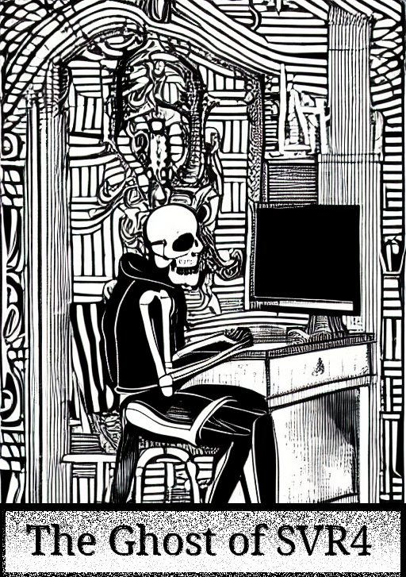

by Lee

<em>for India</em>

# Introduction

This technical guide provides comprehensive documentation of the SVR4 (System V Release 4) i386 kernel architecture and implementation. The documentation is derived from source code analysis and covers the major subsystems that comprise a complete Unix kernel.

## Purpose and Scope

The SVR4 kernel represents a mature implementation of Unix system interfaces and internal architecture. This guide examines:

- **Process Management**: How processes are created, scheduled, signaled, and terminated
- **Memory Management**: Virtual memory implementation, paging, and memory allocation strategies
- **File Systems**: The Virtual File System layer and various filesystem implementations
- **Networking**: Network stack architecture including TCP/IP and NFS
- **I/O and Device Management**: Device drivers, interrupt handling, and boot process

## Documentation Methodology

Each subsection follows a consistent structure:

1. **Technical Summary**: A detailed explanation of the subsystem's architecture and operation
2. **Code Analysis**: Key code snippets showing critical implementation details
3. **Diagrams**: Visual representations of state transitions, data structures, and flow control

The focus is on core logic and significant design decisions, excluding boilerplate and macro definitions that obscure understanding.

## Source Code

The kernel source code analyzed is located in the `svr4-src/uts/i386/` directory, with primary subsystems in:

- `os/` - Core operating system functions
- `mem/` - Memory management
- `fs/` - File system implementations
- `net/` - Networking protocols
- `io/` - Device drivers and I/O subsystem

---
