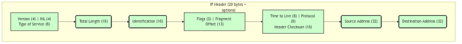

# Internet Protocol (IP)

## Overview: The Imperial Cartographers and Messengers

At the foundation of the kernel's networking suite lies the Internet Protocol (IP), the Empire's vast and intricate network of cartographers and messengers. This is the service responsible for the fundamental task of packet delivery across the myriad of networks that constitute the internetwork. Unlike the meticulous, reliable service of the TCP Telegraph Office or the simple, fire-and-forget Postal Service of UDP, the IP layer is concerned with a single, vital question: given a letter with a destination address, what is the next step on its journey?

The cartographers of this service are the routing daemons, who tirelessly work to maintain the kernel's routing tables—the master maps of the internetwork. The messengers are the IP software itself, which consults these maps to make a hop-by-hop forwarding decision for each and every packet. It is a 'best-effort' service; the messengers make no guarantee of delivery, nor do they ensure that packets will arrive in order. Their sole duty is to read the address on the envelope and send the letter on the next leg of its journey, a journey that may take it across countless networks and through the heart of many intermediate gateways.

## The Letter's Envelope: The IP Header

Every packet that travels across the internetwork is enclosed in an IP header, the envelope that contains the addressing and control information necessary for its delivery.

*The IP Header*

The key fields on this envelope are:

*   **Version and IHL (Internet Header Length)**: Identifies this as an IPv4 packet and specifies the length of the header.
*   **Total Length**: The total length of the IP packet (header and data).
*   **Identification, Flags, and Fragment Offset**: These fields are used for the fragmentation and reassembly of large packets.
*   **Time to Live (TTL)**: A counter that is decremented at each hop. If the TTL reaches zero, the packet is discarded, preventing it from looping endlessly through the network.
*   **Protocol**: Identifies the higher-level protocol (e.g., TCP or UDP) to which the packet's data should be delivered at the final destination.
*   **Header Checksum**: A checksum to verify the integrity of the IP header.
*   **Source and Destination Addresses**: The 32-bit IPv4 addresses of the sender and receiver, the fundamental information used for routing.

## Routing: The Cartographer's Maps

The core function of the IP layer is routing. When a packet needs to be sent, either from a local application or being forwarded from another machine, the IP layer must consult its routing tables to determine the appropriate next hop. This process is handled by the `rtalloc` function, which searches the kernel's routing tables for the best route to the destination address.

The `ip_output` function in `ip_output.c` is responsible for sending IP packets. It uses `rtalloc` to find the correct route and the corresponding network interface. Once the next hop and the outgoing interface are known, the packet is passed down to the link layer for transmission.

For incoming packets, the `ipintr` function in `ip_input.c` is the main entry point. If the packet is not for the local machine, and if the `ipforwarding` flag is set, `ip_forward` is called to route the packet to its next destination.

## Fragmentation and Reassembly: The Scribe's Office

When a packet is too large to be transmitted across a particular network (i.e., it exceeds the network's Maximum Transmission Unit, or MTU), the IP layer must break it into smaller pieces, a process known as fragmentation. Each fragment is a valid IP packet in its own right, with its own IP header. The `Identification`, `Flags`, and `Fragment Offset` fields in the header are used to track the fragments and reassemble them at the final destination.

The `ip_reass` function in `ip_input.c` is responsible for reassembling fragments. When a fragment arrives, it is placed in a queue associated with its source address, destination address, protocol, and identification number. When all fragments of a datagram have arrived, `ip_reass` concatenates them into the original datagram and passes it up to the appropriate higher-level protocol. The `ipq` structure is used to manage the reassembly queues, and a timer in `ip_slowtimo` ensures that stale, incomplete fragments are eventually discarded.

 

> **The Ghost of SVR4:**
>
> "We lived in the age of IPv4, a system of addresses that seemed vast and inexhaustible at the time. We could not have imagined a world where every lightbulb and every teacup would demand its own unique address. Your IPv6, with its impossibly large address space, is a solution to a problem we could barely conceive of. And with it, you have made other, more subtle changes. You have eliminated the header checksum, a small but significant concession to speed, placing your trust in the reliability of the underlying link layers. Most profoundly, you have all but abandoned in-network fragmentation. The routers of your time are busy, overworked creatures, and you have relieved them of the burden of breaking up oversized packets. In your world, it is the sender's responsibility to ensure that its packets are appropriately sized for the path they will travel, a shift in philosophy that we, in our time, would have found most curious."

## Conclusion

The Internet Protocol is the linchpin of the SVR4 networking stack, the fundamental delivery service that makes all other network communication possible. It is the realm of the cartographers and the messengers, a world of maps and routes, of forwarding and fragmentation. While it offers no guarantees, its best-effort delivery model has proven to be a remarkably robust and scalable foundation for the internetwork. It is the service that turns a collection of disparate networks into a cohesive whole, allowing a letter from any corner of the Empire to begin its journey to any other, one hop at a time.