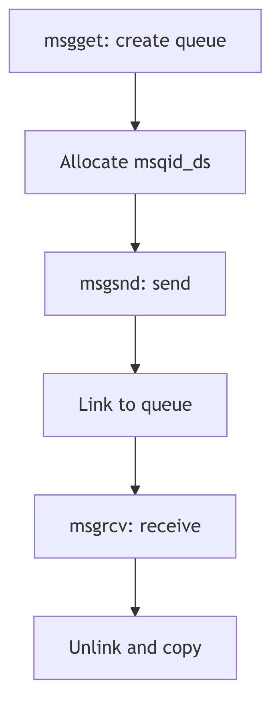
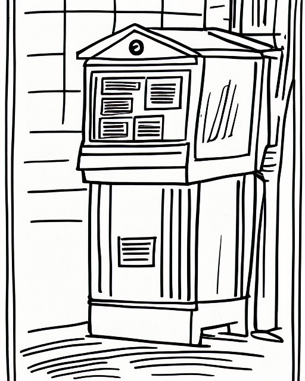
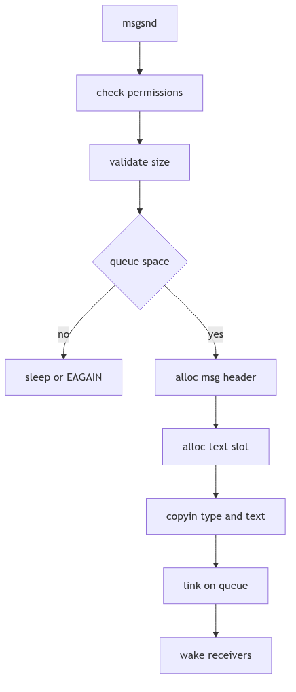
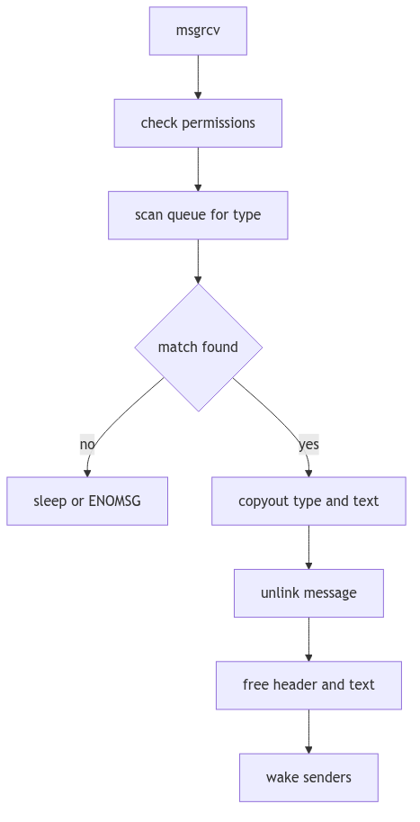

# Messages: The Town Courier and the Ledger of Pigeons

Imagine a bustling town with a central courier office. Citizens drop sealed notes into labeled pigeonholes, each hole marked by a number and a type. Couriers arrive to collect only the type they expect. The clerk does not read the letters; she keeps a ledger, counts the paper, and ensures the pigeonholes never overflow.

SVR4's System V message queues are that courier office. Messages are typed, queued, and delivered asynchronously. The kernel keeps a ledger for each queue, a free list of message headers, and a shared message pool that holds the actual text.

<br/>

## The Queue Ledger: `struct msqid_ds`

The message queue descriptor in `sys/msg.h` tracks permissions, queue pointers, and accounting (sys/msg.h:56-71).

```c
struct msqid_ds {
    struct ipc_perm msg_perm;  /* operation permission struct */
    struct msg *msg_first;     /* ptr to first message on q */
    struct msg *msg_last;      /* ptr to last message on q */
    ulong   msg_cbytes;        /* current # bytes on q */
    ulong   msg_qnum;          /* # of messages on q */
    ulong   msg_qbytes;        /* max # of bytes on q */
    pid_t   msg_lspid;         /* pid of last msgsnd */
    pid_t   msg_lrpid;         /* pid of last msgrcv */
    time_t  msg_stime;         /* last msgsnd time */
    time_t  msg_rtime;         /* last msgrcv time */
    time_t  msg_ctime;         /* last change time */
};
```
**The Courier Ledger** (sys/msg.h:56-69, abridged)

Two fields govern flow:
- **`msg_cbytes`** counts the current bytes in the queue.
- **`msg_qbytes`** sets the maximum, enforcing backpressure.


**Figure 1.8.1: Queue Ledger and Message Links**

<br/>


**Messages IPC - Post Box**

## The Message Header: `struct msg`

Each enqueued message has a header that links it into the queue and points into the shared message pool (sys/msg.h:136-141).

```c
struct msg {
    struct msg *msg_next;  /* ptr to next message on q */
    long    msg_type;      /* message type */
    ushort  msg_ts;        /* message text size */
    short   msg_spot;      /* message text map address */
};
```
**The Pigeon Tag** (sys/msg.h:136-141)

The `msg_spot` field is the index into the message pool, allocated from a resource map. This is why the kernel keeps a free list of headers (`msgfp`) and a separate message text map (`msgmap`).

<br/>

## Sending a Message: `msgsnd()`

The send path in `os/msg.c` checks permissions, validates size, waits for space, and then copies the message into the pool (os/msg.c:498-648).

Key steps:
1. **Permission check** via `ipcaccess`.
2. **Validate size** against `msginfo.msgmax`.
3. **Block or fail** if `msg_cbytes + msgsz > msg_qbytes`.
4. **Allocate header and text spot** from `msgfp` and `msgmap`.
5. **Copy in** type and text, update queue counters.

```c
if (cnt + qp->msg_cbytes > (uint)qp->msg_qbytes) {
    if (uap->msgflg & IPC_NOWAIT) {
        error = EAGAIN;
        goto msgsnd_out;
    }
    qp->msg_perm.mode |= MSG_WWAIT;
    if (sleep((caddr_t)qp, PMSG|PCATCH))
        return EINTR;
    goto getres;
}
```
**The Queue Full Decision** (os/msg.c:544-567)

If receivers are waiting, `msgsnd()` clears `MSG_RWAIT` and wakes them once the new message lands (os/msg.c:641-645). The clerk rings the bell when a pigeon arrives.


**Figure 1.8.2: `msgsnd()` Allocation and Enqueue**

<br/>

## Receiving a Message: `msgrcv()`

The receive path walks the queue, matching by type. It handles three cases (os/msg.c:429-447):
- **`msgtyp == 0`**: take the first message.
- **`msgtyp > 0`**: take the first message with that exact type.
- **`msgtyp < 0`**: take the message with the lowest type that is <= `-msgtyp`.

```c
if (uap->msgtyp == 0)
    smp = mp;
else
    for (; mp; pmp = mp, mp = mp->msg_next) {
        if (uap->msgtyp > 0) {
            if (uap->msgtyp != mp->msg_type)
                continue;
            smp = mp;
            spmp = pmp;
            break;
        }
        if (mp->msg_type <= -uap->msgtyp) {
            if (smp && smp->msg_type <= mp->msg_type)
                continue;
            smp = mp;
            spmp = pmp;
        }
    }
```
**The Type Selection Walk** (os/msg.c:430-447)

Once selected, `msgrcv()` copies out the type and text, updates counters, and frees the header and text slot. If no matching message exists and `IPC_NOWAIT` is not set, the receiver sleeps on `msg_qnum` until a sender wakes it (os/msg.c:476-485).


**Figure 1.8.3: `msgrcv()` Match and Dequeue**

<br/>

## Locks and the Parallel Latch

Because the message queue descriptor is part of the user-visible ABI, the kernel cannot add lock fields directly. Instead it maintains a parallel lock array and uses the `MSGLOCK()` macro to locate the lock slot (sys/msg.h:166-181). This is the clerk's brass latch, separate from the ledger itself.

<br/>

> **The Ghost of SVR4:** Our queues were simple, typed pigeonholes with blocking senders and receivers. Modern systems still keep System V IPC, but they also offer message brokers, epoll-driven pipes, and shared-memory rings. Yet the same ritual persists: check capacity, enqueue, wake sleepers, and count every byte as if paper were scarce.

<br/>

## The Ledger Closes

System V message queues are not glamorous, but they are reliable. The queue descriptor records who last sent and received, the message headers track types and sizes, and the kernel enforces limits so the pigeonholes never overflow. The town courier keeps its promises because the ledger is strict.
