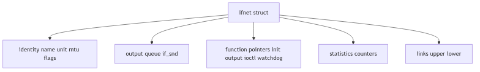
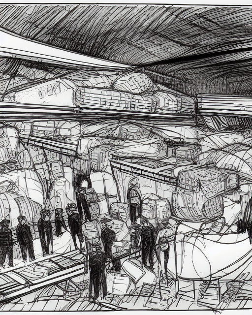
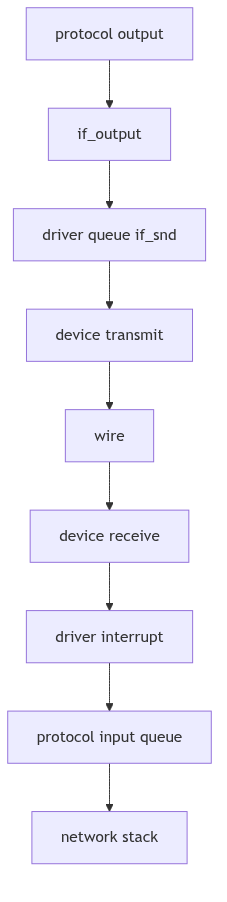

# Network Device Drivers: The Harbor, the Dock, and the Signal Lamps

Stand on a stone quay at dawn, watching the harbor wake. Ships idle in the fog, dockworkers prepare coils of rope, and a signal tower lifts its shutters to the incoming traffic. Each vessel carries goods for the city, but the city cannot speak to the ships directly; it speaks through the dock, the ropes, and the lamps. The harbor is not the ship, nor the city, but the disciplined interface between them.

SVR4's network device drivers are that harbor. Protocols in the kernel have packets to send and frames to receive, but they depend on a strict set of routines to move those frames onto copper and back. The driver is the dock's foreman, and the kernel is the harbor master: one dispatches ships, the other keeps the ledger.

<br/>

## The Dock Ledger: `struct ifnet`

The driver's contract with the rest of the networking stack is expressed by `struct ifnet` in `net/if.h` (net/if.h:88-131). This structure names the interface, defines its capabilities, and provides the function pointers that higher layers call to transmit or control it.

```c
struct ifnet {
    char    *if_name;        /* name, e.g. ``emd'' or ``lo'' */
    short   if_unit;         /* sub-unit for lower level driver */
    short   if_mtu;          /* maximum transmission unit */
    short   if_flags;        /* up/down, broadcast, etc. */
    short   if_timer;        /* time 'til if_watchdog called */
    u_short if_promisc;      /* net # of requests for promisc mode */
    int     if_metric;       /* routing metric (external only) */
    struct  ifaddr *if_addrlist; /* linked list of addresses per if */
    struct  ifqueue {
        struct  mbuf *ifq_head;
        struct  mbuf *ifq_tail;
        int     ifq_len;
        int     ifq_maxlen;
        int     ifq_drops;
    } if_snd;                /* output queue */
    int     (*if_init)();    /* init routine */
    int     (*if_output)();  /* output routine */
    int     (*if_ioctl)();   /* ioctl routine */
    int     (*if_reset)();   /* bus reset routine */
    int     (*if_watchdog)();/* timer routine */
    int     if_ipackets;     /* packets received on interface */
    int     if_ierrors;      /* input errors on interface */
    int     if_opackets;     /* packets sent on interface */
    int     if_oerrors;      /* output errors on interface */
    int     if_collisions;   /* collisions on csma interfaces */
    struct  ifnet *if_next;
    struct  ifnet *if_upper; /* next layer up */
    struct  ifnet *if_lower; /* next layer down */
    int     (*if_input)();   /* input routine */
    int     (*if_ctlin)();   /* control input routine */
    int     (*if_ctlout)();  /* control output routine */
};
```
**The Dock Ledger Structure** (net/if.h:93-127, abridged)

Several details matter for drivers:
- **`if_output`** is the outbound call site. The comment above the structure defines its signature: `(*ifp->if_output)(ifp, m, dst)` (net/if.h:70-74).
- **`if_snd`** is a persistent output queue of mbufs. The driver can enqueue and drain it at its own pace.
- **`if_watchdog`** gives a driver a periodic heartbeat, called when `if_timer` expires.
- **Stats fields** (`if_ipackets`, `if_oerrors`, etc.) are maintained by the driver to report traffic and faults.

The structure is a ledger in the literal sense: it documents identity, stores pending cargo, and records each successful or failed voyage.


**Figure 4.3.1: The Interface Ledger and Its Key Fields**

<br/>


**Network Drivers - Dock Workers**

## The Queue Discipline: `if_snd` and the Macros of Order

SVR4's network drivers are expected to respect a simple, explicit queue discipline. The output queue is managed by macros that enforce length limits and track drops (net/if.h:150-208).

```c
#define IF_QFULL(ifq)       ((ifq)->ifq_len >= (ifq)->ifq_maxlen)
#define IF_DROP(ifq)        ((ifq)->ifq_drops++)
#define IF_ENQUEUE(ifq, m) { \
    (m)->m_act = 0; \
    if ((ifq)->ifq_tail == 0) \
        (ifq)->ifq_head = m; \
    else \
        (ifq)->ifq_tail->m_act = m; \
    (ifq)->ifq_tail = m; \
    (ifq)->ifq_len++; \
}
```
**The Harbor Queue Rules** (net/if.h:156-166)

The macros are not decorative. They define the invariant every driver must respect:
1. **Never exceed `ifq_maxlen`** without incrementing drop counters.
2. **Always maintain the head/tail chain** so packets leave in order.
3. **Always adjust the queue length** so the stack can reason about congestion.

For inbound packets, the interface pointer is prepended to the mbuf chain and later removed with `IF_DEQUEUEIF`, a small ritual that keeps the receiving interface attached to the packet until the upper layers no longer need it (net/if.h:175-198).

<br/>

## Addresses, Names, and the Control Desk

An interface is more than its hardware; it must also carry one or more addresses. SVR4 models these as a linked list of `ifaddr` records, each one bound to an `ifnet` and to interface statistics (net/if.h:235-252).

```c
struct ifaddr {
    struct  sockaddr ifa_addr;   /* address of interface */
    union {
        struct  sockaddr ifu_broadaddr;
        struct  sockaddr ifu_dstaddr;
    } ifa_ifu;
    struct  ifnet *ifa_ifp;      /* back-pointer to interface */
    struct  ifstats *ifa_ifs;    /* back-pointer to interface stats */
    struct  ifaddr *ifa_next;    /* next address for interface */
};
```
**The Address Ledger** (net/if.h:241-251)

This arrangement allows multiple addresses to be bound to a single interface, and it lets protocol families add and remove addresses without touching the driver's core routines. The driver need only honor `if_ioctl` requests that carry these structures through the control plane.

The control plane itself is defined by `ifreq` and `ifconf`, used by `ioctl` calls that set flags, addresses, metrics, and driver-specific data (net/if.h:255-297).

```c
struct ifreq {
    char    ifr_name[IFNAMSIZ];  /* if name, e.g. \"emd1\" */
    union {
        struct  sockaddr ifru_addr;
        struct  sockaddr ifru_dstaddr;
        char    ifru_oname[IFNAMSIZ];
        struct  sockaddr ifru_broadaddr;
        short   ifru_flags;
        int     ifru_metric;
        char    ifru_data[1];    /* interface dependent data */
        char    ifru_enaddr[6];
    } ifr_ifru;
};
```
**The Control Ticket** (net/if.h:260-281)

Drivers interpret these requests to bring a link up, set a hardware address, or toggle promiscuous mode. The harbor master issues the order; the dock foreman carries it out.

<br/>

## The Tally Book: `ifstats`

For tools that want summarized statistics per interface, SVR4 keeps a parallel `ifstats` chain (net/if.h:218-233). It mirrors the counters in `ifnet` but packages them for reporting and polling.

```c
struct ifstats {
    struct ifstats *ifs_next; /* next if on chain */
    char           *ifs_name; /* interface name */
    short           ifs_unit; /* unit number */
    short           ifs_active; /* non-zero if this if is running */
    struct ifaddr  *ifs_addrs; /* list of addresses */
    short           ifs_mtu;  /* maximum transmission unit */
    int             ifs_ipackets;
    int             ifs_ierrors;
    int             ifs_opackets;
    int             ifs_oerrors;
    int             ifs_collisions;
};
```
**The Tally Book Structure** (net/if.h:218-233)

Drivers feed these counters as they transmit and receive. The ledger stays honest only if the dock logs every crate that passes.

<br/>

## Raw Queues and Interface Discovery

The networking subsystem also maintains a raw input queue and interface discovery routines in the kernel namespace (net/if.h:301-307). These hooks let debugging tools and raw packet listeners tap the wire directly, and they allow the stack to locate interfaces by name or address. For a driver, this means the interface must be correctly named (`if_name` plus `if_unit`) and linked into the global `ifnet` list so higher layers can find it.

<br/>

## The Outbound Ritual

When a protocol decides to send, it invokes the interface's `if_output` routine. The driver takes a chain of mbufs, possibly encapsulates it in a link-layer header, and begins transmission. It may push the packet immediately onto the device, or it may queue it in `if_snd` if the hardware is busy.

The driver is expected to:
- **Lock or raise priority** appropriately (the queue macros assume `splimp()` or equivalent protection).
- **Handle link-layer framing** for its medium.
- **Start transmission** and arrange for completion interrupts.
- **Update output statistics** once the device confirms send completion.

The outbound path is the dock's crane: it can load cargo immediately, or stack it in the yard until the ship arrives.

<br/>

## The Inbound Ritual

On input, each interface unwraps the data received by it, and either places it on the input queue of a datagram routine and posts the associated software interrupt, or passes the datagram to a raw packet input routine (net/if.h:76-79).

In other words:
1. **Interrupt fires** or polling loop detects incoming data.
2. **Driver builds mbufs**, attaches the receiving `ifnet` pointer.
3. **Driver enqueues to the protocol input queue** and schedules the software interrupt.
4. **Protocol stack continues** through IP, TCP, UDP, or raw packet handlers.


**Figure 4.3.2: Outbound and Inbound Flow Through the Driver**

<br/>

## Flags, Timers, and Unruly Seas

An interface's flags, such as `IFF_UP`, `IFF_RUNNING`, and `IFF_PROMISC`, tell the rest of the kernel how the dock is configured (net/if.h:133-144). Drivers are responsible for:
- Setting flags on successful initialization.
- Entering promiscuous mode when requested.
- Handling reset and watchdog callbacks when a link wedges.

The `if_timer` and `if_watchdog` fields give the driver a gentle nudge if it goes silent. This is critical for early Ethernet cards and flaky transceivers, where a missed interrupt could otherwise freeze the interface indefinitely.

<br/>

> **The Ghost of SVR4:** We counted packets and queued them with hand-rolled macros, guarding each queue with a raised interrupt priority. In your time the dock has grown into a port authority: multi-queue NICs, NAPI polling, and lockless rings move frames at astonishing speed. Yet the heart is unchanged: a register of capabilities, a transmit routine, a receive path, and an agreement that the driver will keep the water calm for the protocols above.

<br/>

## Harbor at Nightfall

The SVR4 driver framework is modest but sturdy. It does not attempt to hide hardware complexity behind elaborate abstractions; instead it offers a clear ledger (`ifnet`) and a small set of rituals for sending and receiving. The dock endures because it is predictable. When the signal lamps are lit, the ships know where to come, and the city knows what to do with their cargo.
