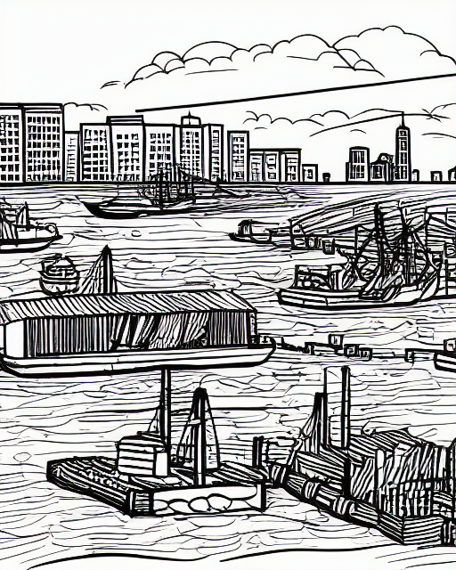
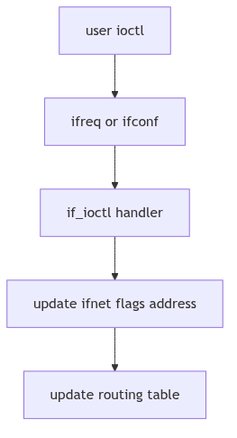
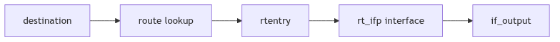

# Network Interfaces: The Registry, the Cartographer, and the Gate

A city that thrives on trade keeps more than docks; it keeps a registry of streets, property lines, and authorized crossings. The registry clerk does not handle cargo, yet without the registry no one knows where a road begins or which bridge is permitted for heavy wagons. The cartographer draws the boundaries, the clerk records names and addresses, and the gatekeeper checks each pass before it opens.

SVR4's network interface layer is that registry. Drivers deliver frames, protocols demand routes, and user programs issue ioctl orders, but the interface subsystem records the names, addresses, and capabilities that make those actions coherent. It is the layer that ties a physical interface to its identity on the network and teaches the routing table which gate to open.

<br/>

## The Interface Register: Names, Units, and Addresses

Every interface is named by `if_name` and `if_unit`, and those identifiers are used throughout the stack to locate it. The kernel maintains a linked list of `ifnet` structures, and address records are attached to each interface through `ifaddr` (net/if.h:241-252).

```c
struct ifaddr {
    struct  sockaddr ifa_addr;   /* address of interface */
    union {
        struct  sockaddr ifu_broadaddr;
        struct  sockaddr ifu_dstaddr;
    } ifa_ifu;
    struct  ifnet *ifa_ifp;      /* back-pointer to interface */
    struct  ifstats *ifa_ifs;    /* back-pointer to interface stats */
    struct  ifaddr *ifa_next;    /* next address for interface */
};
```
**The Address Record** (net/if.h:241-251)

This structure binds a protocol address to a concrete interface. The presence of `ifa_ifp` is crucial: it lets routing code and protocol code jump back from an address to the interface that owns it. Multiple addresses can be chained for one interface, which is how aliases and multiple protocol families coexist.

Interface discovery functions such as `ifunit()` and `ifa_ifwithaddr()` are declared alongside the global `ifnet` list (net/if.h:301-307). They are the registry clerk's index cards: given a name or address, return the matching interface.

<br/>


**Network Interfaces - City Ports**

## Flags and Civic Status

An interface also carries a civic status, recorded as flags in `ifnet`. These flags tell the stack whether a link is up, looped back, broadcasting, or operating in promiscuous mode (net/if.h:133-144).

```c
#define IFF_UP        0x1   /* interface is up */
#define IFF_BROADCAST 0x2   /* broadcast address valid */
#define IFF_LOOPBACK  0x8   /* is a loopback net */
#define IFF_POINTOPOINT 0x10 /* point-to-point link */
#define IFF_RUNNING   0x40  /* resources allocated */
#define IFF_PROMISC   0x100 /* receive all packets */
#define IFF_ALLMULTI  0x200 /* receive all multicast packets */
```
**The Civic Flags** (net/if.h:133-143, abridged)

These are not mere labels. The routing and ARP layers look to these flags to decide whether to emit broadcasts, whether to trust link-level address resolution, and whether a device is operational. Changing a flag is like moving the city gate from open to closed; the entire network takes note.

<br/>

## The Control Desk: `ifreq` and `ifconf`

User space configures interfaces through ioctls that pass `struct ifreq` and `struct ifconf`. These structures are the formal request slips for naming an interface, setting flags, or providing driver-specific data (net/if.h:255-297).

```c
struct ifreq {
    char    ifr_name[IFNAMSIZ];  /* if name, e.g. "emd1" */
    union {
        struct  sockaddr ifru_addr;
        struct  sockaddr ifru_dstaddr;
        char    ifru_oname[IFNAMSIZ];
        struct  sockaddr ifru_broadaddr;
        short   ifru_flags;
        int     ifru_metric;
        char    ifru_data[1];
        char    ifru_enaddr[6];
    } ifr_ifru;
};
```
**The Interface Request Slip** (net/if.h:260-281)

`ifconf` wraps a buffer for querying all configured interfaces, a call that powers tools like `ifconfig -a` in spirit if not yet in name (net/if.h:289-297). The driver handles the details in its `if_ioctl` routine, but the interface layer defines the paper form and the filing rules.


**Figure 4.4.1: Control Requests Through `ifreq` and `ifconf`**

<br/>

## The Configuration Sweep: `ifconf`

When user space asks for the full list of configured interfaces, it supplies an `ifconf` record with a buffer. The kernel fills it with `ifreq` entries, each one naming an interface and returning a selected address or parameter (net/if.h:289-297).

```c
struct ifconf {
    int ifc_len;         /* size of associated buffer */
    union {
        caddr_t ifcu_buf;
        struct ifreq *ifcu_req;
    } ifc_ifcu;
};
```
**The Inventory Envelope** (net/if.h:289-294)

This is how monitoring tools learn what exists without knowing any device names in advance. The registry clerk simply empties the ledger into a stack of slips and hands it across the counter.

<br/>

## Broadcasts, Point-to-Point, and Address Pairing

The `ifaddr` structure holds either a broadcast address or a destination address, depending on the interface type (net/if.h:242-248). A broadcast-capable Ethernet interface uses `ifa_broadaddr`, while a point-to-point link records `ifa_dstaddr`. The distinction matters to routing and ARP; it tells the stack whether a packet can be fanned out to a local segment or must be sent to a single peer.

The interface flags reinforce this: `IFF_BROADCAST` and `IFF_POINTOPOINT` are mutually exclusive in practice, and the route table uses that knowledge when creating directly connected routes. The map is not just where the roads are, but what kind of road each one is.

<br/>

## The Cartographer's Ledger: Routing Entries

Once an interface has an address, the routing table can map destinations to it. `struct rtentry` stores the destination and the interface pointer to use, effectively linking the cartographer's map to the dock (net/route.h:69-98).

```c
struct rtentry {
    u_long  rt_hash;        /* to speed lookups */
    struct  sockaddr rt_dst;/* key */
    struct  sockaddr rt_gateway; /* value */
    short   rt_flags;       /* up/down?, host/net */
    short   rt_refcnt;      /* # held references */
    u_long  rt_use;         /* raw # packets forwarded */
    struct  ifnet *rt_ifp;  /* the answer: interface to use */
};
```
**The Routing Ledger Entry** (net/route.h:86-97)

The flags `RTF_UP`, `RTF_GATEWAY`, and `RTF_HOST` describe whether the route is usable, indirect, or host-specific (net/route.h:100-105). When a packet needs a path, routing code resolves the destination and returns the `rt_ifp` pointer, which is the gatekeeper's answer: "send it through this interface."


**Figure 4.4.2: Destination to Interface via Routing Entry**

<br/>

## Gate Permissions: Route Flags and References

Routing entries carry their own permissions, encoded as flags. These flags let the kernel distinguish a direct host route from a gateway route, and they allow dynamic redirects to be tracked (net/route.h:100-105).

```c
#define RTF_UP       0x1   /* route useable */
#define RTF_GATEWAY  0x2   /* destination is a gateway */
#define RTF_HOST     0x4   /* host entry (net otherwise) */
#define RTF_DYNAMIC  0x10  /* created dynamically (by redirect) */
#define RTF_MODIFIED 0x20  /* modified dynamically (by redirect) */
```
**The Gate Permissions** (net/route.h:100-105, abridged)

Each route also tracks `rt_refcnt`, the number of consumers holding a reference to it. The `RTFREE` macro in the kernel decrements that count and frees the route when the last holder lets go (net/route.h:148-163). The gatekeeper cannot close a gate while travelers still hold the key.

<br/>

## The Route Vault: Hash Buckets and Statistics

SVR4 keeps routing entries in hash buckets for hosts and networks. The hash size is fixed at build time, and lookups choose the appropriate bucket by a simple mask or modulo (net/route.h:166-183).

```c
#define RTHASHSIZ 8
#define RTHASHMOD(h) ((h) & (RTHASHSIZ - 1))

struct mbuf *rthost[RTHASHSIZ];
struct mbuf *rtnet[RTHASHSIZ];
```
**The Route Vault** (net/route.h:166-183, abridged)

The hash tables are humble but effective. They allow frequent lookups with low overhead, which matters because every outgoing packet pays this tax. When a lookup fails, the failure is recorded in routing statistics for diagnostics (net/route.h:140-146).

```c
struct rtstat {
    short rts_badredirect;
    short rts_dynamic;
    short rts_newgateway;
    short rts_unreach;
    short rts_wildcard;
};
```
**The Cartographer's Ledger** (net/route.h:140-145)

These counters are the cartographer's logbook: they tell you how often redirects were trusted, how often routes changed, and how many destinations were unreachable.

<br/>

## The Gatekeeper's Duties

The interface layer lives at the junction of three concerns:
- **Naming and identity**: `if_name` and `if_unit` provide stable handles for users and for the kernel.
- **Address binding**: `ifaddr` records bind protocol addresses to interfaces.
- **Routing integration**: `rtentry` points from destinations back to the owning interface.

The result is a coherent map: protocols pick routes, routes point to interfaces, and interfaces are configured by the control desk. Without that registry, the network stack would be all ships and no harbor master.

<br/>

## The Public Ledger: Global Lists and Raw Queues

SVR4 exports a global `ifnet` list and a `rawintrq` input queue to the rest of the kernel (net/if.h:301-303). The list is the registry ledger, while the raw queue provides a tap for tools that want to observe traffic without protocol decoding. Both rely on interfaces being correctly linked, named, and configured.

These globals are not glamorous, but they are the index that makes every lookup possible. A packet arrives, a destination is chosen, and the first step is always the same: find the interface in the public ledger.

<br/>

> **The Ghost of SVR4:** Our registry was terse but legible. We registered interfaces by name and unit, and we pushed configuration through ioctl slips. Your time keeps the same names but adds a new bureaucracy: netlink sockets, sysfs attributes, and address lifetimes for multiple namespaces. The forms are thicker now, yet the same question remains: which gate should a packet take?

<br/>

## Closing the Ledger

Network interfaces are the kernel's civic records. They translate a device into a named entity, attach addresses to it, and link it into the routing map. Once those entries are in place, the rest of the network can move with certainty, confident that every destination has a known gate and every gate has a known keeper.
