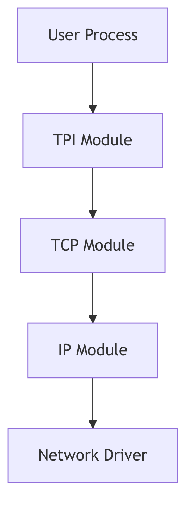
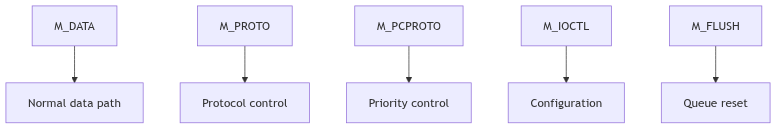
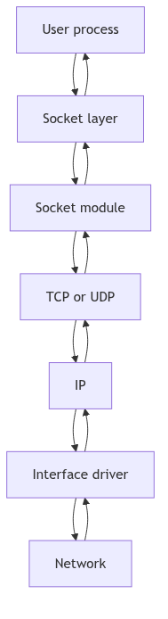
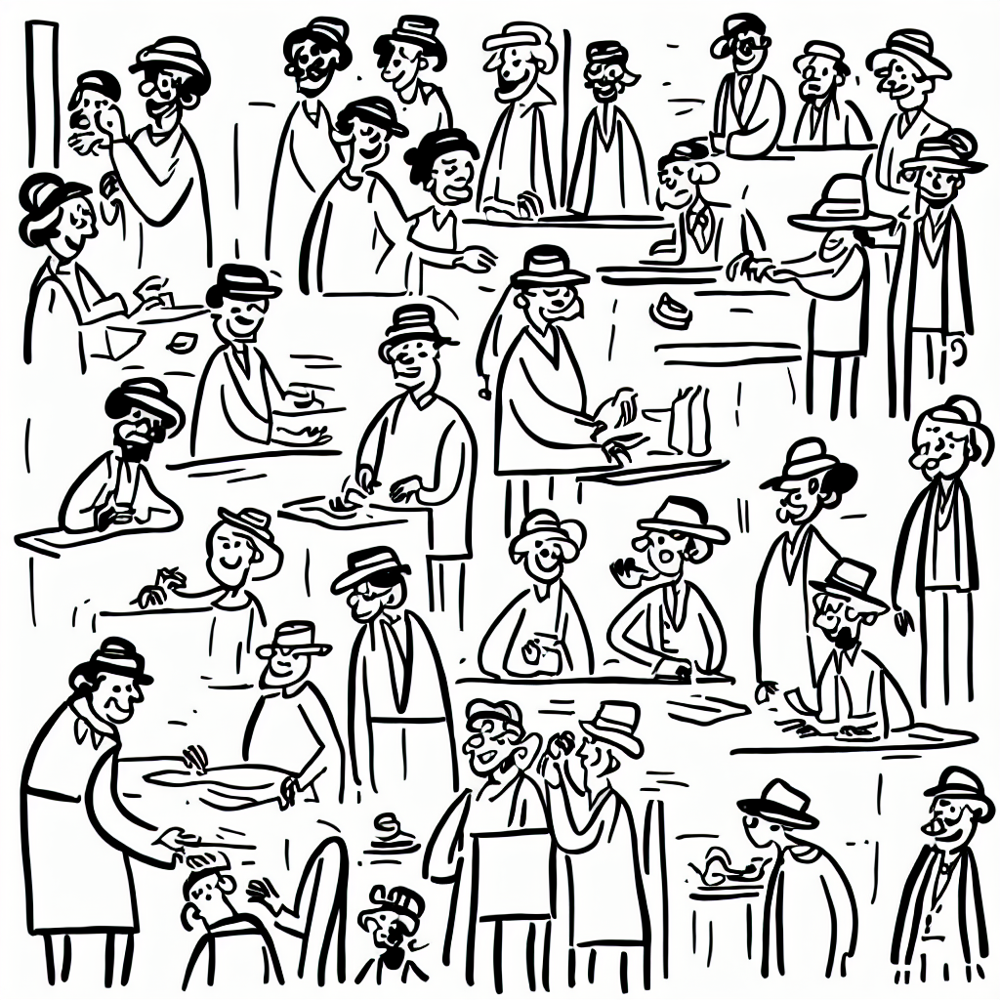

# Network Stack Overview: The Switching Yard

At the edge of the city stands a switching yard where every railcar is retagged, routed, and coupled to new trains. The yardmaster does not build locomotives; she orchestrates movement. She watches queues, reads labels, and keeps the traffic flowing without collisions. In SVR4, the network stack is that yard, and STREAMS is the track bed that everything rides on.

The overview is not a single component. It is the choreography of message blocks, queues, modules, and drivers. Each layer adds a label and passes the car forward, and the whole is held together by a strict contract: messages are typed, queues enforce backpressure, and every module must speak in the same STREAMS dialect.

<br/>

## The Track Bed: STREAMS Queues and Message Blocks

A STREAM is a chain of queues. Each module owns a pair of queues (read and write), and each queue has flow control fields and message lists (sys/stream.h:62-81).

```c
struct queue {
	struct	qinit	*q_qinfo;
	struct	msgb	*q_first;
	struct	msgb	*q_last;
	struct	queue	*q_next;
	struct	queue	*q_link;
	_VOID		*q_ptr;
	ulong		q_count;
	ulong		q_flag;
	long		q_minpsz;
	long		q_maxpsz;
	ulong		q_hiwat;
	ulong		q_lowat;
	struct qband	*q_bandp;
	unsigned char	q_nband;
};
```
**The Switch Track** (sys/stream.h:62-81)

The railcars themselves are message blocks (`mblk_t`), each with read and write pointers into its data buffer and a link to the next block in a chain (sys/stream.h:294-305).

```c
struct	msgb {
	struct	msgb	*b_next;
	struct	msgb	*b_prev;
	struct	msgb	*b_cont;
	unsigned char	*b_rptr;
	unsigned char	*b_wptr;
	struct datab	*b_datap;
	unsigned char	b_band;
	unsigned char	b_pad1;
	unsigned short	b_flag;
	long		b_pad2;
};
```
**The Railcar** (sys/stream.h:294-305)

Every module and driver speaks in these `mblk_t` units. That shared format is what allows a socket module, IP, and a network driver to compose a pipeline without copying buffers at every hop.


**Figure 4.1.1: STREAMS Layers for Networking**

<br/>

## Message Types: Labels on the Cars

STREAMS classifies messages by type. The common workhorse is `M_DATA`, while `M_PROTO` and `M_PCPROTO` carry control data, and control messages like `M_IOCTL` or `M_FLUSH` can rewrite the route (sys/stream.h:332-339).

These types are how the stack keeps control and data apart. An `M_DATA` message travels down toward the driver, while a `M_PROTO` message can notify upstream modules of acknowledgements or errors. The labels are not polite suggestions; they are the yardmaster's authority.


**Figure 4.1.2: Message Types and Priority Paths**

<br/>

## Modules and the Streamtab

Each module or driver exposes a `qinit` table of entry points: put, service, open, and close routines plus module metadata (sys/stream.h:176-186). The `streamtab` binds a pair of `qinit` structures (read and write) into a single unit that can be attached to a stream (sys/stream.h:193-199).

```c
struct qinit {
	int	(*qi_putp)();
	int	(*qi_srvp)();
	int	(*qi_qopen)();
	int	(*qi_qclose)();
	int	(*qi_qadmin)();
	struct module_info *qi_minfo;
	struct module_stat *qi_mstat;
};

struct streamtab {
	struct qinit *st_rdinit;
	struct qinit *st_wrinit;
	struct qinit *st_muxrinit;
	struct qinit *st_muxwinit;
};
```
**The Module Contract** (sys/stream.h:176-199)

This contract is how the networking stack is assembled. A driver registers its `streamtab` in the device switch, and a module registers it in `fmodsw`. When a stream is pushed, the head splices its queues into the chain and the yard gains a new set of tracks.

<br/>

## Priority Bands and Scheduling

STREAMS supports priority bands in each queue (`q_bandp`, `q_nband`) so control traffic can leapfrog ordinary data (sys/stream.h:77-114). A module can push a high-priority message into a band while regular `M_DATA` waits in the main line. This is how control signals avoid deadlock when data queues are congested.

<br/>

## The Route: Socket to Wire and Back

The networking pipeline in SVR4 is built on these queues. A socket write starts at the stream head, enters the socket module (`sockmod`), then flows into the transport (TCP or UDP), down to IP, and finally into the interface driver. The return path mirrors the same track in reverse. This is why the STREAMS framework appears both here and as its own chapter: every network byte must pass through the yard.


**Figure 4.1.3: High-Level Message Flow Across Modules**

The connection between layers is deliberately thin. TCP does not know the interface driver, and the driver does not know TCP. The only promise is that each module understands `mblk_t` messages and queue backpressure. This separation is what allows different protocols to be swapped without rewriting drivers.

<br/>

## The Yard Rules: Flow Control and Backpressure

Queues carry high-water and low-water marks (`q_hiwat`, `q_lowat`) and flags that mark them as full (`QFULL`) or eligible for scheduling (`QENAB`) (sys/stream.h:75-99). This is how the yard avoids congestion: if a downstream module cannot accept more cars, upstream queues stop accepting new traffic.

Flow control is a principle, not a policy. It keeps TCP from overwhelming IP, and IP from overwhelming the driver. When a module drains its queue, it back-enables the upstream queue to resume traffic. The entire network stack depends on these simple rules.

<br/>

> **The Ghost of SVR4:**
>
> We trusted STREAMS to be the universal track bed. In your time, many stacks moved away from STREAMS for raw protocol paths and per-CPU packet rings. Yet the idea persists: isolate modules, keep message ownership clear, and push back when the yard is full. Your XDP and io_uring shortcuts are new tracks laid alongside the old ones, not a denial that the yard still needs rules.

<br/>

## Conclusion

The network stack in SVR4 is a switching yard of queues and messages. It does not care whether the traffic is TCP or UDP, Ethernet or loopback. It only insists that every car arrives with the right label and that no track is allowed to flood. The yardmaster keeps the rails aligned, and the trains keep running.



