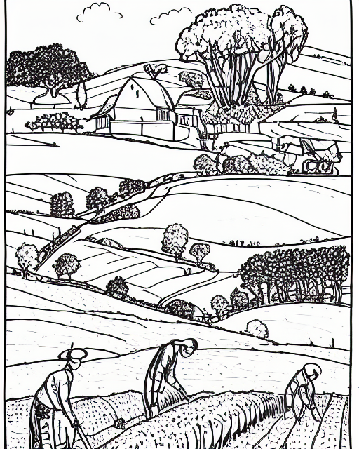
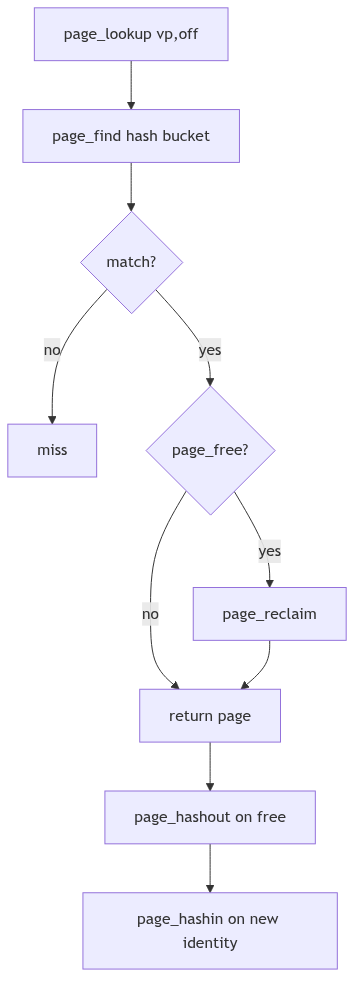

# Page Management: The Keeper of Rooms

A city of machines keeps its citizens in rooms. Some rooms are occupied, some are idle but still furnished, and some are entirely empty. The keeper is not a poet; she is a clerk with ledgers. Her work is to find a room quickly, remember who it belongs to, and decide when a room should be cleaned and returned to the pool.

SVR4's page management system is that keeper. It tracks each physical page with a `page_t` record, ties pages to vnode identities, and manages two free lists that distinguish between empty rooms and rooms that still remember their last occupant.

<br/>

## The Ledger Entry: `struct page`

Every physical page has a `struct page` record that carries its identity, state, and list links (vm/page.h:57-101).

```c
typedef struct page {
	u_int	p_lock: 1,
		p_want: 1,
		p_free: 1,
		p_intrans: 1,
		p_gone: 1,
		p_mod: 1,
		p_ref: 1,
		p_pagein: 1,
		p_nc: 1,
		p_age: 1;
	u_int	p_nio : 6;
	u_short	p_keepcnt;
	struct	vnode *p_vnode;
	u_int	p_offset;
	struct page *p_hash;
	struct page *p_next;
	struct page *p_prev;
	struct page *p_vpnext;
	struct page *p_vpprev;
	struct phat p_hat;
	u_short	p_lckcnt;
	u_short	p_cowcnt;
} page_t;
```
**The Room Ledger** (vm/page.h:57-89)

The fields mirror the keeper's daily questions. Is the room free (`p_free`)? Is a move underway (`p_intrans`)? Does it remember its owner (`p_vnode` and `p_offset`)? The list pointers keep the page on the free lists or on a vnode's page ring. The `p_hat` mapping field, shared with the HAT layer, is the keeper's seal for whether the room is currently mapped (vm/page.h:77-87).

The ledger is also aware of noncontiguous physical memory. `pageac` describes each contiguous span of page frames so the allocator can search disjoint segments when a request needs physical contiguity (vm/page.h:113-125).

<br/>


**Page Management - Farmer's Field**

## The Two Free Lists: Empty Rooms and Remembered Rooms

`page_free()` is the clerk's act of returning a room to the pool. SVR4 does not use a single list; it keeps two circular lists: `page_freelist` for pages with no vnode identity and `page_cachelist` for pages that still remember their former contents (vm/vm_page.c:764-888).

```c
/* Put page on the "free" list.  The free list is really two circular lists
 * with page_freelist and page_cachelist pointers into the middle of the lists.
 */
void
page_free(pp, dontneed)
	register page_t *pp;
	int dontneed;
{
	...
	if (vp == NULL) {
		/* page has no identity, put it on the front of the free list */
		page_add(&page_freelist, pp);
	} else {
		page_add(&page_cachelist, pp);
		if (!dontneed || nopageage)
			page_cachelist = page_cachelist->p_next;
	}
	...
}
```
**The Two Pools** (vm/vm_page.c:764-879, abridged)

A page with no identity goes straight to the front of `page_freelist`. A page with a vnode identity is cached on `page_cachelist`, and by default is pushed toward the tail to age out last. This is the keeper's compromise: keep the most recently used rooms warm in case the same tenant returns.


**Figure 2.3.1: Free and Cache Lists in the Allocator**

<br/>

## Naming and Finding Rooms: Hash Chains and Vnode Rings

The page hash is the index card catalog for the keeper. `page_hashin()` adds a page to the hash table and to the vnode's circular list (vm/vm_page.c:1759-1804). `page_find()` and `page_lookup()` search by `<vnode, offset>`, reclaiming a page from the cache list if necessary (vm/vm_page.c:550-651).

```c
page_t *
page_find(vp, off)
	register struct vnode *vp;
	register u_int off;
{
	for (pp = page_hash[PAGE_HASHFUNC(vp, off)]; pp; pp = pp->p_hash)
		if (pp->p_vnode == vp && pp->p_offset == off && pp->p_gone == 0)
			break;
	if (pp != NULL && pp->p_free)
		page_reclaim(pp);
	return (pp);
}
```
**The Catalog Lookup** (vm/vm_page.c:550-590, abridged)

`page_lookup()` adds the patience of a clerk who waits for a room in transit. If a page is being paged in, it waits on the page's condition before reclaiming it (vm/vm_page.c:614-649). The key idea is that identity wins: if the vnode/offset matches, we do not manufacture a new page, we reclaim the old one.


**Figure 2.3.2: Hash Table and Vnode Page Rings**

<br/>

## Allocation: Asking for Rooms

`page_get()` is the official request for physical pages. It enforces resource limits, optionally sleeps, and prods the pageout daemon when memory is tight (vm/vm_page.c:1050-1154). It also handles the special case of physically contiguous allocation, walking the `pageac` table to find a run of free frames (vm/vm_page.c:1159-1188).

```c
page_t *
page_get(bytes, flags)
	u_int bytes;
	u_int flags;
{
	npages = btopr(bytes);
	reqfree = (flags & P_NORESOURCELIM) ? npages : npages + minpagefree;
	while (freemem < reqfree) {
		if (!(flags & P_CANWAIT))
			return (NULL);
		if (bclnlist != NULL)
			cleanup();
		outofmem();
		(void) sleep((caddr_t)&freemem, PSWP+2);
	}
	...
}
```
**The Allocation Request** (vm/vm_page.c:1050-1154, abridged)

The flags tell the keeper how urgent the request is: `P_CANWAIT` permits sleeping, while `P_PHYSCONTIG` demands a contiguous stretch for DMA or device mappings. The allocator balances fairness (resource limits) with liveness (invoking `outofmem()` to drive pageout).

<br/>

## The Quiet Cleanup: `page_abort()` and Reclamation

When a page loses its identity, `page_abort()` clears mappings, marks the page gone, and drops it back to `page_free()` (vm/vm_page.c:707-761). This path is the keeper's reset: tear down ownership, flush mappings, and return the room to the pool. If the page is still in transit, the cleanup waits for `pvn_done()` to finish the I/O before finally freeing it.

<br/>

> **The Ghost of SVR4:**
>
> We kept one central ledger and two long queues. In your time, the keeper has been split into many clerks. Modern kernels maintain per-CPU page lists, per-node pools for NUMA, and memcg-aware LRU lists for containers. The policy is more complex, but the core idea has not changed: a page is a room with a name, and the kernel must always know which rooms are empty, which are cached, and which still belong to someone.

<br/>

## Closing the Ledger

Page management is the art of disciplined forgetting. The keeper must remember just enough to reuse the right rooms quickly, and forget enough to keep the city breathing. SVR4's two-list allocator, its hash catalog, and its careful wait loops are the steady hand that keeps the rooms available.
