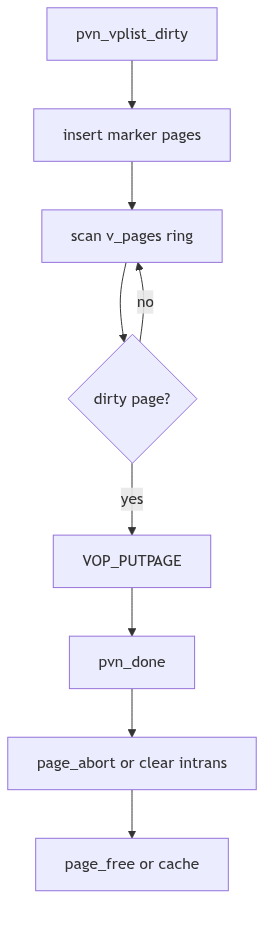

# Page Replacement and Paging: The Courier's Rounds

When a library grows too crowded, the librarians begin a quiet ritual. Volumes that have not been touched are returned to storage, and those that are still in demand are kept on the reading tables. The library does not throw books away; it moves them to where they can be fetched again. In SVR4, this ritual is the paged vnode (pvn) layer and its pageout companions.

The pvn layer sits between file systems and the VM system. It decides which pages can be clustered for I/O, how dirty pages are found, and how completed I/O is reconciled with the page ledger.

<br/>

## Clustering: `pvn_kluster()`

The courier's efficiency comes from carrying bundles, not single sheets. `pvn_kluster()` walks forward and backward from a faulting offset to build a contiguous run of file-backed pages, bounded by filesystem block limits and available memory (vm/vm_pvn.c:79-195).

```c
page_t *
pvn_kluster(vp, off, seg, addr, offp, lenp, vp_off, vp_len, isra)
{
	if (freemem - minfree > 0)
		bytesavail = ptob(freemem - minfree);
	...
	if (page_exists(vp, off))
		return (NULL);
	...
	for (delta = PAGESIZE; off + delta < vp_end; delta += PAGESIZE) {
		if ((*seg->s_ops->kluster)(seg, addr, delta))
			break;
		if (page_exists(vp, off + delta))
			break;
	}
	...
	pp = rm_allocpage(seg, straddr, (u_int)delta, P_CANWAIT);
}
```
**The Bundle Selector** (vm/vm_pvn.c:79-196, abridged)

It checks `freemem` against `minfree` to decide how large the bundle can be, consults the segment driver via `kluster()` to avoid extending beyond file boundaries, and finally allocates a list of pages. Each page is marked `p_intrans` and `p_pagein` to signal that the courier is still on the road.


**Figure 2.10.1: Clustering Around a Fault**

<br/>

## Completing the Delivery: `pvn_done()`

When the I/O completes, `pvn_done()` handles each page in the buffer. It clears `p_intrans`, checks for errors, releases the page, and, if the caller requested invalidation, aborts the page (vm/vm_pvn.c:274-379).

```c
void
pvn_done(bp)
	register struct buf *bp;
{
	if (bp->b_flags & B_REMAPPED)
		bp_mapout(bp);
	for (bytes = 0; bytes < bp->b_bcount; bytes += PAGESIZE) {
		pp = bp->b_pages;
		pp->p_intrans = 0;
		pp->p_pagein = 0;
		PAGE_RELE(pp);
		if ((bp->b_flags & (B_ERROR|B_READ)) == (B_ERROR|B_READ))
			page_abort(pp);
	}
}
```
**The I/O Reconciliation** (vm/vm_pvn.c:279-354, abridged)

The page ledger is verified after each release. If the page lost its identity or was freed in the interim, `pvn_done()` skips it. Errors trigger `page_abort()`, and clean pages are left for the normal aging process.

<br/>

## Dirty Page Scans: `pvn_vplist_dirty()`

To write pages back, the VM needs a safe way to walk a vnode's page ring while the list is still mutating. `pvn_vplist_dirty()` inserts marker pages into the ring, then scans and calls `VOP_PUTPAGE()` for dirty entries (vm/vm_pvn.c:562-699). The markers prevent the scan from looping forever while new pages arrive.

```c
page_t *
pvn_vplist_dirty(vp, off, flags)
{
	if ((spp = (page_t *)kmem_zalloc(2 * sizeof(page_t), KM_SLEEP)) == NULL)
		cmn_err(CE_PANIC, "pvn_vplist_dirty: cannot allocate marker pages");
	...
	/* Insert a start marker at the front of the v_pages list */
	spp->p_vpnext = pp;
	spp->p_vpprev = pp->p_vpprev;
	pp->p_vpprev = spp;
	...
	if (pp->p_intrans)
		page_wait(pp);
	...
	/* Call into the file system with VOP_PUTPAGE */
}
```
**The Marker Scan** (vm/vm_pvn.c:609-695, abridged)

This is the librarian's patrol. It respects `p_intrans`, waits for keep counts to drop, and only then asks the filesystem to write pages back. The pvn layer is careful to avoid deadlocks by requiring the vnode lock at a higher level.


**Figure 2.10.2: Marker Pages and Writeback Flow**

<br/>

## VOP_GETPAGE and VOP_PUTPAGE: The Contract

File systems implement the `VOP_GETPAGE` and `VOP_PUTPAGE` operations using the pvn layer. `VOP_GETPAGE` uses `pvn_kluster()` to determine a read window and then issues I/O. `VOP_PUTPAGE` relies on `pvn_vplist_dirty()` to drive writeback. This contract keeps the file system focused on blocks and metadata, while pvn handles the page choreography.

<br/>

> **The Ghost of SVR4:**
>
> We had one courier and a paper ledger. Today you have fleets: readahead windows shaped by machine learning, writeback throttling for SSDs, and background reclaim threads aware of memory cgroups. Yet the old bargain still stands. A file system cannot hide its pages, and the VM cannot write them without the file system's consent. The pvn layer is the treaty that keeps these offices in polite cooperation.

<br/>

## The Rounds Continue

Page replacement is not a dramatic purge; it is a continuous set of rounds. The pvn layer clusters, writes, and reconciles, while the pageout daemon nudges the system toward balance. The librarian's patrol never ends, and the reading rooms stay open.
