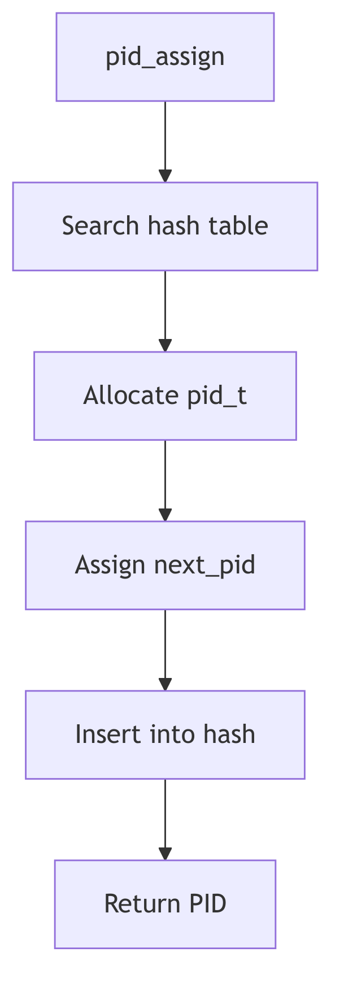
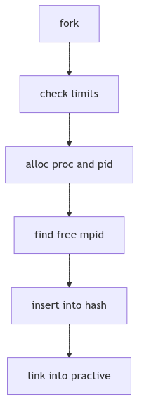
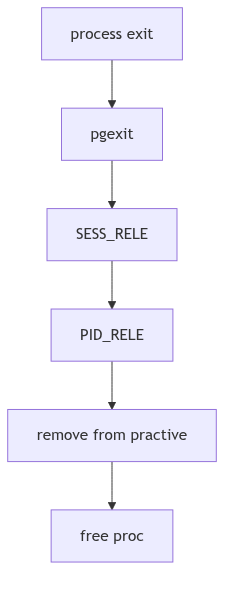

# PID Management: The Registry of Names

A city cannot function without a registry of names. Each citizen is assigned a number, recorded in a ledger, and removed only after their affairs are settled. If a number is reused too soon, confusion follows. The registry clerk must be careful and methodical.

SVR4's PID management is that registry. It allocates process IDs, maintains a hash for fast lookup, and keeps reference counts so a PID is not recycled while it is still referenced by process groups or sessions.

<br/>

## The Ledger Entry: `struct pid`

PIDs are represented by `struct pid` entries stored in a hash table. In `os/pid.c` the kernel keeps a `pidhash` array and helper macros (os/pid.c:51-55).

```c
#define HASHSZ      64
#define HASHPID(pid) (pidhash[((pid)&(HASHSZ-1))])
```
**The Registry Buckets** (os/pid.c:51-53)

Each `pid` entry links to a process group list and tracks reference counts and the `/proc` slot (os/pid.c:41-49, 167-175). The details are scattered in `proc_t` and the pid structure, but the principle is clear: the pid entry is the registry's card for that identity.


**Figure 1.6.1: PID Allocation and Lookup**

<br/>

## Assigning a New Name: `pid_assign()`

`pid_assign()` handles PID allocation at fork time (os/pid.c:96-182). It enforces process limits, allocates a `proc_t` and `pid` structure, and then searches for the next free PID.

```c
if (nproc >= v.v_proc - 1) {
    if (nproc == v.v_proc) {
        syserr.procovf++;
        return -1;
    }
    if (cond & NP_NOLAST)
        return -1;
}
```
**The Capacity Check** (os/pid.c:111-118)

PID selection increments `mpid`, wraps at `MAXPID`, and skips any PID already present in the hash (os/pid.c:152-155). Once a free PID is found, it is inserted into the hash and linked to the new `proc_t`.

```c
do {
    if (++mpid == MAXPID)
        mpid = minpid;
} while (pid_lookup(mpid) != NULL);
```
**The Next Free Name** (os/pid.c:152-155)


**Figure 1.6.2: `pid_assign()` Allocation Path**

<br/>

## Reference Counts and Exit

PIDs are shared by process groups and sessions. The registry uses reference counts to keep an ID alive while any structure still points to it. `PID_HOLD` increments the count; `PID_RELE` and `pid_rele()` remove the entry from the hash when the count reaches zero (os/pid.c:188-206).

When a process exits, `pid_exit()` removes it from the active list, releases its process group and session references, and decrements the PID entry (os/pid.c:212-241). Only after these steps does the PID become available for reuse.


**Figure 1.6.3: `pid_exit()` and Release**

<br/>

## Lookup and Group Find

`prfind()` locates a process by PID via the hash and checks whether the slot is active (os/pid.c:248-257). `pgfind()` does the same for process groups, returning the group's linked list (os/pid.c:265-276). These lookups are fundamental to signaling, job control, and `/proc` traversal.

The low-level hash walk is handled by `pid_lookup()`, which scans a bucket for a matching `pid_id` (os/pid.c:61-72).

```c
for (pidp = HASHPID(pid); pidp; pidp = pidp->pid_link) {
    if (pidp->pid_id == pid) {
        ASSERT(pidp->pid_ref > 0);
        break;
    }
}
```
**The Registry Lookup** (os/pid.c:65-71)

This tight loop is what makes signals and `/proc` queries fast. The registry is only as useful as its lookup speed.

<br/>

## Minimum PID and `/proc` Slots

The allocator maintains a moving floor for PID reuse. `pid_setmin()` advances `minpid` to `mpid + 1` (os/pid.c:75-79), ensuring that recently used PIDs are not immediately recycled. This reduces the chance of PID reuse races in parent/child bookkeeping.

The code also reserves a `/proc` directory slot for each process. A `procent` entry is pulled from the free list, linked to the new `proc_t`, and later returned in `pid_exit()` (os/pid.c:158-166, 223-227). The registry is thus tied to the `/proc` filesystem: every PID has a directory entry while it is active.

These two mechanisms keep the ledger consistent: names are not reused too quickly, and visibility in `/proc` stays in lockstep with process lifetime.

<br/>

> **The Ghost of SVR4:** We kept a modest hash table and a monotonic counter for IDs. Modern kernels use PID namespaces, per-container ranges, and larger ID spaces, but the registry rule is the same: never reuse a name while someone still holds a claim to it.

<br/>

## The Ledger Closes

PID management is a registry of identities. It assigns numbers, tracks them in a hash, and retires them only when all references are gone. The clerk's ledger ensures that every process has a unique name and that no name is reused too soon.
