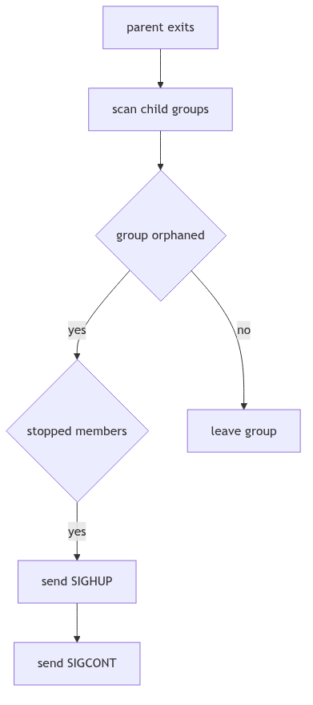
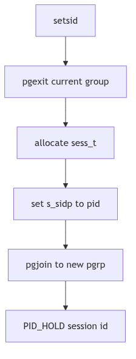

# Process Groups and Sessions: The Theater, the Cast, and the Stage Manager

Picture a grand theater with a single stage. Actors are grouped into casts, each cast rehearsing a scene. The stage manager must know which cast is on stage and which is waiting in the wings. When the curtain rises, the stage belongs to one cast only; the others must stay silent or be ushered off.

SVR4's process groups and sessions are that theater. A process group is a cast. A session is the production. The controlling terminal is the stage, and job control is the stage manager's whistle.

<br/>

## The Cast List: Process Groups

Process groups are represented by `struct pid` entries that link members together. When a process joins a group, `pgjoin()` links it into the group list and updates group metadata (os/pgrp.c:79-101).

```c
void
pgjoin(p, pgp)
    register proc_t *p;
    register struct pid *pgp;
{
    p->p_pglink = pgp->pid_pglink;
    pgp->pid_pglink = p;
    p->p_pgidp = pgp;

    if (pgp->pid_id <= SHRT_MAX)
        p->p_opgrp = (o_pid_t)pgp->pid_id;
    else
        p->p_opgrp = (o_pid_t)NOPID;

    if (p->p_pglink == NULL) {
        PID_HOLD(pgp);
        if (pglinked(p))
            pgp->pid_pgorphaned = 0;
        else
            pgp->pid_pgorphaned = 1;
    } else if (pgp->pid_pgorphaned && pglinked(p))
        pgp->pid_pgorphaned = 0;
}
```
**The Casting Call** (os/pgrp.c:79-101)

Each group keeps a linked list of members via `pid_pglink`. The `pid_pgorphaned` flag tracks whether the group has become orphaned, which affects job-control signals.


**Figure 1.5.1: Processes Linked into a Group**

<br/>

## Signaling the Cast: `pgsignal()`

When the kernel needs to signal a whole group, it walks the group list and delivers the signal to each member (os/pgrp.c:65-72).

```c
for (prp = pidp->pid_pglink; prp; prp = prp->p_pglink)
    psignal(prp, sig);
```
**The Stage Manager's Whistle** (os/pgrp.c:69-72)

This is how `kill(-pgid, SIGTERM)` fans out to every process in the group, and how job control can suspend or continue a whole cast at once.

<br/>

## Orphaned Groups and Job Control

When a parent exits, it may orphan a child's process group. `pgdetach()` checks whether any remaining parent outside the group can still influence it. If not, and if any member is stopped, the kernel sends `SIGHUP` and `SIGCONT` to the group (os/pgrp.c:144-170). The stage manager clears the scene so no stopped cast remains abandoned.

This is the mechanism behind the classic shell behavior: background jobs are terminated or resumed when their controlling shell exits.


**Figure 1.5.2: Orphan Detection and Group Signaling**

<br/>

## The Production: Sessions

A session groups process groups and anchors the controlling terminal. The `sess_t` structure in `sys/session.h` records the session ID, controlling terminal, and reference count (sys/session.h:14-26).

```c
typedef struct sess {
    short s_ref;          /* reference count */
    short s_mode;         /* /sess current permissions */
    uid_t s_uid;          /* /sess current user ID */
    gid_t s_gid;          /* /sess current group ID */
    ulong s_ctime;        /* /sess change time */
    dev_t s_dev;          /* tty's device number */
    struct vnode *s_vp;   /* tty's vnode */
    struct pid *s_sidp;   /* session ID info */
    struct cred *s_cred;  /* allocation credentials */
} sess_t;
```
**The Production Ledger** (sys/session.h:14-25)

Creating a new session via `setsid()` ultimately calls `sess_create()`, which detaches the process from its current group, allocates a new session, and makes the process its own process group leader (os/session.c:57-77).

```c
pgexit(pp);
SESS_RELE(pp->p_sessp);
sp = (sess_t *)kmem_zalloc(sizeof (sess_t), KM_SLEEP);
sp->s_sidp = pp->p_pidp;
pp->p_sessp = sp;
pgjoin(pp, pp->p_pidp);
PID_HOLD(sp->s_sidp);
```
**The New Production** (os/session.c:64-76, abridged)


**Figure 1.5.3: `setsid()` and Session Formation**

<br/>

## The Stage: Controlling Terminals

The controlling terminal belongs to a session. Foreground process groups may read and write freely; background groups are disciplined by signals. When a session loses its terminal, `freectty()` sends `SIGHUP` and clears the association (os/session.c:80-103). This is the stage manager striking the set at the end of the show.

The job-control signals `SIGTTIN` and `SIGTTOU` enforce the rule that only the foreground cast uses the stage. Background actors may speak, but the manager will suspend them if they interrupt the play.

<br/>

> **The Ghost of SVR4:** We organized casts and productions so that terminals could be governed without chaos. Modern shells still use the same model, though virtual terminals, containers, and session leaders have multiplied. The stage is now shared across many theaters, yet the rule remains: one foreground cast at a time.

<br/>

## The Curtain Falls

Process groups and sessions are the social order of the kernel. They tell the system who belongs together, who owns the stage, and who must be silenced when the curtain rises. The theater runs smoothly because the cast list is precise and the stage manager never forgets who is in charge.
