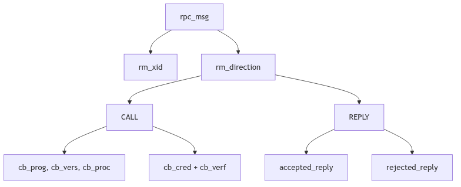
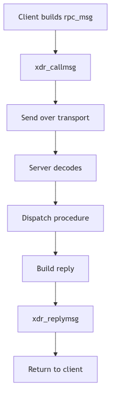

# Remote Procedure Call (RPC): The Sealed Dispatch

In a world of distant provinces, the Crown cannot send couriers for every query. It sends sealed dispatches instead: a standard envelope with a wax seal, a catalog number, and a body that can be read in any court. Remote Procedure Call is that envelope. It carries the name of the service, the procedure number, and the proof of identity, so that a server can execute a request as if the caller were present.

SVR4's kernel RPC is the protocol engine beneath NFS. It defines the message format, authenticators, and XDR serialization routines that allow the rest of the network stack to treat procedure calls as a reliable ritual.

<br/>

## The Dispatch Form: `struct rpc_msg`

Every RPC request or reply is wrapped in a single `rpc_msg` structure with a transaction ID and a direction flag (rpc/rpc_msg.h:146-155). The call and reply bodies share the same envelope, but only one is populated at a time.

```c
struct rpc_msg {
	u_long			rm_xid;
	enum msg_type	rm_direction;
	union {
		struct call_body RM_cmb;
		struct reply_body RM_rmb;
	} ru;
#define rm_call		ru.RM_cmb
#define rm_reply	ru.RM_rmb
};
```
**The Wax-Sealed Envelope** (rpc/rpc_msg.h:146-155)

The call body records the program, version, procedure number, and two authentication blocks (rpc/rpc_msg.h:134-141). The reply body carries either an accepted or rejected reply, with a reason code in both cases (rpc/rpc_msg.h:84-129). These enums (`accept_stat`, `reject_stat`) are the official stamps for success, mismatch, or authentication failure (rpc/rpc_msg.h:61-73).


**Figure 4.5.1: Call and Reply Payloads in the Shared Envelope**

<br/>


**RPC Protocol - Royal Court Dispatches**

## Versioning and Port Conventions

SVR4's RPC wire format declares its version explicitly: `RPC_MSG_VERSION` is 2 (rpc/rpc_msg.h:42). The subsystem also defines a service port constant for kernel RPC services (rpc/rpc_msg.h:42-43). These constants are the dispatch office's registry. The client and server both know which version they are speaking, and the reply can report `PROG_MISMATCH` or `RPC_MISMATCH` if the versions disagree (rpc/rpc_msg.h:61-72).

This is how the system survives change: the envelope includes the version in every call, and the receiver is required to refuse incompatible requests rather than guess.

<br/>

## The Seals: `opaque_auth`

Authentication is carried as opaque blobs. The receiver does not interpret the bytes; it only checks the flavor and length. This allows `AUTH_UNIX`, `AUTH_DES`, and other schemes to coexist (rpc/auth.h:83-87).

```c
struct opaque_auth {
	enum_t	oa_flavor;
	caddr_t	oa_base;
	u_int	oa_length;
};
```
**The Wax Seal** (rpc/auth.h:83-87)

The auth handle (`AUTH`) carries both credentials and verifier plus a small set of callbacks to marshal and refresh them (rpc/auth.h:93-105). The RPC layer does not enforce policy; it only presents the seal to the server and reports whether it was accepted.

<br/>

## Writing the Dispatch: `xdr_callmsg()`

RPC relies on XDR for machine-independent encoding. `xdr_callmsg()` serializes the call header, carefully enforcing the maximum authentication size and inserting fields in the exact order required by the standard (rpc/rpc_calmsg.c:65-105).

```c
if (xdrs->x_op == XDR_ENCODE) {
	if (cmsg->rm_call.cb_cred.oa_length > MAX_AUTH_BYTES)
		return (FALSE);
	buf = XDR_INLINE(xdrs, 8 * BYTES_PER_XDR_UNIT
		+ RNDUP(cmsg->rm_call.cb_cred.oa_length)
		+ 2 * BYTES_PER_XDR_UNIT
		+ RNDUP(cmsg->rm_call.cb_verf.oa_length));
	if (buf != NULL) {
		IXDR_PUT_LONG(buf, cmsg->rm_xid);
		IXDR_PUT_ENUM(buf, cmsg->rm_direction);
		IXDR_PUT_LONG(buf, cmsg->rm_call.cb_rpcvers);
		IXDR_PUT_LONG(buf, cmsg->rm_call.cb_prog);
		IXDR_PUT_LONG(buf, cmsg->rm_call.cb_vers);
		IXDR_PUT_LONG(buf, cmsg->rm_call.cb_proc);
		...
	}
}
```
**The Scribe's Hand** (rpc/rpc_calmsg.c:65-105, abridged)

The XDR layer is the uniform handwriting that makes a dispatch readable in any court, regardless of endian or alignment.

<br/>

## Accepted, Rejected, and Denied

The reply half of `rpc_msg` is explicit about outcomes. `MSG_ACCEPTED` still carries a status code; `SUCCESS` is only one of several outcomes (rpc/rpc_msg.h:56-68). Rejections can be version mismatches or authentication failures (rpc/rpc_msg.h:70-73). This is the protocol's insistence on ceremony: even an error must be wrapped in the official form, so the caller can diagnose which part of the dispatch failed.

The kernel uses `xdr_replymsg()` to encode this reply body (rpc/rpc_msg.h:176-182). In practice, NFS servers and other services build these replies in the same XDR dialect as calls, and the same transaction ID ties the response to its request.

<br/>

## Streams in the Courtyard

Kernel RPC runs over STREAMS. Before establishing its conversation, it may pop the `timod` module off the stream if it is not needed, using `I_FIND` and `I_POP` ioctls (rpc/rpc_subr.c:56-71). This is a small but telling detail: the RPC layer assumes responsibility for the exact shape of the transport stack beneath it.


**Figure 4.5.2: RPC Call, Dispatch, and Reply Path**

<br/>

> **The Ghost of SVR4:**
>
> We assumed the wire was mostly friendly and that a simple seal was enough. Today you wrap calls in TLS, enforce mutual authentication, and track replay windows as a matter of course. Yet you still send the same envelope: transaction ID, program, version, procedure. The wax has changed, but the dispatch is the same.

<br/>

## Conclusion

RPC is a ceremony. It defines the envelope, the seals, and the script by which a procedure call becomes a wire message and returns as a reply. NFS and its companions depend on that ceremony, and the kernel's RPC layer keeps it faithful.
