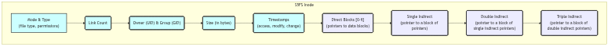
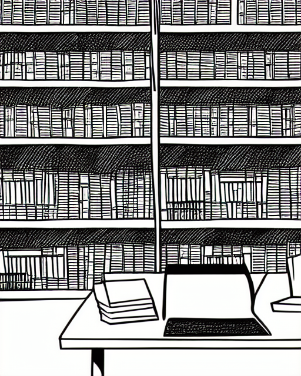

# System V File System (s5fs)

## Overview: The Provincial Lending Library

If UFS is the Grand Library of the Empire, the System V File System (s5fs) is its humbler cousin, the Provincial Lending Library. It is a simpler, more traditional institution, with a single, central card catalog and a straightforward shelving system. It lacks the sophisticated organizational schemes of its grander counterpart, but for a smaller collection, it is a perfectly serviceable and reliable system.

The s5fs is a direct descendant of the original UNIX filesystem, and it carries with it the legacy of that earlier, simpler time. It does not have the concept of cylinder groups, and its block allocation strategy is a simple one based on a linked list of free blocks. This makes it less performant than UFS on large, spinning disks, but its simplicity and low overhead make it a reasonable choice for smaller volumes.

## The Superblock: The Librarian's Desk Diary

The `filsys` structure is the s5fs superblock, the desk diary of the head librarian. It is a more modest affair than the UFS superblock, but it contains all the essential information for managing the library:

*   **`s_isize`** and **`s_fsize`**: The size of the inode list and the total size of the volume.
*   **`s_nfree`** and **`s_free`**: The heart of the s5fs allocation system. `s_free` is an array containing a small number of free block numbers, and `s_nfree` is the number of valid entries in this array.
*   **`s_ninode`** and **`s_inode`** A similar cache for free inode numbers.
*   **`s_tfree`** and **`s_tinode`**: The total number of free blocks and inodes in the filesystem.

## Inodes: The Simple Card Catalog

The s5fs inode is, in many ways, the blueprint for its more sophisticated UFS counterpart. It contains all the essential metadata for a file, including its mode, link count, ownership, size, and timestamps.

*The S5FS Inode Structure*

The block addressing scheme is similar to that of UFS, with a set of direct block pointers and single, double, and triple indirect blocks. However, the s5fs inode has only 10 direct block pointers, compared to 12 in the UFS inode.

## Block Allocation: The Free List

The most significant difference between s5fs and UFS lies in their block allocation strategies. Where UFS uses a complex, cylinder-group-based system to optimize block placement, s5fs uses a simple linked list of free blocks.

The superblock contains a small cache of free block numbers. When a new block is needed, the filesystem takes one from this cache. The block that is taken from the cache is itself a block of pointers to more free blocks. When the cache in the superblock is exhausted, it is refilled from the next available block in the free list. This is a simple and effective system for managing free space, but it has no knowledge of the underlying disk geometry and thus cannot optimize for block locality. The `blkalloc` function in `s5alloc.c` is responsible for this process.

 

> **The Ghost of SVR4:**
>
> "The System V filesystem was our workhorse, our trusted retainer. It was not as clever or as fast as the newfangled filesystem from Berkeley, but it was reliable and we understood it intimately. It was a filesystem from a time when disks were small and fragmentation was a problem to be solved by the system administrator, not by the kernel itself. In your time, you have filesystems like FAT32, which, in their own way, share a similar design philosophy. They are not the fastest or the most scalable, but their simplicity makes them universally understood and easily implemented, a common tongue for a world of disparate devices. Our s5fs was much the same, a simple tool for a simpler time."

**S5FS - Provincial Library**

## Conclusion

The System V. File System is a window into the history of UNIX. It is a simple, robust, and reliable filesystem, but one that was already showing its age by the time of SVR4. Its lack of performance optimizations and its inability to scale to larger disks meant that it was destined to be supplanted by its more sophisticated UFS cousin. Nevertheless, it remains an important part of the SVR4 story, a reminder of the solid, simple foundations upon which the more complex systems of the future would be built.