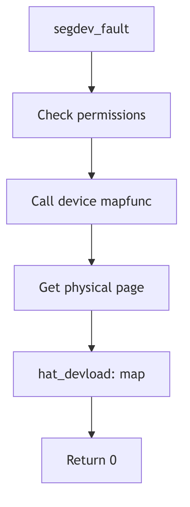

Segment Drivers - Device Memory

## Overview

The seg_dev driver manages mappings of device memory into user address spaces. This enables user programs to directly access memory-mapped I/O regions, framebuffers, and other hardware resources. The driver delegates physical address translation to device-specific mapping functions.

## Segdev Data Structure

The segment private data (seg_dev.h) contains device-specific information:

```c
struct segdev_data {
    u_char  pageprot;           /* per-page protections enabled */
    u_char  prot;               /* segment protection */
    u_char  maxprot;            /* maximum protections */
    struct  vnode *vp;          /* device special file vnode */
    off_t   offset;             /* device offset for start of mapping */
    int     (*mapfunc)();       /* device mmap function */
    struct  vpage *vpage;       /* per-page information */
};
```

The `mapfunc` pointer references the device driver's mmap entry point, which translates device offsets to physical page frame numbers. The vnode points to the device special file in `/dev`.

## Operations Vector

The seg_dev operations (seg_dev.c:80):

```c
STATIC struct seg_ops segdev_ops = {
    segdev_dup,
    segdev_unmap,
    segdev_free,
    segdev_fault,
    segdev_faulta,
    segdev_unload,
    segdev_setprot,
    segdev_checkprot,
    segdev_badop,           /* kluster */
    (u_int (*)()) NULL,     /* swapout */
    segdev_ctlops,          /* sync */
    segdev_incore,
    segdev_ctlops,          /* lockop */
    segdev_getprot,
    segdev_getoffset,
    segdev_gettype,
    segdev_getvp,
};
```

Device segments cannot be swapped or clustered since they represent physical device memory rather than pageable storage.

## Fault Handling

The `segdev_fault()` function (seg_dev.c:358) handles device memory access:

```c
STATIC faultcode_t
segdev_fault(seg, addr, len, type, rw)
    register struct seg *seg;
    register addr_t addr;
    u_int len;
    enum fault_type type;
    enum seg_rw rw;
{
    register struct segdev_data *sdp = (struct segdev_data *)seg->s_data;
    register addr_t adr;
    register u_int prot, protchk;
    u_int ppid;

    if (type == F_PROT) {
        return (FC_PROT);
    }

    if (type != F_SOFTUNLOCK) {
        switch (rw) {
        case S_READ:
            protchk = PROT_READ;
            break;
        case S_WRITE:
            protchk = PROT_WRITE;
            break;
        case S_EXEC:
            protchk = PROT_EXEC;
            break;
        }

        ppid = (u_int)(*sdp->mapfunc)(sdp->vp->v_rdev,
                sdp->offset + (adr - seg->s_base), prot);
        if (ppid == NOPAGE)
            return (FC_MAKE_ERR(EFAULT));

        hat_devload(seg, adr, ppid, prot, type == F_SOFTLOCK);
    }

    return (0);
}
```

The function invokes the device driver's mmap function to obtain the physical page ID, then calls `hat_devload()` to establish the mapping. Protection faults return immediately since seg_dev does not support copy-on-write.

## Device Mapping Function

Device drivers provide mmap functions with this signature:

```c
int (*mmap)(dev_t dev, off_t off, int prot);
```

The function receives the device number, offset within the device, and requested protections. It returns the physical page frame number (pfn) or NOPAGE if the offset is invalid. This interface allows devices to validate access and translate device-relative offsets to physical addresses.

## Per-Page Protections

Like seg_vn, seg_dev supports per-page protections through the vpage array. The `segdev_setprot()` function can modify protections for arbitrary ranges. When per-page protections are first enabled, the driver allocates a vpage array and initializes all entries with the segment's current protection.

## Duplication for Fork

The `segdev_dup()` function creates device mappings in child processes after fork(). The child receives a new segdev_data structure but shares the same device and offset. This allows multiple processes to map the same device region while maintaining independent per-page protections.



**Figure 2.8.1: Device Segment Fault Handling**
