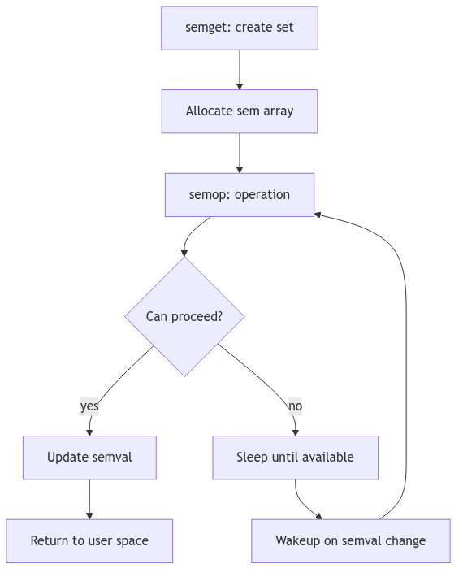
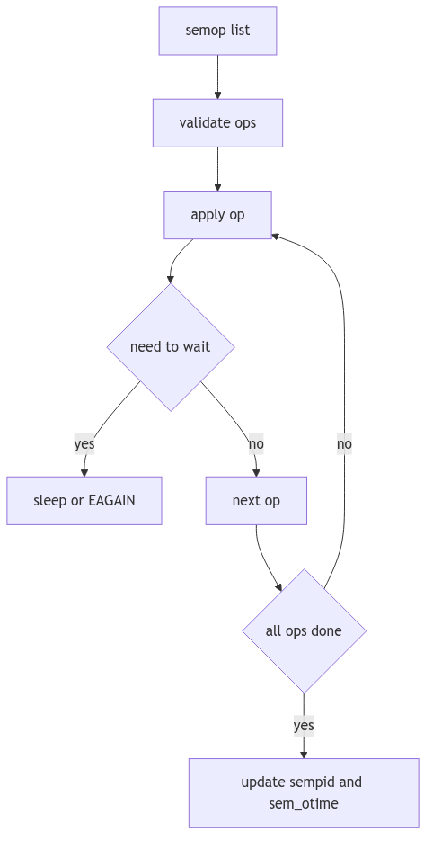
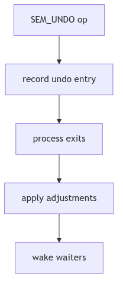

# Semaphores: The Turnstiles and the Ledger of Debts

Imagine a railway station with a row of turnstiles. Each turnstile has a counter and a small notebook. When a passenger enters, the counter decreases. When a train arrives and empties, the counter increases. The station master can adjust several turnstiles at once, and the entire action is either accepted or rejected as a single transaction.

SVR4's System V semaphores are those turnstiles. They are integer counters with an atomic operation list, a record of waiting travelers, and an optional debt ledger that is settled when a process leaves the station.

<br/>

## The Semaphore Set Ledger: `struct semid_ds`

A semaphore set is described by `struct semid_ds` in `sys/sem.h` (sys/sem.h:63-71).

```c
struct semid_ds {
    struct ipc_perm sem_perm; /* operation permission struct */
    struct sem *sem_base;     /* ptr to first semaphore in set */
    ushort sem_nsems;         /* # of semaphores in set */
    time_t sem_otime;         /* last semop time */
    time_t sem_ctime;         /* last change time */
};
```
**The Turnstile Ledger** (sys/sem.h:63-70, abridged)

Each set holds a contiguous array of `struct sem` entries, allowing multiple operations to be applied atomically in a single `semop()` call.


**Figure 1.9.1: Semaphore Set and Per-Semaphore State**

<br/>

## The Turnstile: `struct sem`

Each semaphore maintains its value and the number of waiters for two conditions (sys/sem.h:85-90).

```c
struct sem {
    ushort semval;  /* semaphore value */
    pid_t  sempid;  /* pid of last operation */
    ushort semncnt; /* # awaiting semval > cval */
    ushort semzcnt; /* # awaiting semval = 0 */
};
```
**The Turnstile Record** (sys/sem.h:85-90)

- **`semncnt`** counts processes waiting to decrement (they need more value).
- **`semzcnt`** counts processes waiting for the semaphore to reach zero.

These counters are the clerk's waiting list; they drive wakeups when state changes.

<br/>

## The Atomic Script: `semop()` and `struct sembuf`

A `semop()` call submits an array of `struct sembuf` operations (sys/sem.h:180-184). All operations are validated and executed atomically.

```c
struct sembuf {
    ushort sem_num; /* semaphore # */
    short  sem_op;  /* semaphore operation */
    short  sem_flg; /* operation flags */
};
```
**The Operation Slip** (sys/sem.h:180-183)

`semop()` in `os/sem.c` walks the operation list and applies each step (os/sem.c:665-745). The logic is strict:
- **`sem_op > 0`** increments the counter, waking waiters if necessary.
- **`sem_op < 0`** decrements if the counter is high enough; otherwise sleep or return `EAGAIN`.
- **`sem_op == 0`** waits until the counter reaches zero.

```c
if (op->sem_op < 0) {
    if (semp->semval >= (unsigned)(-op->sem_op)) {
        semp->semval += op->sem_op;
        if (semp->semzcnt && !semp->semval)
            wakeprocs((caddr_t)&semp->semzcnt, PRMPT);
        continue;
    }
    if (op->sem_flg & IPC_NOWAIT)
        return EAGAIN;
    semp->semncnt++;
    if (sleep((caddr_t)&semp->semncnt, PCATCH|PSEMN))
        return EINTR;
    goto check;
}
```
**The Negative Gate** (os/sem.c:688-719, abridged)

If a later operation fails after earlier ones succeeded, `semundo()` rolls back the completed steps to preserve atomicity (os/sem.c:672-707). The station master never leaves a partial transaction in the ledger.


**Figure 1.9.2: `semop()` Atomic Evaluation**

<br/>

## The Debt Ledger: `SEM_UNDO`

When a process sets `SEM_UNDO`, the kernel records an adjustment in a per-process undo structure (sys/sem.h:150-158). This lets the kernel reverse the operation if the process exits unexpectedly.

```c
struct sem_undo {
    struct sem_undo *un_np;
    short un_cnt;
    struct undo {
        short  un_aoe; /* adjust on exit */
        ushort un_num; /* semaphore # */
        int    un_id;  /* semid */
    } un_ent[1];
};
```
**The Debt Ledger** (sys/sem.h:150-158)

This mechanism prevents deadlocks caused by process crashes. The station records debts, then settles them at exit so the turnstiles are never left permanently locked.


**Figure 1.9.3: Undo Tracking on Process Exit**

<br/>

> **The Ghost of SVR4:** We offered atomic arrays of semaphore ops and a built‑in debt ledger for crashes. Modern systems still carry System V semaphores, but many applications now prefer futexes, robust mutexes, and lock‑free queues. The turnstiles are faster now, yet the old rule remains: the ledger must balance, or the station grinds to a halt.

<br/>

## The Ledger Closes

Semaphores in SVR4 are a careful accounting system. Each set has a ledger, each semaphore has waiting lists, and each operation is either fully applied or unwound. The station master keeps every turnstile honest, and the travelers pass through in orderly fashion.
