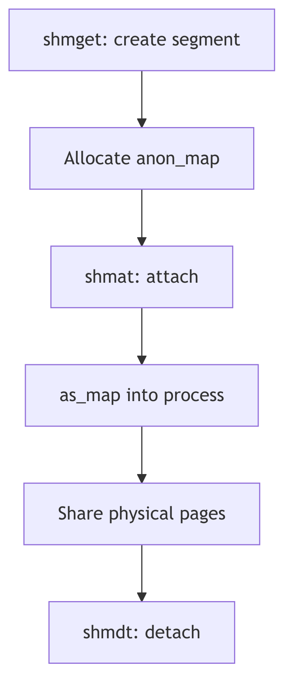
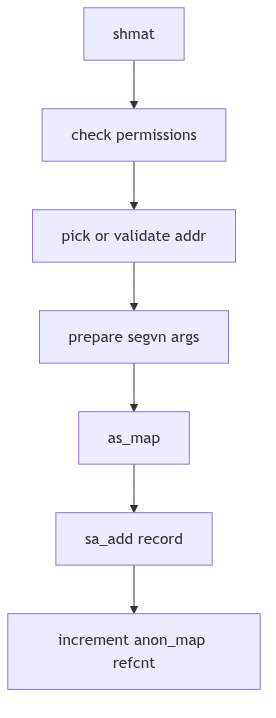
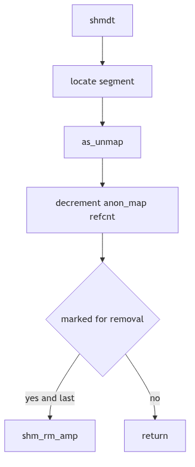

# Shared Memory: The Common Courtyard and the Keyring

Imagine a walled courtyard shared by several households. Each family has a key, and each key opens the same gate. The courtyard is not copied; it is the same stones under every footstep. The city clerk records how many keys are issued and takes the courtyard back only when the last key is returned.

SVR4's shared memory is that courtyard. It maps a single anonymous memory region into multiple address spaces and relies on attach counts and permissions to keep the ledger balanced.

<br/>

## The Courtyard Ledger: `struct shmid_ds`

Shared memory segments are described by `struct shmid_ds` in `sys/shm.h` (sys/shm.h:83-99).

```c
struct shmid_ds {
	struct ipc_perm shm_perm;	/* operation permission struct */
	int		shm_segsz;	/* size of segment in bytes */
	struct anon_map	*shm_amp;	/* segment anon_map pointer */
	ushort		shm_lkcnt;	/* number of times it is being locked */
	pid_t		shm_lpid;	/* pid of last shmop */
	pid_t		shm_cpid;	/* pid of creator */
	ulong		shm_nattch;	/* used only for shminfo */
	ulong		shm_cnattch;	/* used only for shminfo */
	time_t		shm_atime;	/* last shmat time */
	long		shm_pad1;	/* reserved for time_t expansion */
	time_t		shm_dtime;	/* last shmdt time */
	long		shm_pad2;	/* reserved for time_t expansion */
	time_t		shm_ctime;	/* last change time */
	long		shm_pad3;	/* reserved for time_t expansion */
	long		shm_pad4[4];	/* reserve area */
};
```
**The Courtyard Ledger** (sys/shm.h:83-111)

The crucial field is **`shm_amp`**, an `anon_map` that represents the shared anonymous pages. Every process maps this same `anon_map`, so every write becomes visible to all key holders.


**Figure 1.10.1: One Courtyard, Many Address Spaces**

<br/>


**Shared Memory - Shared Courtyard**

## Attaching the Courtyard: `shmat()`

The `shmat()` system call validates permissions and maps the `anon_map` into the process address space. In `os/shm.c`, the kernel picks or validates an address, then calls `as_map()` with `segvn_create` (os/shm.c:168-246).

```c
if (addr == 0) {
	map_addr(&addr, size, (off_t)0, 1);
	if (addr == NULL) {
		error = ENOMEM;
		goto errret;
	}
} else {
	if (uap->flag & SHM_RND)
		addr = (addr_t)((ulong)addr & ~(SHMLBA - 1));
	base = addr;
	len = size;
	if (((uint)base & PAGEOFFSET) ||
	    (valid_usr_range(base,len) == 0) ||
	    as_gap(pp->p_as, len, &base, &len, AH_LO, (addr_t)NULL) != 0) {
		error = EINVAL;
		goto errret;
	}
}

crargs = *(struct segvn_crargs *)zfod_argsp;
crargs.offset = 0;
crargs.type = MAP_SHARED;
crargs.amp = sp->shm_amp;
crargs.maxprot = crargs.prot;
crargs.prot = (uap->flag & SHM_RDONLY) ?
	(PROT_ALL & ~PROT_WRITE) : PROT_ALL;

error = as_map(pp->p_as, addr, size, segvn_create, (caddr_t)&crargs);
```
**The Attach Ritual** (os/shm.c:194-236, excerpt)

After mapping, the kernel records the region for later detach (`sa_add`) and increments the `anon_map` reference count (os/shm.c:238-241). This reference count is the keyring tally.


**Figure 1.10.2: `shmat()` Mapping and Reference Counting**

<br/>

### Choosing an Address

If the caller supplies no address, `shmat()` asks the system to pick a gap via `map_addr()` (os/shm.c:194-199). If an address is supplied, the kernel optionally rounds it down when `SHM_RND` is set and verifies alignment and range (os/shm.c:206-219). These rules ensure that shared mappings land on valid, page-aligned boundaries and do not collide with existing segments.

The choice is practical: the clerk will choose a safe courtyard unless the requester insists on a specific location, in which case the clerk verifies that the gate can be opened there.

<br/>

## Detaching the Courtyard: `shmdt()`

Detaching removes the mapping from the process address space but does not free the shared memory unless the segment has been marked for removal and the last attachment has gone away. The refcount on `shm_amp` is the decisive factor: the courtyard remains while any key is still held.

The detach path calls `kshmdt()` (os/shm.c:519-585). It locates the segment by address, unmaps it, and updates reference counts. If the `anon_map` refcount drops to one and the segment is marked for removal, `shm_rm_amp()` reclaims the pages (os/shm.c:301-306).


**Figure 1.10.3: `shmdt()` and Final Reclamation**

<br/>

## Removal and the Last Key

Shared memory segments are not destroyed at the first request. `shmctl(IPC_RMID)` marks a segment for removal, but the pages persist until the last attachment detaches. This design protects live processes from sudden eviction: the clerk notes the removal order and waits for the last key to return.

The `anon_map` refcount is the decisive measure. Each `shmat()` increments it, and each `shmdt()` decrements it. When the count shows that only the kernel's own reference remains, `shm_rm_amp()` can reclaim the pages (os/shm.c:301-306). The courtyard disappears only after the ledger is balanced.

<br/>

## Coordination Is Separate

Shared memory makes data cheap but leaves coordination to others. The kernel does not serialize access; it merely provides a shared courtyard. Processes must use semaphores or other synchronization to avoid trampling each other's state. This separation allows each application to choose the right balance between speed and safety.

<br/>

## Locks and Limits: `SHM_LOCK` and `shminfo`

The shared memory subsystem also enforces system-wide limits through `struct shminfo` (sys/shm.h:155-160). These values cap the size and number of shared segments and the number of attachments per process.

```c
struct shminfo {
    int shmmax; /* max shared memory segment size */
    int shmmin; /* min shared memory segment size */
    int shmmni; /* # of shared memory identifiers */
    int shmseg; /* max attached shared memory segments per process */
};
```
**The City Ordinances** (sys/shm.h:155-160)

The `shmctl()` interface exposes lock control operations such as `SHM_LOCK` and `SHM_UNLOCK` (sys/shm.h:168-169). Locking pins a segment's pages in memory, preventing paging for latency-sensitive workloads. The `shm_lkcnt` field in the descriptor tracks how many times a segment has been locked, a careful tally that ensures each lock is matched by an unlock.

These controls are the city ordinances: how large a courtyard may be, how many courtyards can exist, and whether a courtyard can be protected from eviction.

<br/>

> **The Ghost of SVR4:** We offered a courtyard with strict accounting and a simple keyring. Modern systems still keep System V shared memory, but they also provide `mmap`-backed files, huge pages, and lock-free shared rings. The courtyard has grown larger, yet the rule is unchanged: the last keyholder decides when the gate is closed.

<br/>

## The Ledger Closes

Shared memory is the fastest IPC because the kernel steps out of the way after attachment. The ledger keeps permissions and counts, the `anon_map` holds the actual pages, and each process carries its own key. When the last key is returned, the courtyard becomes empty once more.
