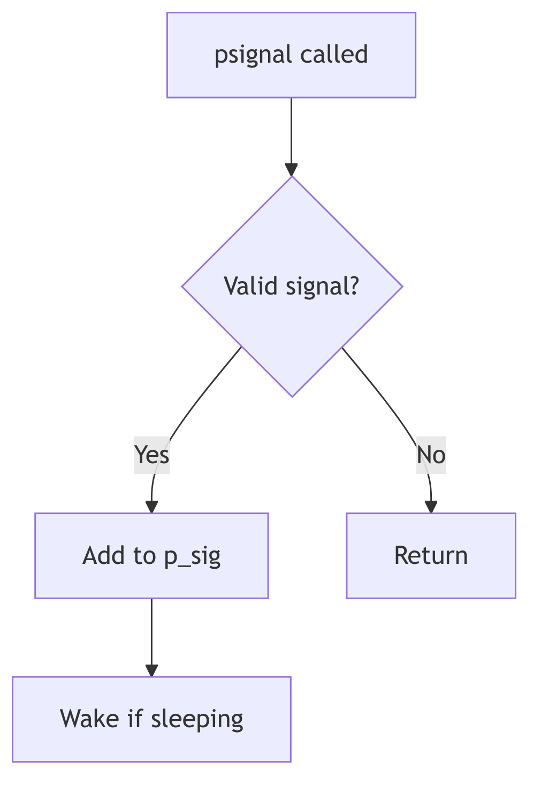
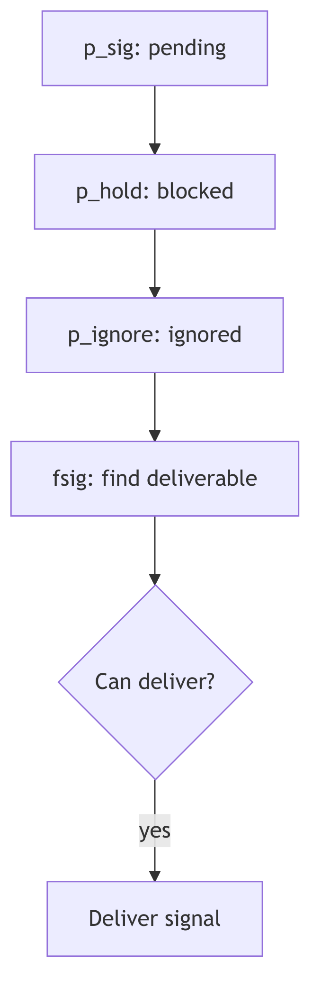
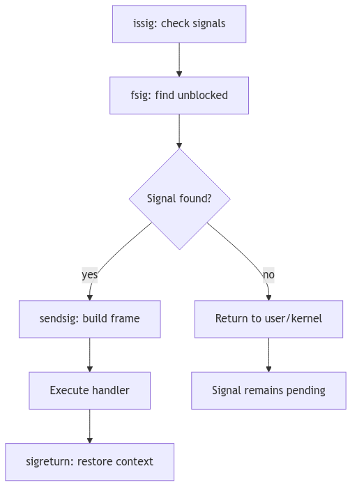

Whispers from the Kernel: The Art of Signal Handling

In the cacophony of a busy kernel, where processes dance to the CPU's tune, there exists a delicate system of asynchronous communication: **signals**. These are not polite invitations, but urgent whispers, sharp nudges, or even outright shouts from the kernel, hardware, or other processes, designed to notify a process of an event that demands its attention. From an illegal memory access to the tap on the shoulder from a user pressing `Ctrl+C`, signals are the kernel's primitive yet powerful mechanism for event-driven interaction. To truly master SVR4, one must understand this "dark art"—how signals are born, how they travel, and how a process, or indeed the kernel, chooses to respond.

<br/>

## The Genesis of a Whisper: Signal Posting



A signal's journey begins with its **posting**. This is the act of marking a target process as having a pending signal. Whether triggered by a hardware fault (like a `SIGSEGV`), a user's command (`kill -9 PID`), or a kernel event (like a child process terminating, sending a `SIGCHLD`), the kernel's `psignal()` function (often starting its work around `sig.c:103` in the SVR4 source) acts as the signal's dispatcher.

The dispatch mechanism is surprisingly nuanced, especially for job control signals, which carry specific implications for process states. For instance, a `SIGCONT` (continue signal) is a powerful command:

```c
// Simplified excerpt from psignal() in sig.c:103 onwards
if (sig == SIGCONT) {
    if (p->p_sig & sigmask(SIGSTOP)) // Check if SIGSTOP is pending
        sigdelq(p, SIGSTOP);         // Clear any pending SIGSTOP
    sigdiffset(&p->p_sig, &stopdefault); // Remove other stop signals
    if (p->p_stat == SSTOP && p->p_whystop == PR_JOBCONTROL) {
        p->p_flag |= SXSTART; // Mark for immediate start
        setrun(p);            // Make process runnable
    }
} else if (sigismember(&stopdefault, sig)) { // If it's a stop signal
    sigdelq(p, SIGCONT);                     // Clear any pending SIGCONT
    sigdelset(&p->p_sig, SIGCONT);           // Remove SIGCONT from pending
}
```
**Code Snippet 1.4: Job Control Signal Posting Logic (Simplified)**

This snippet illustrates the delicate dance between `SIGCONT` and stop signals (`SIGSTOP`, `SIGTSTP`, etc.). Posting a `SIGCONT` implicitly cancels any pending stop signals and, crucially, can awaken a process that was previously `SSTOP` (stopped). Conversely, attempting to stop a process will clear any pending `SIGCONT`. This mutual exclusivity is the kernel's way of enforcing consistent job control semantics, preventing paradoxical states.

Once these job control nuances are handled, the signal is added to the process's **pending signal set** (`p->p_sig`). If the target process is currently in an interruptible sleep (`SSLEEP` without the `SNWAKE` flag, meaning it can be awakened by a signal), the `setrun()` function is invoked to stir it from its slumber, making it runnable. However, the venerable `SIGKILL` is a brute-force exception: it will always awaken even a `SSTOP` process, as termination is its ultimate, undeniable decree.

For the currently executing process, a special flag (`u.u_sigevpend`) is set. This ensures that any signals posted to `self` (even from an interrupt context) are noticed and handled *before* the kernel finally relinquishes control and returns to user mode. This separation of "posting" (the asynchronous event) from "delivery" (the synchronous handling upon returning to user space) is a cornerstone of UNIX signal reliability.

---

> #### **The Ghost of SVR4: Reliability in a Preemptive World**
>
> The careful separation of signal posting from delivery was a design marvel for its time, ensuring consistency even when signals could arrive asynchronously from various sources (hardware, other processes). This two-phase approach prevented many race conditions that could plague simpler signal implementations. The kernel explicitly waits until a safe point (return to user mode) to process signals.
>
> **Modern Contrast (2026):** While the fundamental principles remain, modern kernels often employ more sophisticated, per-thread signal queues and more granular control over signal delivery to individual threads within a multi-threaded process. However, the core idea of signals as asynchronous notifications, processed at specific, safe points, traces its lineage directly back to robust designs like SVR4's.

---

<br/>


**Signal Handling - Whispers and Nudges**

## The Sentry's Gate: Signal Masks and Sets



A process is not merely a passive recipient of signals; it possesses a sophisticated array of defenses and preferences, managed by the kernel through various **signal bitmasks** and predefined **signal sets**. These act as filters, allowing a process to selectively block, ignore, or trace specific signals, thereby controlling its susceptibility to external interruptions.

The kernel maintains several critical bitmasks for each process (conceptually depicted in Figure 1.3.3 from your `.mmd` diagrams):

*   **`p_sig` (Pending Signals)**: This bitmask holds the signals that have been posted to the process but have not yet been delivered. Think of it as a process's "inbox" for incoming notifications.
*   **`p_hold` (Blocked Signals)**: Signals whose corresponding bit is set in `p_hold` are *blocked*. They will not be delivered to the process even if they are pending (`p_sig` has their bit set). They effectively wait in `p_sig` until they are unblocked. This is crucial for critical sections of code where a process needs to avoid asynchronous interruptions.
*   **`p_ignore` (Ignored Signals)**: Signals in this set are simply discarded upon delivery. The process explicitly tells the kernel, "Don't bother me with these; I don't care."
*   **`p_sigmask` (Traced Signals)**: Primarily used by debuggers, signals in this set cause the process to stop and notify its tracing parent when they are about to be delivered. This allows a debugger to intercept and potentially alter the signal's fate.

Beyond these per-process masks, SVR4 defines several global `k_sigset_t` (kernel signal set type) bitmasks that encode fundamental, unchangeable behaviors (found in `sig.c:72-89`):

```c
// Excerpt from sig.c:72-89 - Immutable Signal Properties
k_sigset_t cantmask = (sigmask(SIGKILL)|sigmask(SIGSTOP));
k_sigset_t cantreset = (sigmask(SIGILL)|sigmask(SIGTRAP)|sigmask(SIGPWR));
k_sigset_t stopdefault = (sigmask(SIGSTOP)|sigmask(SIGTSTP)
            |sigmask(SIGTTOU)|sigmask(SIGTTIN));
k_sigset_t coredefault = (sigmask(SIGQUIT)|sigmask(SIGILL)|sigmask(SIGTRAP)
            |sigmask(SIGIOT)|sigmask(SIGEMT)|sigmask(SIGFPE)
            |sigmask(SIGBUS)|sigmask(SIGSEGV)|sigmask(SIGSYS)
            |sigmask(SIGXCPU)|sigmask(SIGXFSZ));
```
**Code Snippet 1.5: Predefined Kernel Signal Sets**

These predefined sets are the kernel's immutable laws regarding signals:

*   **`cantmask`**: This set, containing `SIGKILL` and `SIGSTOP`, represents signals that cannot be blocked, ignored, or caught. `SIGKILL` ensures a process can always be forcibly terminated, while `SIGSTOP` guarantees it can always be halted by the system. There are no safe words against these.
*   **`cantreset`**: Signals like `SIGILL` (illegal instruction) and `SIGTRAP` (trap instruction) cannot be reset to their default handlers by `SA_RESETHAND`. This prevents scenarios where a handler for a CPU exception might accidentally re-enable an infinite loop, crashing the system.
*   **`stopdefault`**: These are the signals whose default action is to stop the process (e.g., `SIGTSTP` from `Ctrl+Z`).
*   **`coredefault`**: Signals in this set (e.g., `SIGSEGV` for segmentation fault, `SIGQUIT` for quit) will, by default, cause the process to terminate and dump a core file for post-mortem debugging.

Understanding these masks and sets is paramount, for they define the very boundaries of a process's control over its own execution flow in the face of asynchronous events.

---

<br/>

## The Grand Interrogation: Signal Delivery

A signal, once posted and nestled in `p_sig`, does not immediately disrupt the process's user-mode reverie. The SVR4 kernel is far more discerning. Signal delivery is typically a synchronous event, carefully orchestrated to occur at safe points—specifically, when a process is about to transition from kernel mode back into user mode. This is the moment for the `issig()` function (`sig.c:224`) to perform its grand interrogation.

Think of `issig()` as the gatekeeper, constantly scanning the process's pending signals (via the `fsig()` helper function, which dutifully checks `p->p_sig` for the first unblocked, unignored signal). Its loop is relentless, ensuring no deliverable signal is overlooked:

```c
// Simplified logic of issig() in sig.c:224
for (;;) {
    if ((sig = fsig(p)) == 0) // No deliverable signal?
        return 0;             // Return, let process continue
    
    // Is it being traced or not ignored?
    if (tracing(p, sig) || !sigismember(&p->p_ignore, sig)) {
        if (why == JUSTLOOKING) // Just checking, don't consume signal yet
            return sig;
        break;                  // Found a signal to deliver
    }
    // If ignored, consume and keep looking
    sigdelset(&p->p_sig, sig);
    sigdelq(p, sig); // Also remove from any detailed queue
}
// ... further processing for 'sig'
```
**Code Snippet 1.6: The `issig()` Signal Delivery Loop (Simplified)**



The `issig()` function follows a clear hierarchy of handling:

1.  **Ignored Signals**: If `fsig()` discovers a signal that is marked in `p->p_ignore`, it's summarily discarded (`sigdelset`, `sigdelq`), and `issig()` continues its scan, as if the signal never existed.
2.  **Traced Signals**: For processes being debugged (`tracing(p, sig)`), a deliverable signal causes the process to stop via `stop()` (`sig.c:343`). This notifies the tracing parent (the debugger), allowing it to inspect the process's state and even potentially alter the signal or its action. The process enters an `SSTOP` state and yields the CPU (`swtch()`), patiently awaiting the debugger's command.
3.  **Job Control Stop Signals**: If a `stopdefault` signal (`SIGSTOP`, `SIGTSTP`, `SIGTTIN`, `SIGTTOU`) is found and its default action is active (i.e., not ignored or caught), the `isjobstop()` function intervenes (`sig.c:177`). This again stops the process, setting its state to `SSTOP`, and notifies its process group leader (and potentially the parent) via `sigcld()`). This is the fundamental mechanism behind shell job control, allowing you to suspend a foreground process with `Ctrl+Z`.

Only after passing these gauntlets is a signal promoted to `p_cursig`, indicating it's ready for its ultimate **action**.

<br/>

## The Process's Reply: Signal Action and `sigaction`

Once `issig()` has crowned a signal as `p_cursig`, the `psig()` function (`sig.c:420`) steps in to determine the process's final response. SVR4, adhering to the POSIX standard, provides a robust framework for specifying how a process reacts to a signal, primarily through the `sigaction()` system call. This system call is the process's declaration of intent, a detailed instruction set for its signal handling strategy.

There are three fundamental actions a process can take:

1.  **Ignore**: As discussed, if a signal is in `p->p_ignore`, it's silently discarded. This is the simplest form of dismissal.
2.  **Default**: Each signal has a predefined default action by the kernel. This can range from:
    *   **Terminate**: The process simply exits (`exit()`). Signals like `SIGHUP`, `SIGINT`, `SIGTERM` fall here.
    *   **Terminate and Core Dump**: The process exits, but first writes an image of its memory (a "core dump") to disk for post-mortem debugging. `SIGSEGV`, `SIGQUIT`, `SIGFPE` are prime examples (members of `coredefault`).
    *   **Stop**: The process suspends its execution. `SIGSTOP`, `SIGTSTP` are the culprits here.
    *   **Ignore**: A few signals, like `SIGCHLD` (child status change) and `SIGURG` (urgent condition on a socket), are ignored by default.

3.  **Catch (User-Defined Handler)**: This is where a process truly asserts its control. Using `sigaction()`, a process can specify a user-mode function (a "signal handler") to be executed when a specific signal is delivered. This allows applications to gracefully respond to events, such as saving state before termination (`SIGTERM`) or resetting broken network connections.

The `sigaction` structure (or its conceptual SVR4 equivalent) is the heart of this customization:

```c
// Conceptual SVR4 sigaction structure
struct sigaction {
    void (*sa_handler)(int);        // Pointer to the signal handler function
    k_sigset_t sa_mask;             // Signals to block while handler runs
    int        sa_flags;            // Special flags (SA_RESTART, SA_NOCLDSTOP, SA_RESETHAND, SA_NODEFER)
    // ... other fields like sa_restorer for some architectures
};
```
**Code Snippet 1.7: The `sigaction` Structure (Conceptual)**

When a user-defined handler is invoked (`sendsig()` in `sig.c:467`), the kernel performs a meticulous setup:

*   **Blocking Signals (`sa_mask`, `SA_NODEFER`)**: The `sa_mask` in the `sigaction` structure specifies a set of signals to be *blocked* (added to `p_hold`) for the duration of the handler's execution. This prevents these signals from interrupting the handler itself, ensuring its atomic execution. Crucially, the signal currently being handled is *automatically blocked* to prevent reentrant delivery unless the `SA_NODEFER` flag is set.
*   **One-Shot Handlers (`SA_RESETHAND`)**: If the `SA_RESETHAND` flag is set, the kernel automatically resets the signal's disposition to `SIG_DFL` (default) *before* invoking the handler. This creates a "one-shot" handler that only executes once, after which the signal reverts to its default behavior.
*   **The Signal Frame (`sendsig()`)**: This is where the kernel works its magic at the boundary of kernel and user space. The `sendsig()` function (which is typically architecture-specific, meaning it differs for i386 vs. SPARC) meticulously constructs a "signal frame" on the user's stack. This frame is a temporary data structure containing:
    *   The signal number.
    *   Extended signal information (`siginfo_t`, if `SA_SIGINFO` was specified).
    *   A snapshot of the process's user-mode CPU context (`ucontext_t` or equivalent, including registers, program counter, stack pointer).
    *   The return address, carefully set to point to the user-defined signal handler.

    The kernel then modifies the process's saved CPU state (the one that would normally be restored upon return from kernel mode) to make it appear as if the process had called its own signal handler. When the kernel returns to user mode, instead of resuming the interrupted code, the CPU jumps directly to the signal handler.

When the user-defined signal handler completes its execution, it does *not* typically return using a standard `ret` instruction. Instead, it must invoke the `sigreturn()` system call. This specialized system call is the handler's graceful exit. `sigreturn()`'s sole purpose is to dismantle the signal frame, restore the original process context (from before the signal delivery), and atomically unblock any signals that were blocked by `sa_mask`. This allows the process to seamlessly resume execution from precisely where it was interrupted, often unaware of the kernel's swift, intricate intervention.

---

> #### **The Ghost of SVR4: The Evolution of Signal Semantics**
>
> Early UNIX signals were notoriously unreliable and fraught with race conditions (System V signals being a prime example). Signals could be lost, or handlers could be re-entered unpredictably. The `sigaction()` interface, along with the detailed blocking semantics (`sa_mask`, `SA_NODEFER`) and the `sigreturn()` mechanism, were crucial advancements introduced (or standardized by POSIX, which SVR4 embraced) to make signal handling robust and predictable. This provided developers with the necessary tools to write reliable signal-driven applications.
>
> **Modern Contrast (2026):** While `sigaction()` remains the preferred and most robust API for signal handling in modern UNIX-like systems (including Linux), the evolution of multi-threading (`pthreads`) introduced new complexities. Signals are now often delivered to specific threads rather than entire processes, requiring thread-specific signal masks (`pthread_sigmask`). Despite these advancements, the core mechanisms of signal posting, masking, delivery, and the signal frame concept are directly descended from the foundations laid by systems like SVR4.

---

<br/>

## Safeguarding the Kernel: Implementation Notes

The SVR4 signal mechanism is fortified with careful considerations for race conditions and system stability:

*   **`SIGKILL`'s Supremacy**: A pending `SIGKILL` always takes precedence, ensuring that a process can be terminated regardless of what other signals it's handling or blocking. There is no escape from `SIGKILL`.
*   **Stop vs. Kill**: `SIGKILL` cannot be stopped. If a `SIGKILL` is pending, any attempt to stop the process is overridden, guaranteeing unstoppable termination.
*   **Timely Delivery**: The `u.u_sigevpend` flag for the current process is a subtle yet vital mechanism. It forces the kernel to check for signals immediately before returning to user mode, ensuring that signals posted even in an interrupt context (e.g., a timer interrupt posting a `SIGALRM`) are noticed without undue delay.
*   **Queued Signal Information**: For real-time signals (which SVR4 did support, though less prevalently than in modern systems) or when extended signal information is requested (`SA_SIGINFO`), the kernel maintains detailed queues of `siginfo_t` structures. Functions like `sigdelq()` and `sigdeq()` manage this richer information, allowing the handler to receive not just the signal number, but also *why* and *where* the signal occurred.

This careful separation of the asynchronous act of signal posting from the synchronous, controlled act of signal delivery, coupled with robust masking and a well-defined action framework, underpins the reliability of SVR4's signal architecture.

---
