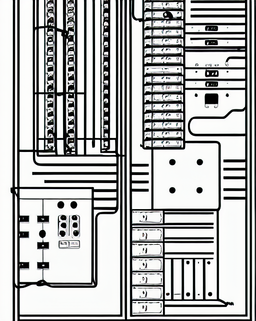
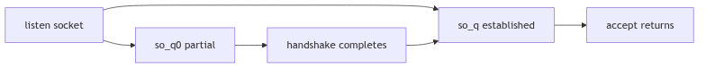
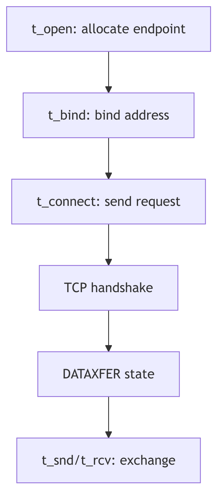
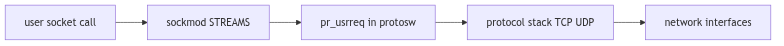

# Socket Layer: The Switchboard and the Call Ledger

Picture a public telephone exchange with a wall of brass sockets and a clerk who knows every line by number. A caller lifts a receiver and asks for a connection. The clerk does not carry the conversation; she binds the line, notes the request, and routes it to the proper operator. The exchange is not the wire and not the caller, but the ordered space where connections are declared and recorded.

SVR4's socket layer is that switchboard. It defines the vocabulary of connection types, keeps the ledger of each socket's state, and hands requests to the appropriate protocol machinery. The socket itself is the stamped ticket; the rest of the system honors it because the switchboard insists on order.

<br/>

## The Socket Charter: Types and Options

The socket API's basic contract is defined in `sys/socket.h`. It ties abstract socket types to the transport classes used by the networking stack (sys/socket.h:46-61).

```c
#define SOCK_STREAM    NC_TPI_COTS   /* stream socket */
#define SOCK_DGRAM     NC_TPI_CLTS   /* datagram socket */
#define SOCK_RAW       NC_TPI_RAW    /* raw-protocol interface */
#define SOCK_RDM       5             /* reliably-delivered message */
#define SOCK_SEQPACKET 6             /* sequenced packet stream */
```
**The Charter of Types** (sys/socket.h:56-60)

Options are recorded as bit flags. These indicate whether a socket may broadcast, linger on close, or accept new connections (sys/socket.h:63-75).

```c
#define SO_ACCEPTCONN  0x0002  /* socket has had listen() */
#define SO_REUSEADDR   0x0004  /* allow local address reuse */
#define SO_KEEPALIVE   0x0008  /* keep connections alive */
#define SO_BROADCAST   0x0020  /* permit sending of broadcast msgs */
#define SO_LINGER      0x0080  /* linger on close if data present */
#define SO_OOBINLINE   0x0100  /* leave received OOB data in line */
#define SO_IMASOCKET   0x0400  /* use socket semantics */
```
**The Option Seals** (sys/socket.h:65-75)

These flags are the seals on the ticket. They are set by `setsockopt`, tested by protocol code, and reflected in the internal socket state as requests arrive.

<br/>


**Socket Layer - Telephone Exchange**

## The Call Ledger: `struct socket`

The kernel's per-socket ledger is defined in `sys/socketvar.h`. It records the socket's type, state, connection queues, and buffer state (sys/socketvar.h:42-98).

```c
struct socket {
    short   so_type;        /* generic type, see socket.h */
    short   so_options;     /* from socket call, see socket.h */
    short   so_linger;      /* time to linger while closing */
    short   so_state;       /* internal state flags SS_* */
    caddr_t so_pcb;         /* protocol control block */
    struct protosw *so_proto; /* protocol handle */

    struct socket *so_head; /* back pointer to accept socket */
    struct socket *so_q0;   /* queue of partial connections */
    struct socket *so_q;    /* queue of incoming connections */
    short   so_q0len;
    short   so_qlen;
    short   so_qlimit;
    short   so_timeo;
    u_short so_error;
    short   so_pgrp;
    u_long  so_oobmark;

    struct sockbuf {
        u_long sb_cc;
        u_long sb_hiwat;
        u_long sb_mbcnt;
        u_long sb_mbmax;
        u_long sb_lowat;
        struct mbuf *sb_mb;
        struct proc *sb_sel;
        short sb_timeo;
        short sb_flags;
    } so_rcv, so_snd;
};
```
**The Call Ledger** (sys/socketvar.h:42-83)

The connection queues deserve special attention:
- **`so_q0`** holds half-open connections, those partway through a handshake.
- **`so_q`** holds fully established connections, ready for `accept()`.
- **`so_qlimit`** caps the sum of both, preventing the switchboard from being overwhelmed.

Socket state flags such as `SS_ISCONNECTED` and `SS_ISBOUND` mark progress through the connection lifecycle (sys/socketvar.h:112-120). Meanwhile, the `sockbuf` structures track receive and send space, guarded by locking macros like `sblock` and `sbunlock` (sys/socketvar.h:168-189). The ledger does not merely record; it enforces flow control.


**Figure 4.2.1: The Two Queues of a Listening Socket**

<br/>

## The Protocol Switchboard: `protosw`

Sockets are abstract; protocols are concrete. The switchboard between them is `struct protosw` in `sys/protosw.h`. It supplies hooks for input, output, and user requests (sys/protosw.h:61-78).

```c
struct protosw {
    short   pr_type;        /* socket type used for */
    struct  domain *pr_domain;
    short   pr_protocol;
    short   pr_flags;
    int     (*pr_input)();
    int     (*pr_output)();
    int     (*pr_ctlinput)();
    int     (*pr_ctloutput)();
    int     (*pr_usrreq)();
    int     (*pr_init)();
    int     (*pr_fasttimo)();
    int     (*pr_slowtimo)();
    int     (*pr_drain)();
};
```
**The Protocol Switchboard** (sys/protosw.h:61-78)

The `pr_usrreq` entry point receives the classic socket requests: attach, bind, listen, connect, accept, send, and so on. These are encoded as `PRU_*` constants (sys/protosw.h:106-129). In other words, a call like `connect()` becomes `PRU_CONNECT`, and the protocol handler knows exactly how to proceed.

This is where the abstraction pays off: TCP and UDP share the same request vocabulary, even though their behavior differs dramatically.

<br/>

## STREAMS and the Socket Module

SVR4's socket layer is tightly bound to STREAMS. The socket module (`sockmod`) presents socket semantics on top of STREAMS queues, bridging the TLI/TPI world with the BSD socket interface. Its data structures live in `sys/sockmod.h`, notably `struct so_so`, which holds per-socket STREAMS state and TPI information (sys/sockmod.h:131-159).

```c
struct so_so {
    long            flags;
    queue_t         *rdq;
    mblk_t          *iocsave;
    struct t_info   tp_info;
    struct netbuf   raddr;
    struct netbuf   laddr;
    struct ux_extaddr lux_dev;
    struct ux_extaddr rux_dev;
    int             so_error;
    mblk_t          *oob;
    struct so_so    *so_conn;
    mblk_t          *consave;
    struct si_udata udata;
    int             so_option;
    mblk_t          *bigmsg;
    struct so_ux    so_ux;
    int             hasoutofband;
    mblk_t          *urg_msg;
    int             sndbuf;
    int             rcvbuf;
    int             sndlowat;
    int             rcvlowat;
    int             linger;
    int             sndtimeo;
    int             rcvtimeo;
    int             prototype;
    int             esbcnt;
};
```
**The STREAMS Socket Record** (sys/sockmod.h:131-159)

The module itself is a STREAMS component with standard read and write queue initializers, exposed via the `sockinfo` streamtab (io/sockmod.c:183-220). This is the physical switchboard, wired into the STREAMS fabric.


**Figure 4.2.2: TLI Connection Semantics Used by `sockmod`**

<br/>

## The Call Path

A socket call from user space becomes a message into this layered world:
1. **User calls `socket()`** and receives a file descriptor.
2. **`sockmod` attaches** and records `si_udata` (type, options, service type).
3. **`pr_usrreq` dispatches** the request to the protocol implementation.
4. **STREAMS queues carry data**, translating between socket semantics and TPI primitives.


**Figure 4.2.5: Socket Requests Across STREAMS and Protocols**

This path is less direct than a single call into TCP, but it preserves the uniform STREAMS architecture of SVR4 while offering the familiar socket API to applications.

<br/>

> **The Ghost of SVR4:** Our sockets lived in a STREAMS world. We translated BSD calls into TPI messages and let the queues mediate flow. In your era the abstraction still exists, but it is thinner: native sockets with epoll, kqueue, and io_uring provide direct paths that we could only imagine. Yet the ledger remains: a socket still has state, buffers, and a protocol switch, and the switchboard clerk still decides which line rings.

<br/>

## The Switchboard at Dusk

The socket layer in SVR4 is a careful mediation between users and protocols. It defines the contract, maintains the ledger of each connection, and dispatches requests to the protocol switchboard while honoring the STREAMS architecture. The calls that enter the exchange depart with a clear destination, and the clerk's ledger keeps every line in order.
