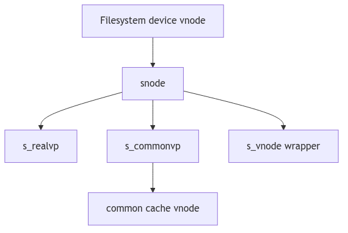
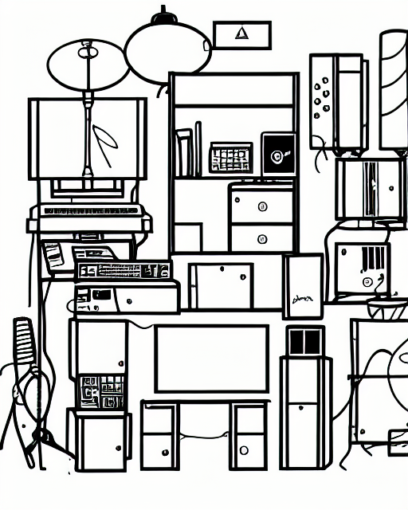
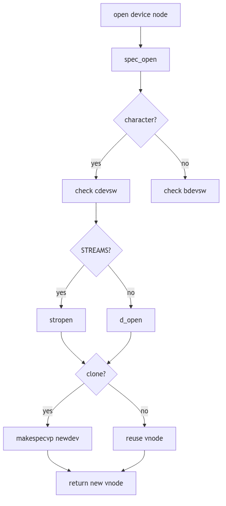

# Special Files and Devices: The Cabinet of Apparatus

Every city has a cabinet of instruments: valves that open rivers, levers that ring bells, and wheels that set engines in motion. They are not ordinary objects, yet they are handled through ordinary doors. Special files are those doors. A device node looks like a file in the directory tree, but behind it lies hardware, a stream, or a synthetic endpoint.

SVR4 builds this cabinet with specfs. It wraps device nodes in `snode` structures, shares a common vnode for caching, and routes open and I/O calls into the proper device switch.

<br/>

## The Instrument Card: `struct snode`

A special file is tracked by a `struct snode`. It binds a vnode to a device, and holds both a real vnode (the filesystem entry) and a common vnode used for shared caching (sys/fs/snode.h:31-49).

```c
struct snode {
	struct	snode *s_next;
	struct	vnode s_vnode;
	struct	vnode *s_realvp;
	struct	vnode *s_commonvp;
	ushort	s_flag;
	dev_t	s_dev;
	dev_t	s_fsid;
	daddr_t	s_nextr;
	long	s_size;
	time_t	s_atime;
	time_t	s_mtime;
	time_t	s_ctime;
	int	s_count;
	long	s_mapcnt;
	long	s_pad1;
	long	s_pad2;
	long	s_pad3;
	struct proc *s_powns;
};
```
**The Instrument Card** (sys/fs/snode.h:31-49)

The `s_commonvp` is the shared shelf where cached pages live. Multiple filesystem entries pointing at the same device can share that cache without aliasing, while each entry retains its own `s_realvp` identity.


**Figure 3.7.1: Real Vnode, Common Vnode, and Snode**

<br/>


**Special Files - Instruments Cabinet**

## Creating a Device Door: `specvp()`

When the kernel encounters a device vnode, it wraps it in an snode and associates it with the common vnode for that device (specfs/specsubr.c:80-144). This is the point where the cabinet's index card is created.

```c
if ((sp = sfind(dev, type, vp)) == NULL) {
	sp = (struct snode *)kmem_zalloc(sizeof(*sp), KM_SLEEP);
	STOV(sp)->v_op = &spec_vnodeops;
	...
	sp->s_realvp = vp;
	VN_HOLD(vp);
	sp->s_dev = dev;
	svp = STOV(sp);
	svp->v_rdev = dev;
	svp->v_data = (caddr_t)sp;
	if (type == VBLK || type == VCHR) {
		sp->s_commonvp = commonvp(dev, type);
		svp->v_stream = sp->s_commonvp->v_stream;
	}
	...
}
```
**The Wrapped Device Vnode** (specfs/specsubr.c:104-132, abridged)

The wrapper installs `spec_vnodeops`, ties the vnode to its device number, and ensures that character and block devices share a common stream if one exists.

<br/>

## The Hash Table: Finding Shared Devices

Specfs keeps a hash table (`stable`) keyed by device number. `sfind()` searches for an existing snode by device, type, and backing vnode, and holds it if found (specfs/specsubr.c:379-399). This is what prevents duplicate wrappers for the same device.

```c
st = stable[STABLEHASH(dev)];
while (st != NULL) {
	svp = STOV(st);
	if (st->s_dev == dev && svp->v_type == type
	  && VN_CMP(st->s_realvp, vp)
	  && (vp != NULL || st->s_commonvp == svp)) {
		VN_HOLD(svp);
		return st;
	}
	st = st->s_next;
}
```
**The Snode Lookup** (specfs/specsubr.c:388-398, abridged)

When the last reference disappears, specfs removes the snode from the hash in `sdelete()` and marks timestamps with `smark()` so that device access times remain meaningful (specfs/specsubr.c:360-418).

<br/>

## Opening the Instrument: `spec_open()`

When a process opens a device node, `spec_open()` selects the correct device switch, handles clone opens, and wires the stream if the driver is STREAMS-based (specfs/specvnops.c:179-259). The clerk even accounts for controlling terminals when the device is a TTY.

```c
if (cdevsw[maj].d_str) {
	if ((error = stropen(cvp, &newdev, flag, cr)) == 0) {
		struct stdata *stp = cvp->v_stream;
		if (dev != newdev) {
			/* Clone open. */
			if ((nvp = makespecvp(newdev, VCHR)) == NULL)
				...
			VTOS(nvp)->s_fsid = VTOS(vp)->s_fsid;
			nvp->v_stream = stp;
			cvp = VTOS(nvp)->s_commonvp;
			stp->sd_strtab = cdevsw[getmajor(newdev)].d_str;
			*vpp = nvp;
		} else {
			vp->v_stream = stp;
		}
	}
}
```
**The Cabinet Door Opens** (specfs/specvnops.c:220-260, abridged)

Clone opens are a special trick: the driver returns a new minor device number, and specfs manufactures a new vnode and snode for it. This is how devices like `/dev/ptmx` and `/dev/clone` hand out private endpoints.


**Figure 3.7.2: Open Path for Character and Block Devices**

<br/>

## Common Vnodes and Shared State

Specfs keeps a common vnode so that page caching and stream state do not diverge across multiple filesystem entries. A device node in `/dev`, a mounted filesystem entry, and a clone vnode all point to the same shared core, keeping their caching and stream buffers consistent while still tracking distinct names.

<br/>

> **The Ghost of SVR4:**
>
> We treated devices as files because it let the cabinet use the same keys as the library. Modern systems still do this, but they add new locks: devtmpfs, udev rules, and permission mediation at the device manager. The cabinet is larger now, yet the door still turns on the same hinge: a vnode that routes operations to a driver.

<br/>

## Conclusion

Special files are not ordinary books, but they live in the same catalog. Specfs builds the index cards (`snode`), keeps a common shelf for shared state, and translates open and I/O calls into the device switch. The cabinet is orderly, and the instruments answer when the doors are opened.
