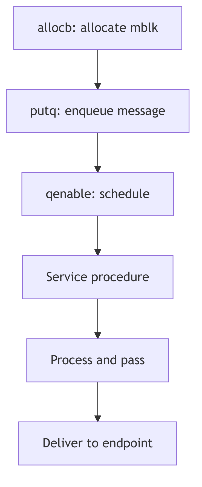

The Plumbing Unveiled: STREAMS Framework Internals



Having explored the STREAMS-based networking architecture from the application perspective, we now descend into the very machinery itself—the **STREAMS framework**, the kernel subsystem that makes modularity, message passing, and dynamic reconfiguration not merely aspirations but operational realities. This is the plumbing behind the elegant abstractions, where message blocks are allocated, queues are serviced, and flow control prevents the system from drowning in its own data.

<br/>

## The Fundamental Triad: Message Blocks, Data Blocks, and Queues

At the core of STREAMS lies a trinity of structures that together embody the essence of message-based I/O:


**STREAMS - Postal System**

### The Message Block (`mblk_t`)

A message block is a lightweight descriptor, the handle by which STREAMS code manipulates data. It does not own the data itself; rather, it **points** to a data block and maintains metadata about the message's position within that data:

```c
/* From sys/stream.h */
struct	msgb {
	struct	msgb	*b_next;
	struct	msgb	*b_prev;
	struct	msgb	*b_cont;
	unsigned char	*b_rptr;
	unsigned char	*b_wptr;
	struct datab 	*b_datap;
	unsigned char	b_band;
	unsigned char	b_pad1;
	unsigned short	b_flag;
	long		b_pad2;
};
```
**Code Snippet 4.10.1: The Message Block Structure (sys/stream.h:294-305)**

The genius of this design is the **separation of descriptor from data**. Multiple message blocks can reference the same underlying data block (via `b_datap`), enabling zero-copy operations. When TCP prepends a header to user data, it doesn't copy the data—it allocates a new `mblk_t` for the header, links it via `b_cont` to the original data's `mblk_t`, and passes the chain downward.

### The Data Block (`datab`)

The data block is the actual memory buffer, reference-counted to support sharing:

```c
/* From sys/stream.h */
struct datab {
	union {
		struct datab	*freep;
		struct free_rtn *frtnp;
	} db_f;
	unsigned char	*db_base;
	unsigned char	*db_lim;
	unsigned char	db_ref;
	unsigned char	db_type;
	unsigned char	db_iswhat;
	unsigned int	db_size;
	long		db_filler;
	caddr_t		db_msgaddr;
};
```
**Code Snippet 4.10.2: The Data Block Structure (sys/stream.h:254-266)**

When a message block is duplicated (via `dupb()`), the reference count (`db_ref`) increments—but this is **NOT garbage collection**. This is not Java. This is not automatic. This is **manual reference bookkeeping** in the most unforgiving sense.

Every call to `freeb()` MUST have a matching `allocb()` or `dupb()` somewhere in the call chain, or the data block leaks into the void—eternally consuming kernel memory, invisible to all tracers, reclaimable only by reboot. The kernel has no sweeper, no reaper, no `gc()` pass. Only the iron promise: **if `db_ref` reaches zero, the block returns to `mdbfreelist`**.

This is C, where memory is not managed—it is **tamed**. One missed `freeb()` in a driver, and the kernel slowly hemorrhages message blocks until `allocb()` returns NULL and the network collapses. SVR4 programmers lived in constant awareness of this: reference counts were not conveniences but **sacred contracts**, enforced by nothing but discipline and late-night debugging sessions with `crash` dumps.

This manual reference counting is the bedrock of STREAMS' zero-copy philosophy—not because it's safe, but because it's **fast**. No garbage collector pause. No mark-and-sweep. Just `db_ref++` and `db_ref--`, executed in **two CPU cycles** each.

### The Queue (`queue_t`)

Queues are the conduits through which messages flow. Each STREAMS module has four queues: read and write queues for both its upper and lower interfaces. The queue structure encapsulates not just the message list, but also the procedural entry points for processing:

```c
/* From sys/stream.h */
struct	queue {
	struct	qinit	*q_qinfo;
	struct	msgb	*q_first;
	struct	msgb	*q_last;
	struct	queue	*q_next;
	struct	queue	*q_link;
	_VOID		*q_ptr;
	ulong		q_count;
	ulong		q_flag;
	long		q_minpsz;
	long		q_maxpsz;
	ulong		q_hiwat;
	ulong		q_lowat;
	struct qband	*q_bandp;
	unsigned char	q_nband;
	unsigned char	q_pad1[3];
	long		q_pad2[2];
};
```
**Code Snippet 4.10.3: The Queue Structure (sys/stream.h:62-81)**

The `q_qinfo` pointer references a `qinit` structure, defining the module's `put` and `service` procedures—the very functions we encountered in TCP and IP modules earlier.

<br/>

## Message Allocation: The Assembly Line

The performance of STREAMS hinges on a brutal truth: **allocation must be faster than memory itself**. Consider the problem: a 10-megabit Ethernet delivers packets at 1,250,000 bytes per second. Each packet requires a message block. If allocation requires a system call to `kmem_alloc()`—traversing the heap, checking free lists, possibly even invoking `sbrk()` to extend the data segment—the network drowns the kernel.

SVR4's solution is Fordist: the **assembly line**.

Picture a conveyor belt of pre-stamped, blank message blocks rolling endlessly through the kernel. When `allocb()` needs one, it doesn't stop to CUT metal from raw ore. It doesn't consult a manager. It simply **grabs the next block mid-conveyor**—a single pointer dereference:

```c
// From stream.c - Fast Message Block Allocation (lines 97-102)
#define ALLOCMSGBLOCK(mesgp)		{ \
	mesgp = msgfreelist;           // Grab block from conveyor
	msgfreelist = mesgp->b_next;   // Advance conveyor to next block
	BUMPUP(strst.msgblock);	       // Statistics (ignorable)
	_INSERT_MSG_INUSE((struct mbinfo *)mesgp); // Debug tracking (conditional)
}
```
**Code Snippet 4.10.4: The Assembly Line Macro**

This is **O(1) pointer surgery**—three instructions on i386: `mov`, `mov`, `inc`. No function call. No lock (the `splstr()` happens in the caller). Executed at interrupt level, this macro allocates a message block in **~20 nanoseconds**, faster than a single DRAM access.

The `msgfreelist` is not a list in the abstract sense—it is a **physical chain** of kernel memory addresses, each 32-bit pointer value residing in DRAM at addresses like `0xc0123000`, `0xc0123040`, etc. When the CPU executes `mesgp = msgfreelist`, it issues a `MOV EAX, [msgfreelist]` instruction, which triggers a DRAM read cycle—RAS strobe, CAS strobe, sense amplifier activation—retrieving the address of the next block from capacitor charge patterns. This is not abstraction. This is **silicon retrieving voltage from oxide gates**.

The conveyor belt never stops. When `freeb()` returns a block, it's pushed back onto the front of `msgfreelist`—another `O(1)` operation. No heap traversal. No coalescing. Just a LIFO stack of pre-allocated memory, operating at the speed of cache and DRAM bandwidth.

When a message block is freed, the inverse occurs:

```c
// From stream.c - Message Block Deallocation (lines 78-86)
#define	FREEMSGBLOCK( mesgp )	{ \
	register int s = splstr(); \
	(mesgp)->b_next = (struct msgb *) msgfreelist; \
	msgfreelist = mesgp; \
	strst.msgblock.use--; \
	_DELETE_MSG_INUSE((struct mbinfo *)mesgp); \
	splx(s); \
}
```
**Code Snippet 4.10.5: Message Deallocation Macro**

The `splstr()` call raises the interrupt priority to protect the free list from concurrent modification—a brief but necessary serialization point in an otherwise highly concurrent system.

<br/>

## Flow Control: The Sluice Gates of Silicon

Imagine a 19th-century grist mill on the River Tyne. The upstream reservoir—fed by spring rains and mountain snow—wants desperately to flood the valley. But the miller's wheel can only turn so fast, grinding grain at the pace of wood and stone. Two brass float valves control the sluice gate: one at the **high mark** (`q_hiwat`), one at the **low mark** (`q_lowat`).

When the mill pond fills beyond the high float, the gate **SLAMS shut** with a mechanical clang—the `QFULL` flag sets—and the upstream reservoir must hold its water. This is **backpressure**, hydraulic and absolute. The dam strains, but it holds. No negotiation. No protocol. Just physics.

When the miller's wheel drains the pond below the low float, the gate **CREAKS open** again—`QFULL` clears—and the pent-up water surges through. The upstream dam releases with a rush. Flow resumes.

**This is not metaphor. This is hydraulics implemented in silicon.**

The queue's byte count (`q_count`) is the water level, measured not in meters but in memory addresses. The "water" is voltage patterns in DRAM capacitors—charges representing TCP segments, each byte a HIGH or LOW in a 64-bit DIMM. These charges "drain" at the speed of `putq()` and `getq()` calls, function invocations that manipulate linked lists at nanosecond precision. The sluice gate is not brass but a single bit (`QFULL`) in the queue's flag word, checked by every upstream module before sending.

When `q_count` exceeds `q_hiwat` (typically 4096 bytes), the kernel executes:

```c
if (q->q_count > q->q_hiwat)
    q->q_flag |= QFULL;  // SLAM. Gate closed.
```

This is a **digital sluice**, operating not with water but with electron flow, not at the pace of river currents but at the pace of DRAM refresh cycles (64 milliseconds). Yet the principle—float valve, gate position, backpressure—remains unchanged from James Watt's era.

<br/>

## Queue Scheduling: The Service Procedure Dance

Not all processing can occur in interrupt context. When a hardware interrupt delivers a network packet, the driver's `put` procedure (executing at interrupt level) typically enqueues the message and **schedules** the queue's service procedure to run later, at a safer priority level.

The kernel maintains a **queue run list** (`qhead` and `qtail` in the source), a linked list of queues whose service procedures need execution. The `qenable()` function adds a queue to this list:

```c
void
qenable(q)
	register queue_t *q;
{
	register s;

	ASSERT(q);

	if (!q->q_qinfo->qi_srvp)
		return;

	s = splstr();
	if (q->q_flag & QENAB) {
		splx(s);
		return;
	}

	q->q_flag |= QENAB;
	if (!qhead)
		qhead = q;
	else
		qtail->q_link = q;
	qtail = q;
	q->q_link = NULL;
	setqsched();
	splx(s);
}
```
**Code Snippet 4.10.6: Queue Enable Logic (io/stream.c:2089-2121)**

Periodically (often during the return from system calls or interrupts), the kernel checks `qrunflag`. If set, it invokes `runqueues()`, which iterates through the queue run list, invoking each queue's service procedure in turn. This deferred processing model allows interrupt handlers to remain brief while complex protocol logic runs in a more permissive context.

<br/>

## Message Types: A Taxonomy of Intent

STREAMS messages are typed, signaling their purpose through the `db_type` field in the data block. Common types include:

- **`M_DATA`**: Ordinary data, the lifeblood of user communication.
- **`M_PROTO`**: Protocol control messages (e.g., TLI's `T_BIND_REQ`, TCP's internal control signals).
- **`M_IOCTL`**: I/O control requests, originating from user-space `ioctl()` calls.
- **`M_FLUSH`**: Flush requests, commanding queues to discard pending messages (used during connection teardown or error recovery).
- **`M_ERROR`**: Error notifications, propagated upstream to signal fatal stream conditions.

This typing allows modules to distinguish data from control, process appropriately, and pass unrecognized types transparently—a key enabler of the modular architecture.

<br/>

## Stream Construction: `stropen()` and Module Pushing

When a user opens a STREAMS device (e.g., `/dev/tcp`), the `stropen()` function in `streamio.c` orchestrates the stream's construction:

```c
/* Excerpt from stropen() in os/streamio.c */
retry:
	if (stp = vp->v_stream) {
		if (stp->sd_flag & (STWOPEN|STRCLOSE)) {
			if (flag & (FNDELAY|FNONBLOCK)) {
				error = EAGAIN;
				goto ckreturn;
			}
			if (sleep((caddr_t)stp, STOPRI|PCATCH)) {
				error = EINTR;
				goto ckreturn;
			}
			goto retry;  /* could be clone */
		}

		if (stp->sd_flag & (STRDERR|STWRERR)) {
			error = EIO;
			goto ckreturn;
		}

		s = splstr();
		stp->sd_flag |= STWOPEN;
		splx(s);

		qp = stp->sd_wrq;
		while (SAMESTR(qp)) {
			qp = qp->q_next;
			if (qp->q_flag & QREADR)
				break;
			if (qp->q_flag & QOLD) {
				dev_t oldev;
				extern void gen_setup_idinfo();

				gen_setup_idinfo(crp);
				if ((oldev = cmpdev(*devp)) == NODEV) {
					error = ENXIO;
					break;
				}
				if ((*RD(qp)->q_qinfo->qi_qopen)(RD(qp),
				    oldev, (qp->q_next ? 0 : flag),
			    	    (qp->q_next ? MODOPEN : 0)) == OPENFAIL) {
					if ((error = u.u_error) == 0)
						error = ENXIO;
					break;
				}
			} else {
				dummydev = *devp;
				if (error = ((*RD(qp)->q_qinfo->qi_qopen)(RD(qp),
				    &dummydev, (qp->q_next ? 0 : flag),
			    	    (qp->q_next ? MODOPEN : 0), crp)))
					break;
			}
		}
	}
```
**Code Snippet 4.10.7: Stream Open Logic (os/streamio.c:101-156, excerpt)**

This code handles both initial stream creation and subsequent re-opens. The `sd_flag` field serializes concurrent opens, ensuring that stream state remains consistent. Once open, modules can be dynamically pushed onto the stream using the `I_PUSH` ioctl, inserting new functionality (e.g., line disciplines, compression, encryption) into an active data path.

---

> **The Ghost Speaks: The Tragedy of Beautiful Abstraction**
>
> Picture STREAMS as a grand old-world postal system—every packet a letter in a cream envelope, every queue a mahogany sorting office with glass doors, every service procedure a clerk in waistcoat and spectacles, meticulously examining each message before passing it to the next office. In 1988, this was elegance itself: **modular, inspectable, debuggable**. You could WATCH the mail flow through those glass-doored cabinets. A kernel debugger could freeze time and examine each `mblk_t` as if it were a letter on a desk—sender address (`b_rptr`), recipient (`b_wptr`), contents (`db_base`). The abstraction was so clean that new protocols could be added as new "departments" without rebuilding the post office.
>
> **But then the telegraph became the telephone, and the telephone became fiber-optic cable.**
>
> Linux's network stack is not a postal system—it is a **particle accelerator**. Packets aren't sorted by clerks in offices; they're **hurled through function pointers** at near-light speed, bypassing the "sorting offices" (queues) entirely via **zero-copy DMA**. The network driver writes directly into socket buffers using bus-mastering transfers—the packet never touches a "queue" in the STREAMS sense. It appears in RAM via PCI Express transaction, already in the correct cache line for the TCP stack to consume.
>
> The per-CPU processing queues aren't Victorian mail slots—they're **quantum fields**, each CPU core manipulating its own isolated universe of `sk_buff` structures. Core 0 processes packets from NIC queue 0. Core 1 handles queue 1. They never coordinate. No global `qhead`. No `runqueues()` sweep. Just per-CPU lockless NAPI polling—each core racing through its private backlog at billions of instructions per second.
>
> **The tragedy of STREAMS is that it was RIGHT.** Message-based I/O, flow control, modular composition—all **correct principles**. But correctness lost to **register pressure**. Every message block dereference (`bp->b_datap->db_base`) is a dependent load—the CPU must wait for `bp->b_datap` to arrive from DRAM before it can issue the second load for `db_base`. Two cache misses, serially dependent. In modern terms: **~200 nanoseconds of stall time** on every access.
>
> Linux's `sk_buff` is a monolithic slab—ugly, but it fits entirely in two cache lines (128 bytes on x86). The TCP header, IP header, and socket metadata are co-located in memory. One cache miss fetches everything. Beauty lost to **locality of reference**.
>
> **STREAMS lives on in Solaris terminal drivers**, a ghost maintaining its glass-doored cabinets in a world that has moved to pneumatic tubes and pneumatic tubes to quantum-entangled photons. Visit `/dev/pts` on a Solaris box in 2026, and you'll find STREAMS modules (`ldterm`, `ptem`, `ttcompat`) still stacked like clerks in a Victorian counting house, faithfully translating `VMIN`/`VTIME` into message flow control.
>
> But the network? The network moved on.
>
> The lesson? **Sometimes the beautiful abstraction loses to the brutal inline.** Not because beauty doesn't matter—it does—but because at 100 gigabits per second, **a single cache miss costs you 20 packets**. STREAMS taught us modularity. Linux taught us that modularity's cost is memory latency. The future belongs to whoever can reconcile the two.
>
> **But oh, how clearly you could SEE the data in 1988...**

---

<br/>

## Ancient Incantations: Fossils in the Silicon

The STREAMS framework, though faded, left archaeological traces throughout modern kernels—code patterns and data structures that echo across four decades:

**The `putq()` / `getq()` Symmetry**
These function names persist in Solaris, IllumOS, and even in Linux's TTY layer (as `tty_buffer_request_room()`). The pattern—enqueue a message, check a flag, optionally schedule deferred work—is STREAMS' DNA, replicated in modern queueing disciplines.

**The `M_` Message Type Prefix**
`M_DATA`, `M_PROTO`, `M_FLUSH`—these constants (defined in `<sys/stream.h>`) still compile in 2026 Solaris kernels. They're archaeological sites, frozen in header files, maintained for binary compatibility with drivers written when Reagan was president.

**The `b_rptr` / `b_wptr` Idiom**
Linux's `sk_buff` structure contains `unsigned char *head, *data, *tail, *end`—a direct descendant of STREAMS' read/write pointer pattern. The names changed, but the concept—**marking valid data within a larger buffer**—survived the transition. Even the pointer arithmetic (`bp->b_wptr - bp->b_rptr` becomes `skb->tail - skb->data`) is identical.

**The Service Procedure Contract**
STREAMS' "put procedure runs at interrupt level, service procedure runs deferred" split directly inspired Linux's **NAPI** (New API) for network drivers. NAPI's `poll()` method is conceptually a service procedure—invoked when the driver's RX queue has work, running in softirq context, processing multiple packets per invocation. The name changed. The architecture endured.

**The Modularity Fossil**
The `I_PUSH` ioctl still exists in Solaris `/dev/pts` (pseudo-terminal) streams. You can, even in 2026, push a STREAMS module onto a terminal to add line editing (`ldterm`), terminal emulation (`ptem`), or compatibility layers (`ttcompat`). This is a living fossil—a Coelacanth swimming in the deep ocean of kernel I/O, unchanged since SVR4's Miocene epoch.

**The Whisper in the Code**
Search any modern Solaris kernel source for `STR` prefixes: `STRHOLD`, `STRGETMSG`, `STRMSGSZ`. These are not active code—they're **#ifdef**-wrapped relics, maintained for backward compatibility, never executed on modern hardware. They're like hieroglyphs on a reused stone—visible under the right light, telling of an older empire that once ruled this silicon.

---

<br/>

## The Enduring Lessons

Though STREAMS has faded from the mainstream, its architectural principles endure:

- **Message-Based Abstraction**: Decoupling control from mechanism through well-defined message protocols.
- **Modular Composition**: Building complex functionality from simple, interchangeable components.
- **Flow Control as Emergent Property**: Letting backpressure arise naturally from queue state, rather than explicit protocols.
- **Zero-Copy Optimization**: Sharing data through reference counting, minimizing memory bandwidth.

These ideas resonate in modern systems: message queues in distributed systems, pluggable protocol stacks in user-space networking (e.g., DPDK), and the eternal quest to balance abstraction with performance. STREAMS was ahead of its time—a framework so ambitious that hardware took decades to catch up, and by then, simpler designs had won the day.

Yet for those who study it, STREAMS remains a **masterclass in kernel architecture**, a reminder that elegance and performance are not always allies, and that the best designs are those that acknowledge the constraints of their era while aspiring to transcend them.
