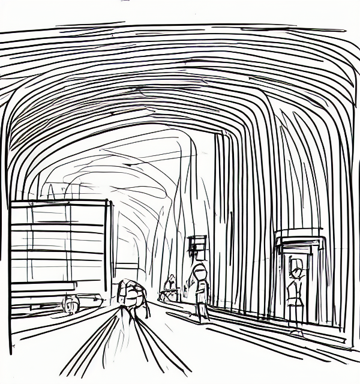
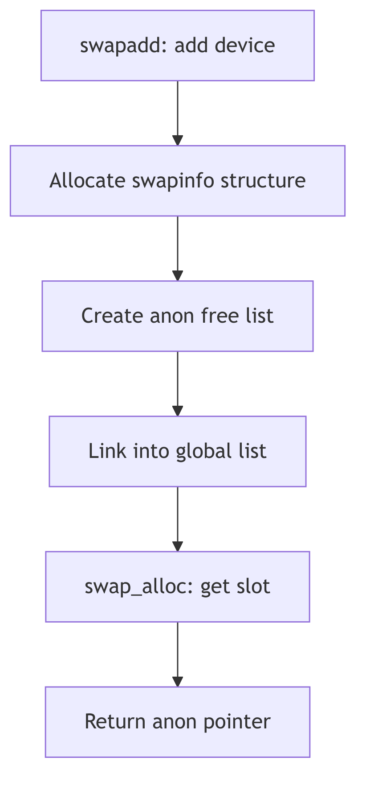
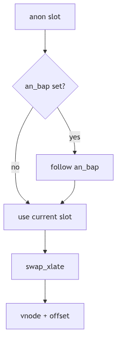

# Swap Space Management: The Underground Reserve

Beneath the city lies a reserve of sealed vaults. The clerk on the surface does not care which tunnel leads to which vault. She cares only that every sealed slot can be found again and that no vault is overused. This is swap space in SVR4: a virtual device made from a chain of physical swap areas, managed as one ledger of anonymous slots.

<br/>

## The Swap Area Ledger: `struct swapinfo`

Each swap area is tracked by a `swapinfo` entry, which holds the vnode, offset range, and the free-list head for its anon slots (sys/swap.h:133-151).

```c
struct swapinfo {
	struct	vnode *si_vp;
	struct	vnode *si_svp;
	uint	si_soff;
	uint	si_eoff;
	struct	anon *si_anon;
	struct	anon *si_eanon;
	struct	anon *si_free;
	int	si_allocs;
	struct	swapinfo *si_next;
	short	si_flags;
	ulong	si_npgs;
	ulong	si_nfpgs;
	char	*si_pname;
};
```
**The Vault Ledger** (sys/swap.h:133-151)

The `si_anon` array is the true map of vault slots. Free slots are linked through each anon's `un.an_next` pointer. The `si_allocs` counter helps spread allocations across devices, and `si_flags` tracks deletion and in-progress state.

<br/>


**Swap Space - Underground Vaults**

## Logical Concatenation and Load Balancing

SVR4 treats swap as one logical array of anon slots, even though the physical devices are separate. The allocator walks the `swapinfo` list, rotating across devices after `swap_maxcontig` consecutive allocations (vm/vm_swap.c:107-160).

```c
STATIC int swap_maxcontig = 1024 * 1024 / PAGESIZE; /* 1MB of pages */

struct anon *
swap_alloc()
{
	do {
		if ((sip->si_flags & ST_INDEL) == 0) {
			ap = sip->si_free;
			if (ap) {
				sip->si_free = ap->un.an_next;
				sip->si_nfpgs--;
				if (++sip->si_allocs >= swap_maxcontig)
					sip = sip->si_next ? sip->si_next : swapinfo;
				return (ap);
			}
			sip->si_allocs = 0;
		}
		sip = sip->si_next ? sip->si_next : swapinfo;
	} while (sip != silast);
	return (NULL);
}
```
**The Interleaved Allocation** (vm/vm_swap.c:107-160, abridged)

This simple rotation prevents a single swap area from becoming a hot spot. The vaults are spread across the underground grid, balancing wear and contention.


**Figure 2.9.1: Swapinfo Rotation and Free Slot Selection**

<br/>

## Translating a Slot: `swap_xlate()` and `an_bap`

An anon slot is not a disk address. It is a pointer into one of the swap area's anon arrays. `swap_xlate()` resolves that pointer into a `<vnode, offset>` pair when the VM needs to issue I/O (vm/vm_swap.c:215-244). If the slot has been moved during a swap deletion, it uses `an_bap` indirection to find the new home (vm/vm_swap.c:223-234, vm/anon.h:54-68).

```c
void
swap_xlate(ap, vpp, offsetp)
	register struct anon *ap;
	register struct vnode **vpp;
	register uint *offsetp;
{
	if (ap->an_bap)
		ap = ap->an_bap;
	...
	*offsetp = sip->si_soff + ((ap - sip->si_anon) << PAGESHIFT);
	*vpp = sip->si_vp;
}
```
**The Vault Addressing** (vm/vm_swap.c:215-240, abridged)

The back pointer is the keeper's forwarding note. When an area is deleted, the old slot points to the new slot, preserving identity without rewriting every anonymous map in the system.


**Figure 2.9.2: `an_bap` Forwarding When Areas Are Removed**

<br/>

## Adding and Deleting Vaults

`swapadd()` opens a swap vnode, verifies the partition bounds, allocates a new `swapinfo`, and builds the anon free list by linking entries from the end back to the head (vm/vm_swap.c:565-749). The free list is initialized so the first usable entry is at `si_free`.

`swapdel()` walks the list, marks an area deleted, and relocates active anon slots by installing `an_bap` indirections before finally freeing the swapinfo structure (vm/vm_swap.c:768-868). The vault is closed only after every active slot has a forwarding address.

<br/>

> **The Ghost of SVR4:**
>
> We treated swap like a row of vaults and accepted that our clerk had to walk the list. Your systems now hide swap behind layered devices, compressed caches, and memory tiers. Some keep a hot in-memory shadow (zswap), others compress pages before they ever touch a disk. Yet even in 2026, the oldest rule remains: you cannot lose the address of a sealed vault, and you cannot keep every room in memory forever.

<br/>

## The Reserve Holds

Swap space management is not about speed. It is about endurance. The ledger of `swapinfo`, the rotating allocator, and the indirection mechanism keep the reserve usable even as devices come and go. The vaults hold, and the city keeps running.
