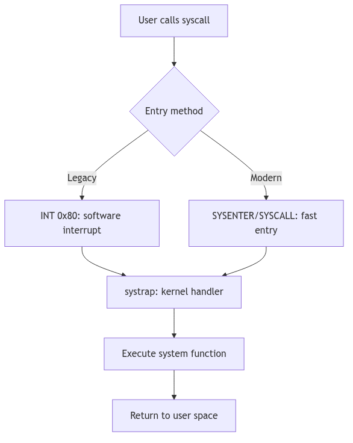

The Kernel's Gateway: System Calls Interface

In the austere landscape of a protected mode operating system, user-space processes are like diligent workers confined to a meticulously guarded factory floor. They can perform their tasks with gusto, but should they require raw materials from the warehouse (disk I/O), or need to communicate with central management (process creation), they cannot simply wander off. Instead, they must respectfully knock on a very specific door: the **System Call Interface**. This is the kernel's tightly controlled, rigorously audited gateway, providing the only legitimate means for a user process to request privileged operations and interact with the very heart of the operating system.

<br/>

## The Knock on the Door: System Call Entry

The journey into the kernel begins with a solemn ritual. When a user program requires a kernel service (e.g., `read()`, `write()`, `fork()`), it doesn't directly execute kernel code. Instead, it typically calls a wrapper function in the C standard library. This wrapper performs a crucial preparatory step: it loads a unique **system call number** (an integer identifier for the desired service) into a designated CPU register, usually `EAX` on the i386 architecture.

Then, with a flourish, the wrapper triggers a **software interrupt**, specifically `INT 0x80` in classic i386 implementations. This `INT 0x80` instruction is the magical incantation that causes the CPU to shed its user-mode privileges and elevate itself to the exalted kernel mode. It's an atomic, hardware-assisted transition designed for security and efficiency.

> **Modern Evolution:** Contemporary x86 processors provide faster system call entry mechanisms: `SYSENTER` (Intel) and `SYSCALL` (AMD), which avoid the overhead of a full interrupt gate transition. These instructions perform a more direct privilege-level switch, bypassing the interrupt descriptor table lookup and offering significantly improved performance for high-frequency system calls. Modern kernels typically support both the legacy `INT 0x80` path (for compatibility) and the fast entry path.

Upon activation of the entry instruction, control is transferred to the kernel's dedicated entry point, often a highly optimized assembly routine like `systrap`. This routine, the vigilant doorman of the kernel, immediately performs several critical tasks:

1.  **Context Preservation**: The first and foremost duty is to meticulously save the entire user-mode CPU context (registers, stack pointer, program counter, flags) onto the kernel stack. This snapshot ensures that when the system call completes, the user process can seamlessly resume execution from precisely where it left off, as if the kernel interlude never happened.
2.  **Privilege Check**: The kernel verifies that the incoming request is legitimate and that the system call number itself is valid.
3.  **Argument Retrieval**: The arguments for the system call, which the user process pushed onto its own stack, must be safely copied from user space to kernel space. This copy is not merely a transfer; it's a careful validation, ensuring that user-provided pointers do not reference invalid or malicious memory locations within the user's or, worse, the kernel's address space.



## The `sysent` Table: The Kernel's Service Directory

Once safely within the kernel, the `systrap` routine consults the **`sysent` table** (defined in `sysent.c`), which serves as the kernel's authoritative directory of all available system calls. This table is an array of `struct sysent` entries, indexed directly by the system call number (the value initially placed in `EAX`).

Each entry in the `sysent` table is a compact but vital record:

```c
// Excerpt from sysent.c - The Kernel's System Call Dispatch Table
struct sysent sysent[] = {
    { 0, 0, nosys },       /* 0 = indir - Special entry, usually unused or for indirect calls */
    { 1, 0, rexit },       /* 1 = exit - 1 argument (exit code) */
    { 0, 0, fork },        /* 2 = fork - 0 arguments */
    { 3, 0, read },        /* 3 = read - 3 arguments (fd, buf, count) */
    { 3, 0, write },       /* 4 = write - 3 arguments (fd, buf, count) */
    /* ... and many more ... */
};
```
**Code Snippet 1.8: The `sysent` Table (Simplified)**

Here, the first field typically indicates the number of arguments the system call expects, the second might hold flags, and the third is a function pointer to the actual kernel handler responsible for executing the system call's logic. This design provides an efficient and organized way for the kernel to dispatch control to the correct handler based on the system call number provided by the user process.

<br/>

## The Language of Request: Argument Passing

The kernel's `systrap` entry point, having identified the correct system call handler via `sysent`, now orchestrates the transfer of arguments from the user process to the kernel handler. This is a highly sensitive operation, as the kernel must never implicitly trust data originating from user space.

Arguments are typically pushed onto the user process's stack before the `INT 0x80` instruction. The kernel, using functions like `copyin()`, carefully copies these arguments from the user's virtual address space into a secure, temporary buffer within the kernel's own address space.

This `copyin()` (and its counterpart `copyout()` for returning data) is more than just a memory copy; it includes critical **validation** steps:

1.  **Address Range Check**: Does the user-provided address for an argument (e.g., a buffer for `read()`) actually fall within the user process's allocated virtual address space? An attempt to read from or write to arbitrary memory locations (especially kernel space) would be a severe security breach.
2.  **Permissions Check**: Does the user process have the necessary permissions to access the memory at the given address? For instance, `copyin()` ensures read access, while `copyout()` ensures write access.
3.  **Size Limits**: If a size is specified (e.g., number of bytes to read), the kernel ensures that the operation does not exceed the bounds of the user-provided buffer or other reasonable limits.

Only after these stringent checks are passed are the arguments provided to the system call handler. The handler then executes its core logic, operating within the full privileges and context of the kernel. Results, if any, are typically placed into an `rval_t` structure (e.g., containing `r_val1` and `r_val2` for system calls like `pipe()` that return two values, like a file descriptor pair). This ensures a standardized return mechanism from kernel to user space.

---

> #### **The Ghost of SVR4: The Legacy of INT 0x80**
>
> The `INT 0x80` mechanism was the standard, and often the only, way to enter the kernel on i386 systems in the SVR4 era. It was robust, well-understood, and provided the necessary protection boundary. However, each software interrupt involves significant overhead due to the saving and restoring of context and the transition through the interrupt descriptor table.
>
> **Modern Contrast (2026):** Modern x86 processors (and other architectures) feature specialized, faster instructions for system call entry, such as `SYSENTER`/`SYSEXIT` (Intel) and `SYSCALL`/`SYSRET` (AMD). These instructions offer a more streamlined, hardware-optimized path directly into the kernel, bypassing some of the interrupt overhead. While `INT 0x80` may still be supported for compatibility, high-performance applications and modern operating systems prefer these dedicated fast system call mechanisms, a testament to the continuous pursuit of efficiency in the face of ever-increasing system call frequencies.

---

<br/>

## The Return Journey: System Call Exit

Having successfully navigated the kernel's labyrinth, performed its sacred duties, and perhaps even transformed the system state, the system call handler must now orchestrate a graceful exit. The journey back from the privileged kernel mode to the constrained user mode is not a mere reversal of entry but a carefully choreographed sequence of checks and context restorations. The `systrap_rtn` routine, the counterpart to `systrap`, assumes command for this delicate phase.

Before the CPU can shed its kernel-mode attire and resume user-mode execution, `systrap_rtn` performs two critical checks:

1.  **Signal Interception (`issig()`)**: The very first order of business is to invoke `issig()`, our familiar signal gatekeeper from Section 1.3. This check is paramount: if any signals have been posted to the process while it was executing in kernel mode, `issig()` will identify the highest-priority deliverable signal. If such a signal is found, the kernel will not return directly to the user's interrupted instruction. Instead, it will divert control to the signal delivery mechanism (`psig()`), potentially invoking a user-defined signal handler or executing the signal's default action (e.g., terminating the process). This ensures that asynchronous events are processed promptly and that a process cannot indefinitely defer signal handling by remaining in kernel mode.

2.  **Preemption Check (`runrun` flag)**: Next, `systrap_rtn` inspects the `runrun` flag. This humble-looking flag is the scheduler's silent decree, a one-bit memo indicating that a preemption event is pending—a higher-priority process is now runnable, or the current process's time slice has expired. If `runrun` is set, the kernel will not return to the current user process. Instead, it triggers a context switch (`preempt()`), handing control back to the scheduler to select the next deserving process. This ensures that the kernel maintains its responsiveness and fairness, even when a process has just completed a system call.

Only if both these checks are cleared—no deliverable signals and no pending preemption—does the kernel proceed to restore the user-mode CPU context that was so carefully preserved during system call entry. The saved registers, stack pointer, and program counter are meticulously reloaded, and finally, a special instruction (typically `IRET` on i386 for interrupt returns) is executed. This `IRET` instruction atomically restores the CPU to user mode and returns control to the precise instruction in the user program that was interrupted by the `INT 0x80`.

<br/>

## The Echo of the Kernel: Return Values

The outcome of a system call needs to be communicated back to the requesting user process. In SVR4, the results are typically passed back via general-purpose registers. Successful system calls return a non-negative value (often 0, or a specific result like a file descriptor or byte count) in `EAX`.

In the event of an error, the system call typically returns a value of `-1` in `EAX`, and sets the CPU's carry flag. This carry flag is a subtle but critical indicator. The C library wrapper, which initiated the `INT 0x80` call, then checks this carry flag. If set, it interprets the value in `EAX` as an error code (a negative `errno` value), translates it into the appropriate positive `errno` value (e.g., `EFAULT`, `EPERM`, `ENOENT`), and stores it in the global `errno` variable, making it accessible to the user program.

This meticulous dance of entry, execution, and exit, punctuated by critical checks for signals and preemption, forms the very bedrock of the SVR4 kernel's interaction with user applications, safeguarding system integrity while providing essential services.

---
