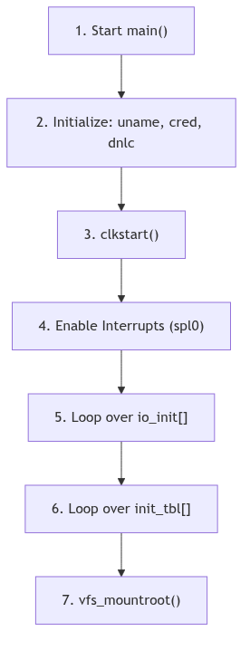
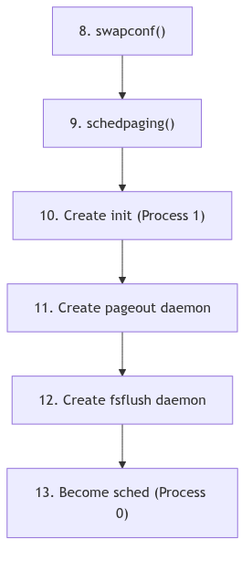
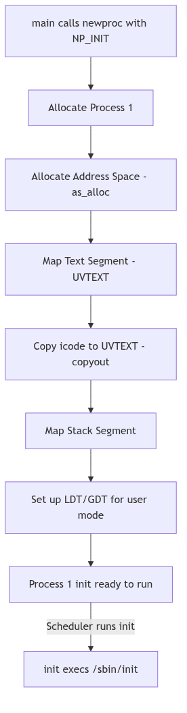

# System Initialization: The Grand Exhibition

The dawn of a new day for the system is a momentous occasion, akin to the grand opening of a magnificent world's fair. Before the gates can be thrown open to the public, a master of ceremonies must ensure that every exhibit is prepared, every gas lamp is lit, and every steam engine is polished and ready. In the SVR4 kernel, this master of ceremonies is the `main()` function, residing in `os/main.c`. It is the very first C function to run after the low-level assembly language boot code has prepared the machine, and its duty is to orchestrate the transformation of a machine from a silent collection of circuits into a vibrant, living UNIX system.

The process is not a chaotic rush, but a meticulously ordered progression. The `main` function follows a strict protocol, first establishing the foundational infrastructure, then systematically bringing each of the kernel's great mechanisms to life. Only when every piece is in its proper place are the first processes created and the system finally opened for business, transitioning from its solitary setup phase into the bustling, multi-user world it was built for.

<br/>

## The Master of Ceremonies: `main()`

The `main()` function is the unwavering conductor of the startup orchestra. Upon being called, it inherits a machine with memory laid out and a provisional stack, but with interrupts disabled and the great subsystems of the kernel lying dormant. Its first actions are foundational.

**The Opening Fanfare** (os/main.c:113):
```c
main(argc, argv)
	int	argc;
	char	*argv[];
{
	register int	(**initptr)();
	/* ... */

	inituname();
 	cred_init();
 	dnlc_init();

	/* ... */

	clkstart();
	spl0();         /* enable interrupts */

	/* ... */
}
```

The ceremony begins:
1.  **`inituname()`**: The system's identity—its name, release, and version—is established.
2.  **`cred_init()`, `dnlc_init()`**: Foundational data structures for security credentials and filename caching are initialized.
3.  **`clkstart()`**: The system's heart, the clock interrupt, begins to beat, giving the kernel its sense of time.
4.  **`spl0()`**: With a flourish, the master of ceremonies enables interrupts on the processor. The system is now live and can respond to the outside world.

<br/>


**System Init - World's Fair Opening**

## The Grand Procession of Subsystems

With the foundations laid and the clock ticking, `main()` turns its attention to the great exhibits of the fair—the kernel's subsystems. It does not call each one by name. Instead, it defers to two great tables of function pointers, `io_init` and `init_tbl`, which constitute the guest list for the ceremony.

**The Initialization Tables** (os/main.c:196):
```c
 	for (initptr= &io_init[0]; *initptr; initptr++) {
		(**initptr)();
	}

	/* ... */

 	for (initptr= &init_tbl[0]; *initptr; initptr++) 
		(**initptr)();
```
This elegant design allows for great modularity. To add a new subsystem, a programmer need only add a pointer to its initialization function to one of these tables in the configuration files. The `main` function, like a true master of ceremonies, does not need to know the specifics of each exhibit, only that it must be called upon to set itself up. These loops are responsible for initializing every major part of the kernel: the buffer cache (`binit`), the STREAMS framework (`strinit`), device drivers, and filesystems.

After the core subsystems are running, the root filesystem is mounted (`vfs_mountroot()`), making the primary hierarchy of files and directories available for the first time.


**Figure 5.7.2: Flowchart of `main()` Initialization—Early Phase**


**Figure 5.7.3: Flowchart of `main()` Initialization—Process Creation Phase**

<br/>

## The First Citizen: The `init` Process

With the fairgrounds fully prepared, it is time to admit the first citizen. `main()` calls `newproc()` to create the most important process of all: **Process 1**, known to all as `init`.

**The Creation of `init`** (os/main.c:267):
```c
 	if (newproc(NP_INIT, NULL, &error)) {
 		/* ... setup for a new process ... */

 		register proc_t *p = u.u_procp;
		proc_init = p;

		p->p_flag &= ~(SSYS | SLOCK);  

 		/* Set up the text region to do an exec of /sbin/init. */
 		(void) as_map(p->p_as, UVTEXT, szicode, segvn_create, zfod_argsp);
 		if (copyout((caddr_t)icode, (caddr_t)(UVTEXT), szicode))
			cmn_err(CE_PANIC, "main - copyout of icode failed");

		/* ... allocate stack ... */

 		return UVTEXT;
	}
```
This is a special case of process creation. The new process, which will have a process ID of 1, does not `fork` from an existing process in the usual way. Instead, `main()` constructs its user-space image from scratch. It maps a text segment and copies in a small piece of machine code known as `icode`. This `icode` is a miniature program whose only purpose is to execute the program `/sbin/init`.

Once this new process is created and made ready to run, the `main()` function's work in this context is done. It will return, and the scheduler will eventually run the newly-birthed `init` process, which will immediately `exec("/sbin/init")`. This user-space `init` program then takes over the task of bringing the system to its operational run-level by reading its configuration from `/etc/inittab` and spawning `getty` processes, daemons, and other essential services.


**Figure 5.7.1: Flowchart for the Creation of the `init` Process (Process 1)**

<br/>

## The Unseen Workforce: Kernel Daemons

Before its work is truly finished, `main()` creates a few more essential, but unseen, members of the exhibition staff. These are kernel-only processes, daemons that run perpetually in kernel mode to perform essential housekeeping tasks.

- **`sched`**: The original process, PID 0, having fulfilled its duty of creating all others, transforms itself into the scheduler, or "swapper." It is the process that is run when no other process is runnable. Its primary task is to manage memory, swapping processes out to disk when memory is scarce.
- **`pageout`**: Created via `newproc(NP_SYSPROC, ...)` and given the name "pageout," this daemon is responsible for the page replacement algorithm, scanning memory for old, unused pages and freeing them to make room for new allocations.
- **`fsflush` (or `bdflush`)**: Another system process, this daemon periodically flushes "dirty" buffers from the block I/O cache to disk, ensuring that modified data is eventually made permanent.

These daemons are the tireless workforce of the system, laboring in the background to ensure the smooth operation of the grand exhibition.

---

> #### **The Ghost of SVR4: A Pre-ordained Ceremony**
>
> My dear reader, our initialization was a simple, linear, and deeply predictable affair. The `main` function called its initialization routines in a fixed order, `init` was born, and it, in turn, read `/etc/inittab`—a simple, sequential script of commands—to bring the system to life. `inittab` defined a set of "run-levels" and the processes to start or stop for each. It was robust, it was understandable, but it was not particularly swift. Each step waited for the last, a slow and deliberate procession.
>
> **Modern Contrast (2026):** The opening ceremony of a 2026 Linux system is a different beast entirely. The simple, sequential `/sbin/init` has been almost universally replaced by `systemd`, a vastly more complex and powerful initialization system. `systemd` does not think in terms of sequential scripts, but in terms of "units"—services, mount points, sockets, and targets. It analyzes a vast web of dependencies between these units, determining that, for instance, the network filesystem service depends on the network being active, which in turn depends on the network card's driver being loaded.
>
> Armed with this dependency graph, `systemd` performs a marvel of parallelization. It starts dozens, or even hundreds, of services simultaneously, activating only those that are not blocked by an unmet dependency. It uses socket activation, where a service is not even started until the first connection to its network socket arrives. The result is a boot process that is dramatically faster and more efficient than our stately, sequential march. The master of ceremonies no longer directs a simple procession; he conducts a complex and dazzling fireworks display, with dozens of rockets launching at once in a perfectly coordinated, yet parallel, spectacle.

---

<br/>

## Conclusion: Opening the Gates

The journey from a cold hardware state to a fully operational, multi-user system is a masterclass in orchestration. The `main` function, as the master of ceremonies, does not attempt to manage every detail itself. Instead, it relies on a well-defined protocol and a modular architecture, delegating the specifics of initialization to the individual subsystems. It erects the foundational pillars of the system, calls upon the exhibitors to prepare their displays, and, as its final and most important act, creates the first citizen, the `init` process, to whom it hands the keys to the city. With the unseen workforce of kernel daemons humming in the background, the grand exhibition is declared open, and the system comes to life.
