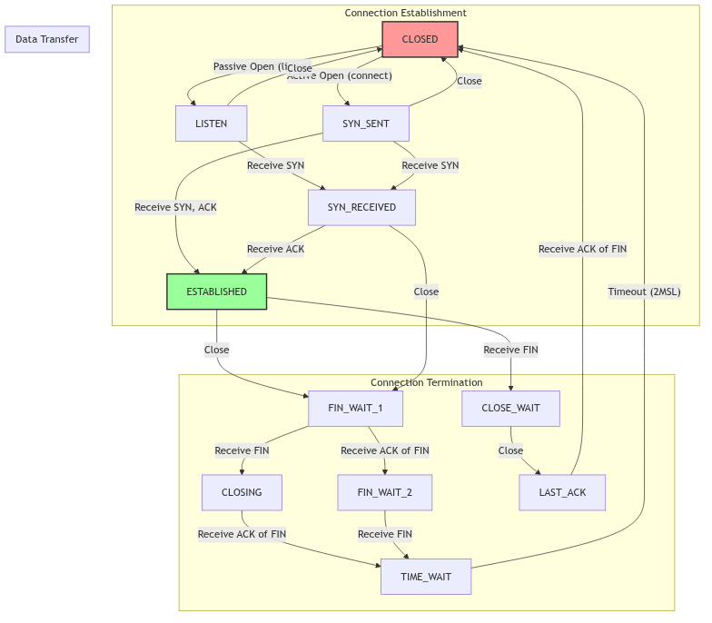
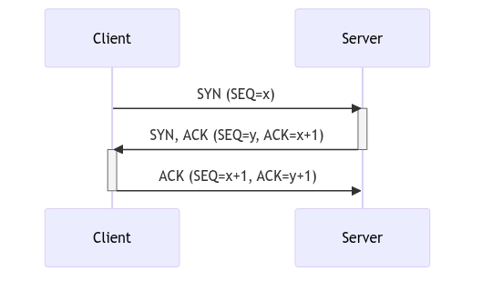

# Transport Control Protocol (TCP)

## Overview: The Empire's Telegraph Office

Imagine a vast, bustling telegraph office in the heart of a sprawling Victorian empire. This is not a chaotic operation of haphazardly transmitted messages, but a meticulously organized system dedicated to the reliable delivery of every dispatch. This is the world of the Transmission Control Protocol (TCP) in SVR4. Where the underlying postal service (the Internet Protocol) offers no guarantees—letters may be lost, arrive out of order, or be duplicated—the TCP Telegraph Office takes upon itself the solemn duty of ensuring that every word, every sentence, every message arrives at its destination precisely as it was sent.

Each conversation is a dedicated correspondence between two parties, managed by a senior clerk who maintains a detailed ledger. This ledger, the TCP Control Block, tracks every byte sent and received, ensuring that lost packets are retransmitted, duplicates are discarded, and a constant, orderly flow of information is maintained. The office operates under a strict set of rules—the TCP Finite State Machine—governing the lifecycle of each connection, from the formal three-way handshake that initiates a conversation to the final, four-part farewell that concludes it. This is a world of sequence numbers, acknowledgements, windows, and timers, all working in concert to create a reliable stream of communication over an inherently unreliable medium.

## The Clerk's Ledger: The TCP Control Block

At the heart of every TCP connection is the `tcpcb`, the TCP Control Block. This structure is the clerk's master ledger for a single conversation, a comprehensive record of everything needed to maintain a reliable, ordered stream of data.

```c
/*
 * Kernel variables for tcp.
 */

/*
 * Tcp control block, one per tcp; fields:
 */
struct tcpcb {
	struct	tcpiphdr *seg_next;	/* sequencing queue */
	short	t_state;		/* state of this connection */
	short	t_timer[TCPT_NTIMERS];	/* tcp timers */
	short	t_rxtshift;		/* log(2) of rexmt exp. backoff */
	short	t_rxtcur;		/* current retransmit value */
	u_short	t_maxseg;		/* maximum segment size */
	char	t_force;		/* 1 if forcing out a byte */
	u_short	t_flags;

/* send sequence variables */
	tcp_seq	snd_una;		/* send unacknowledged */
	tcp_seq	snd_nxt;		/* send next */
	tcp_seq	snd_up;			/* send urgent pointer */
	tcp_seq	snd_wl1;		/* window update seg seq number */
	tcp_seq	snd_wl2;		/* window update seg ack number */
	tcp_seq	iss;			/* initial send sequence number */
	u_long	snd_wnd;		/* send window */
/* receive sequence variables */
	u_long	rcv_wnd;		/* receive window */
	tcp_seq	rcv_nxt;		/* receive next */
	tcp_seq	rcv_up;			/* receive urgent pointer */
	tcp_seq	irs;			/* initial receive sequence number */
};
```
*_(netinet/tcp_var.h)_*

Key fields in this ledger include:

*   **`t_state`**: The current state of the connection, drawn from the finite state machine.
*   **`snd_una`**, **`snd_nxt`**: Sequence numbers that track the bytes that have been sent and acknowledged.
*   **`rcv_nxt`**: The sequence number of the next byte the receiver expects to receive.
*   **`snd_wnd`**, **`rcv_wnd`**: The send and receive windows, which manage flow control.
*   **`t_timer`**: An array of timers for retransmissions, keep-alives, and other time-based events.
*   **`t_maxseg`**: The maximum segment size, negotiated during the handshake, to avoid IP-level fragmentation.

## The Rulebook: The TCP Finite State Machine

The life of a TCP connection is governed by a strict set of rules known as the Finite State Machine. Each state represents a distinct phase in the conversation, and the transitions between states are triggered by specific events, such as the arrival of a particular type of segment or a request from the user application.


*The TCP State Machine*

The primary states and their roles:

*   **`CLOSED`**: The beginning and end. No connection exists.
*   **`LISTEN`**: A server waiting for a connection request from a client.
*   **`SYN_SENT`**: A client has sent a connection request (a `SYN` segment) and is waiting for a reply.
*   **`SYN_RECEIVED`**: A server has received a `SYN` and sent its own `SYN-ACK`, and is now waiting for the final `ACK` from the client.
*   **`ESTABLISHED`**: The connection is active. Data can be transferred freely in both directions. This is the main state for a healthy, active connection.
*   **`FIN_WAIT_1`** / **`FIN_WAIT_2`**: The local application has closed the connection, and the TCP module has sent a `FIN` segment. It is waiting for an `ACK` and then a `FIN` from the remote party.
*   **`CLOSE_WAIT`**: The local TCP has received a `FIN` from the remote party and is waiting for the local application to close its end of the connection.
*   **`LAST_ACK`**: Both sides have sent `FIN`s, and the TCP is waiting for the final `ACK` of its own `FIN`.
*   **`TIME_WAIT`**: The "2MSL Wait" state. The connection is closed, but the control block is kept around for a short period to catch any stray, late-arriving packets from the now-defunct connection, preventing them from being misinterpreted as belonging to a new connection.

## Opening the Line: The Three-Way Handshake

A TCP connection is established through a precise, three-step process known as the three-way handshake. This ensures that both parties are ready to communicate and have agreed upon the initial sequence numbers.


*The Three-Way Handshake*

1.  **SYN**: The client, wishing to start a conversation, sends a `SYN` (synchronize) segment to the server. This segment includes the client's initial sequence number (`SEQ=x`).
2.  **SYN-ACK**: The server, having received the `SYN`, responds with a `SYN-ACK` segment. This segment contains the server's own initial sequence number (`SEQ=y`) and an acknowledgement of the client's sequence number (`ACK=x+1`).
3.  **ACK**: Finally, the client sends an `ACK` segment back to the server, acknowledging the server's sequence number (`ACK=y+1`).

Upon completion of this exchange, the connection is `ESTABLISHED`, and data transfer can begin. The SVR4 implementation of this logic is primarily handled in `tcp_input.c`, within the `tcp_uinput` function, which processes incoming segments and drives state transitions.

<br/>

> **The Ghost of SVR4:**
>
> "Ah, the simple, elegant dance of the three-way handshake. It was a robust and reliable method in its day, and remains the foundation of TCP connections even now, in your far-flung future of 2026. But the world has grown so much faster, so much more concerned with latency. Your modern TCP stacks have learned new tricks. 'TCP Fast Open' (TFO), for instance, allows data to be sent in the very first `SYN` packet, a brazen violation of the old etiquette, all in the name of shaving off a few precious milliseconds. We, in our time, valued correctness and a clear separation of concerns above all. The handshake was for synchronization, and only once the line was declared open would data ever be transmitted. A more civilized age, perhaps."

## Reliable Delivery and Flow Control

TCP's primary mandate is reliability. It achieves this through several key mechanisms:

*   **Sequence Numbers**: Every byte of data is assigned a unique sequence number. The `snd_nxt` and `rcv_nxt` fields in the `tcpcb` track the progress of this byte stream.
*   **Acknowledgements (ACKs)**: The receiver sends `ACK` segments back to the sender to confirm receipt of data. If the sender does not receive an `ACK` for a segment within a certain time (the retransmission timeout, or RTO), it assumes the segment was lost and sends it again. The SVR4 kernel manages this with a set of timers, handled in `tcp_timer.c`.
*   **Sliding Window**: The `snd_wnd` and `rcv_wnd` fields implement a "sliding window" for flow control. The receiver advertises its `rcv_wnd`—the amount of buffer space it has available. The sender is not allowed to send more data than the advertised window, preventing the receiver from being overwhelmed. The logic for sending data, respecting the window, and handling retransmissions is found in `tcp_output.c`.

## Conclusion

The SVR4 TCP implementation, a faithful rendition of the classic protocol, is a testament to the enduring principles of reliable network design. Like a well-run telegraph office, it is a system of immense complexity, with clerks, rules, and ledgers all working in harmony. It imposes order on the chaos of the underlying network, providing applications with the simple, reassuring abstraction of a reliable, unbroken stream of data. While the speeds and latencies of the networks have changed beyond recognition, the fundamental challenges of reliability that TCP was designed to solve remain, and its core principles, as implemented in SVR4, endure.