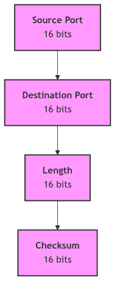

# User Datagram Protocol (UDP)

## Overview: The Empire's Postal Service

In contrast to the formal, registered mail service of the TCP Telegraph Office, the User Datagram Protocol (UDP) is the Empire's simple, no-frills postal service. It is a service built on a philosophy of speed and simplicity, making no promises about the delivery of your letters. You write your message, drop it into the nearest postbox, and hope for the best.

There is no formal handshake to initiate a correspondence, no sequence numbers to ensure letters arrive in order, and no acknowledgements to confirm their receipt. If a letter is lost to the void, duplicated by a confused postal worker, or arrives after a later dispatch, the postal service offers no apology and takes no corrective action. It is a 'fire-and-forget' system, where the burden of reliability rests entirely on the shoulders of the sender and receiver. This makes it unsuitable for transmitting the chapters of a novel, but perfectly adequate for a quick, informal note where speed is of the essence and the loss of a single message is not catastrophic.

## The UDP Header: A Simple Postcard

The UDP header is a model of minimalism, a simple postcard containing only the most essential information required to get the message to its destination. It is a mere 8 bytes, a fraction of the size of its verbose TCP counterpart.

*The UDP Header*

The header contains just four fields:

*   **Source Port** and **Destination Port**: The addresses of the sender and receiver within their respective machines.
*   **Length**: The length of the UDP header and its data.
*   **Checksum**: An optional field to verify the integrity of the header and data. In the SVR4 era, the use of this checksum was often disabled by default to squeeze out every last drop of performance.

This simplicity is UDP's greatest strength and its most profound weakness. The lack of sequence numbers, acknowledgement numbers, and window size fields is what makes UDP so fast and lightweight, but it is also what makes it an unreliable, connectionless protocol.

## The `inpcb` and UDP

Like TCP, UDP uses the `inpcb` (Internet Protocol Control Block) to manage its endpoints. However, because UDP is connectionless, the `inpcb` is used in a much simpler way. It primarily serves to bind a user's application to a specific port, a postbox waiting to receive mail. It does not track state, sequence numbers, or window sizes, as these concepts are foreign to the world of UDP.

The core of the UDP implementation in SVR4 can be found in `udp_io.c` and `udp_main.c`. These files contain the logic for handling incoming and outgoing datagrams.

## `udp_input` and `udp_output`: The Mailroom Clerks

The two key functions in the SVR4 UDP implementation are `udp_input` and `udp_output`.

*   **`udp_input`**: This function is the receiving mailroom clerk. When a UDP datagram arrives from the IP layer, `udp_input` is called. It performs a few basic checks, such as verifying the checksum if enabled, and then looks for an `inpcb` associated with the destination port. If it finds one, it places the datagram in the appropriate application's queue and moves on. If no application is listening on that port, the datagram is simply discarded, much like a letter with an unknown address.

*   **`udp_output`**: This function is the dispatching clerk. When an application sends a UDP datagram, `udp_output` takes the data, prepends the simple 8-byte UDP header, and passes the resulting package down to the IP layer for delivery. It makes no copy of the data and sets no timers. Once the datagram is handed off to IP, UDP's involvement is over.

 

> **The Ghost of SVR4:**
>
> "We saw UDP as a necessary, if somewhat crude, tool. It was for services like DNS, where a single, small query and response were all that was needed. The idea of building complex, reliable protocols on top of our simple postal service would have seemed a curious, if not foolhardy, endeavor. Yet, in your time, this is precisely what has happened. You have built a new, impossibly fast telegraph service called QUIC, not on the solid foundation of IP, but on the shifting sands of UDP. You have taken our fire-and-forget postal system and, through herculean effort, layered on your own reliability, congestion control, and even encryption. It is a marvel of engineering, a testament to the relentless pursuit of speed. You have built a palace on a swamp, and somehow, it stands."

**UDP - Simple Postal Service**

## Conclusion

The User Datagram Protocol in SVR4 is a study in contrasts to the complexity of TCP. It is the swift, efficient, and fundamentally unreliable postal service of the kernel's networking suite. It offers no guarantees, but in doing so, it provides a raw, direct path to the underlying network, a path that applications requiring speed and low overhead, and who are willing to shoulder the burden of reliability themselves, have found to be invaluable. It is a simple tool for a simple job, a reminder that sometimes, the fastest way to send a message is to simply drop it in the mail and hope for the best.