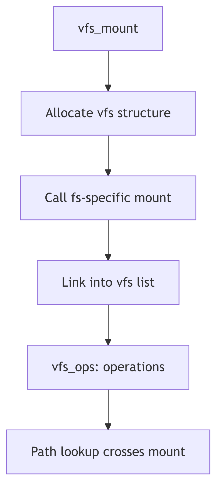

Virtual File System (VFS) Layer


**VFS Layer - Customs House**

## Overview

The VFS layer provides a uniform interface to multiple file system types. It allows the kernel to support different file systems simultaneously through a common set of operations. Each mounted file system has a vfs structure containing function pointers for filesystem-specific operations.

## VFS Structure

The vfs structure (vfs.h:46) represents a mounted file system:

```c
typedef struct vfs {
    struct vfs *vfs_next;           /* next VFS in VFS list */
    struct vfsops *vfs_op;          /* operations on VFS */
    struct vnode *vfs_vnodecovered; /* vnode mounted on */
    u_long vfs_flag;                /* flags */
    u_long vfs_bsize;               /* native block size */
    int vfs_fstype;                 /* file system type index */
    fsid_t vfs_fsid;                /* file system id */
    caddr_t vfs_data;               /* private data */
    dev_t vfs_dev;                  /* device of mounted VFS */
    u_long vfs_bcount;              /* I/O count (accounting) */
    u_short vfs_nsubmounts;         /* immediate sub-mount count */
} vfs_t;
```

The `vfs_next` field links all mounted file systems into a global list headed by `rootvfs`. The `vfs_vnodecovered` points to the mount point vnode. The `vfs_data` field holds filesystem-specific private data.

## VFS Operations Vector

The vfsops structure (vfs.h:87) defines file system operations:

```c
typedef struct vfsops {
    int (*vfs_mount)();        /* mount file system */
    int (*vfs_unmount)();      /* unmount file system */
    int (*vfs_root)();         /* get root vnode */
    int (*vfs_statvfs)();      /* get file system statistics */
    int (*vfs_sync)();         /* flush fs buffers */
    int (*vfs_vget)();         /* get vnode from fid */
    int (*vfs_mountroot)();    /* mount the root filesystem */
    int (*vfs_swapvp)();       /* return vnode for swap */
    int (*vfs_filler[8])();    /* for future expansion */
} vfsops_t;
```

Each operation is invoked through macros like `VFS_MOUNT(vfsp, mvp, uap, cr)` which indirect through the vfs_op pointer. This allows different file system types to provide custom implementations.

## File System Type Switch

The vfssw structure (vfs.h:116) maps file system names to operations:

```c
typedef struct vfssw {
    char *vsw_name;             /* type name string */
    int (*vsw_init)();          /* init routine */
    struct vfsops *vsw_vfsops;  /* filesystem operations vector */
    long vsw_flag;              /* flags */
} vfssw_t;
```

The global `vfssw[]` array contains entries for each configured file system type (UFS, S5FS, NFS, etc.). The `vfs_getvfssw()` function looks up entries by name.

## Mount Operation

The mount() system call (vfs.c:78) attaches a file system to the directory tree:

```c
int
mount(uap, rvp)
    register struct mounta *uap;
    rval_t *rvp;
{
    vnode_t *vp = NULL;
    register struct vfs *vfsp;
    struct vfssw *vswp;
    struct vfsops *vfsops;
    register int error;

    /* Resolve mount point */
    if (error = lookupname(uap->dir, UIO_USERSPACE, FOLLOW, NULLVPP, &vp))
        return error;
    if (vp->v_vfsmountedhere != NULL) {
        VN_RELE(vp);
        return EBUSY;
    }
    if (vp->v_flag & VNOMOUNT) {
        VN_RELE(vp);
        return EINVAL;
    }
```

The function looks up the mount point vnode, verifies nothing is already mounted there, then locates the appropriate vfsops based on the file system type name or number.

## VFS Flags

VFS flags (vfs.h:63) control mount behavior:

```c
#define VFS_RDONLY    0x01    /* read-only vfs */
#define VFS_MLOCK     0x02    /* lock vfs so subtree is stable */
#define VFS_MWAIT     0x04    /* someone is waiting for lock */
#define VFS_NOSUID    0x08    /* setuid disallowed */
#define VFS_REMOUNT   0x10    /* modify mount options only */
#define VFS_NOTRUNC   0x20    /* does not truncate long file names */
#define VFS_UNLINKABLE 0x40   /* unlink can be applied to root */
```

These flags affect operations like permission checking, name handling, and locking behavior for the mounted file system.

## VFS List Management

The `vfs_add()` function links a new vfs into the global list, while `vfs_remove()` unlinks it during unmount. The `vfs_lock()` and `vfs_unlock()` functions provide locking to stabilize the VFS tree during operations that traverse mount points.



**Figure 3.0.1: VFS List and Mount Structure**
